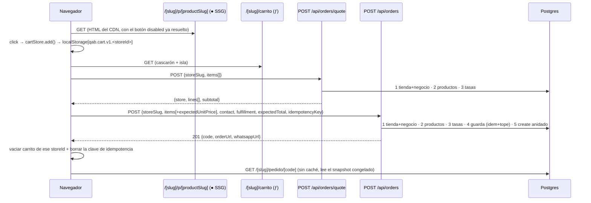

> **AP1 y AP2 respondidas por el humano el 2026-08-26**, las dos con la opción (a)
> recomendada; incorporadas donde tocaba y anotadas al pie. El documento está
> cerrado y es planificable tal cual.

## Estado actual relevante

Lo que ya existe y se reutiliza **sin tocar**:

| Pieza                                             | Qué aporta a F-010                                                                |
| ------------------------------------------------- | --------------------------------------------------------------------------------- |
| `src/lib/money.ts`                                | `money`, `add`, `subtract`, `multiply`, `sum`, `convert`, `formatMoney`. R4/R5/R6 |
| `src/lib/pricing.ts`                              | `effectivePrice` (el override gana, ADR 0007) y `displayPrice`                    |
| `src/lib/availability.ts`                         | `isOrderable`, `AVAILABILITY_LABEL`, `AVAILABILITY_TONE`. R11                     |
| `src/features/catalog/server/queries.ts`          | `requireStore` (cacheada, tag `store:<slug>`) para el cascarón de las páginas     |
| `src/components/ui/{Button,Card,Badge,Container}` | Primitivos server-only ya existentes                                              |
| `src/app/[slug]/layout.tsx`                       | Cabecera y tema por tienda; `revalidate = 3600` literal                           |
| `src/app/api/internal/_lib/guard.ts`              | **No se usa**: el checkout es público. Se documenta el porqué                     |
| `scripts/send-catalog-batch.mjs`                  | El patrón de «ejercitar el contrato sin navegador» que copia `place-order.mjs`    |
| `prisma/seed.ts` (`seedStore`)                    | El upsert idempotente donde entra el fixture de I4                                |

Lo que existe y **se extiende**:

- `src/features/orders/server/pull.ts` — cuatro campos nuevos, aditivos (SP2).
- `prisma/schema.prisma` — tres columnas nullables y un índice único (SP1/SP2).
- `prisma/seed.ts` — tres campos por tienda para el fixture de I4.
- `scripts/check-bundle-budget.mjs` — el número por defecto de `BUDGET_KB` (SP4).
- `docs/sync-contract.md` — versión 2 (§ «El contrato v2», más abajo).

Lo que **no existe todavía** y este feature crea: `src/constants/` (hoy no hay
carpeta, y AGENTS.md prohíbe magic numbers), `src/features/cart/` entero, el
primer `"use client"` del repo, y la primera ruta pública bajo `src/app/api/`
—hasta hoy solo hay `api/internal/*` con `SYNC_TOKEN` y `api/crons/*`.

`zustand` sigue en `package.json` **sin usar** y así se queda (decisión 7 de la
spec). Nota para F-013: es una dependencia muerta que se puede quitar.

## Decisión

**Un route handler público `POST /api/orders` es el único camino de creación, y
un segundo route handler `POST /api/orders/quote` es el único camino de
precio.** Los dos comparten la misma función de servidor, así que lo que el
carrito enseña y lo que el checkout valida no pueden divergir. El estado de
cliente vive en un módulo con `useSyncExternalStore`, sin gestor de estado y sin
Context, y solo cuatro componentes hoja llevan `"use client"`.

Por qué así, decisión por decisión:

**Transporte de la confirmación (R25): route handler, no Server Action.** Una
Server Action se invoca con un id de acción cifrado y un cuerpo RSC; no se puede
ejercitar con `curl` de forma estable, y el criterio 3 exige ejercitar la
creación **sin navegador**. Además el mismo endpoint lo van a llamar
`scripts/place-order.mjs`, `smoke.sh` y —más adelante— el checkout con cuenta de
F-012. Descartadas: Server Action sola (no verificable con un comando); las dos
(dos caminos de código para una sola regla de negocio, justo lo que R1 evita en
`checkoutMode`).

**Ruta `POST /api/orders` con `storeSlug` en el cuerpo**, no `/api/[slug]/orders`:
la tabla «Lo que se manda al confirmar» de la spec ya declara `storeSlug` como
campo del cuerpo, y `robots.ts` ya prohíbe `/api/`. `api` está en `RESERVED` de
`src/lib/slug.ts`, así que no colisiona con ninguna tienda.

**Un endpoint de cotización, `POST /api/orders/quote`.** El servidor no puede
saber qué hay en `localStorage` durante el GET de `/[slug]/carrito`: no es una
elección, es un hecho. Así que el precio de servidor que exige E6 llega en una
segunda petición, inmediatamente al montar la isla, contra la **misma**
`quoteCart()` que usa la creación. Descartadas: renderizar el catálogo entero en
el cascarón del carrito y filtrar en cliente (una tienda de 5 000 productos
mandaría cientos de KB por vista de carrito); pasar el carrito por `searchParams`
(el carrito acaba en la URL y en los logs, y 50 líneas no caben cómodas).

**Estado de cliente: módulo + `useSyncExternalStore`, sin Context.** El botón de
agregar (página de producto) y el contador (cabecera del layout) están en subárboles
distintos y tienen que hablarse sin navegación (E1). Con un provider en el layout
habría que envolver **todas** las páginas de tienda, incluidas las SSG, en un
componente de cliente. Con un módulo de estado importado por las dos hojas no hay
provider, el layout sigue siendo un server component puro, y `useSyncExternalStore`
—que está en React, no es una dependencia— da `getServerSnapshot` para que el HTML
prerenderizado y la primera hidratación coincidan. Descartadas: `zustand` (prohibido
por la decisión 7); Context (obliga a un cliente en el layout compartido con las SSG);
`localStorage` leído en cada render (desincroniza las dos islas y produce mismatch de
hidratación).

**Nada del pedido pasa por caché.** `/[slug]/carrito`, `/[slug]/checkout`,
`/[slug]/pedido/[code]` y los dos endpoints se sirven sin caché; el único dato
cacheado que tocan es `requireStore` para el cascarón (id, slug, nombre), que no
gobierna ninguna decisión del pedido. Todo lo que decide precio, disponibilidad,
moneda, envío y modo de checkout viaja en la respuesta de `quote`, que se lee
fresco. Eso cierra el hueco de «la página ofrece envío durante una hora después
de que la tienda lo apagó».

**Ninguna `$transaction` interactiva.** `Order` + `OrderItem[]` se escriben con un
`create` anidado —una sola llamada, atómica por el motor de Prisma—, y la
comprobación de idempotencia y tope es **un** `findMany`. Ficha
`.agent/playbook/pooler-transaccion-deadlock.md`: el pooler de Supabase corre en
modo transacción y una query del cliente global dentro de un `$transaction` hace
abrazo mortal. Aquí no hay ningún `$transaction` que escribir.

## Componentes

| Componente                    | Capa                        | Responsabilidad                                                                         | Archivo                                                                  |
| ----------------------------- | --------------------------- | --------------------------------------------------------------------------------------- | ------------------------------------------------------------------------ |
| Constantes del carrito        | `src/constants/`            | Clave, versión, topes 1..99 / 50 líneas / 30 días                                       | `src/constants/cart.ts` (nuevo)                                          |
| Constantes de pedido          | `src/constants/`            | Alfabeto y longitud de `code`, 5 reintentos, tope 5/10 min, 32 KB                       | `src/constants/orders.ts` (nuevo)                                        |
| `orderCode`                   | `lib/` (puro)               | `generateOrderCode`, `normalizeOrderCode`, `formatOrderCode`, `isOrderCode` (R17)       | `src/lib/orderCode.ts` (nuevo)                                           |
| Lector del carrito persistido | `features/cart/`            | Guarda de tipo escrita a mano, **sin Zod**; descarta versión desconocida (R16)          | `src/features/cart/parseCart.ts` (nuevo)                                 |
| Adaptador de `localStorage`   | `features/cart/`            | Leer/escribir/limpiar por `Store.id`, caducidad 30 días, degradar a memoria (E21)       | `src/features/cart/cartStorage.ts` (nuevo)                               |
| Store de cliente              | `features/cart/`            | Módulo + `useCart()` con `useSyncExternalStore`; evento `storage` (E23)                 | `src/features/cart/cartStore.ts` (nuevo, `use client`)                   |
| Botón de agregar              | `features/cart/components/` | Isla hoja de la ficha de producto (E1, E2, E5)                                          | `src/features/cart/components/AddToCartButton.tsx` (nuevo, `use client`) |
| Contador de cabecera          | `features/cart/components/` | Isla hoja del layout; 0 en el HTML, real tras hidratar                                  | `src/features/cart/components/CartBadge.tsx` (nuevo, `use client`)       |
| Vista del carrito             | `features/cart/components/` | Cotiza, pinta líneas, sube/baja/quita, marca no disponibles (E6, E7)                    | `src/features/cart/components/CartView.tsx` (nuevo, `use client`)        |
| Formulario de checkout        | `features/cart/components/` | Contacto, entrega, `idempotencyKey`, envío y manejo de 409/429 (E8–E13)                 | `src/features/cart/components/CheckoutForm.tsx` (nuevo, `use client`)    |
| Tipos de red del pedido       | `features/orders/`          | `QuoteResponse`, `CreateOrderBody`, `CreateOrderError`. Sin Zod: los importan las islas | `src/features/orders/types.ts` (nuevo)                                   |
| Esquemas de red del pedido    | `features/*/schemas.ts`     | Zod de `quote` y de `create`; normaliza contacto. **Solo servidor**                     | `src/features/orders/schemas.ts` (nuevo)                                 |
| Normalización de contacto     | `features/orders/`          | `normalizeName`, `normalizePhone` (puras; F-012 las reutiliza)                          | `src/features/orders/contact.ts` (nuevo)                                 |
| Enlace de WhatsApp            | `features/orders/`          | Construye `wa.me` o `null`; puro (E18)                                                  | `src/features/orders/whatsapp.ts` (nuevo)                                |
| Cotización                    | `features/*/server/`        | `loadStoreForOrder`, `quoteCart`, `quoteBySlug`. Único sitio que precia                 | `src/features/orders/server/quote.ts` (nuevo)                            |
| Creación del pedido           | `features/*/server/`        | Idempotencia + tope en una consulta, `create` anidado, P2002, reintento de `code`       | `src/features/orders/server/createOrder.ts` (nuevo)                      |
| Lectura del pedido            | `features/*/server/`        | `getOrderByCode(slug, code)` — 404 cruzado por construcción (E17)                       | `src/features/orders/server/read.ts` (nuevo)                             |
| Guardas de error de Prisma    | `features/*/server/`        | `isUniqueViolation(error, target)` sin `any` y sin importar el namespace generado       | `src/features/orders/server/prismaErrors.ts` (nuevo)                     |
| Pull del POS                  | `features/*/server/`        | +`originalUnitPrice`, `originalCurrencyCode`, `originalLineTotal`, `rateSnapshot`       | `src/features/orders/server/pull.ts` (**editar**)                        |
| Endpoint de creación          | `src/app/`                  | Valida, mapea resultado → HTTP, `Retry-After`. Sin lógica de negocio                    | `src/app/api/orders/route.ts` (nuevo)                                    |
| Endpoint de cotización        | `src/app/`                  | Igual, para precio y ajustes de la tienda                                               | `src/app/api/orders/quote/route.ts` (nuevo)                              |
| Página del carrito            | `src/app/`                  | Cascarón + isla. `dynamic = "force-dynamic"` literal                                    | `src/app/[slug]/carrito/page.tsx` (nuevo)                                |
| Página de checkout            | `src/app/`                  | Cascarón + isla. `dynamic = "force-dynamic"` literal                                    | `src/app/[slug]/checkout/page.tsx` (nuevo)                               |
| Página del pedido             | `src/app/`                  | Render server puro del snapshot; `noindex`; sin caché (E16, E19, R18)                   | `src/app/[slug]/pedido/[code]/page.tsx` (nuevo)                          |
| Layout de tienda              | `src/app/`                  | Añade `<CartBadge storeId={store.id} storeSlug={store.slug} />`                         | `src/app/[slug]/layout.tsx` (**editar**)                                 |
| Ficha de producto             | `src/app/`                  | Sustituye el `Button` decorativo por la isla                                            | `src/app/[slug]/p/[productSlug]/page.tsx` (**editar**)                   |
| Migración                     | `prisma/`                   | Tres columnas nullables + índice único                                                  | `prisma/migrations/<ts>_order_idempotency_and_original_price/`           |
| Fixture I4                    | `prisma/`                   | `checkoutMode`, `deliveryEnabled`, `deliveryFee` en `seedStore`                         | `prisma/seed.ts` (**editar**)                                            |
| Ejercitador sin navegador     | `scripts/`                  | R25 y criterios 3, 4, 16, 17, 18 en un comando                                          | `scripts/place-order.mjs` (nuevo)                                        |
| Presupuesto de bundle         | `scripts/`                  | `BUDGET_KB` al número medido (SP4)                                                      | `scripts/check-bundle-budget.mjs` (**editar**)                           |
| Contrato                      | `docs/`                     | Versión 2 (§ ③④)                                                                        | `docs/sync-contract.md` (**editar**)                                     |
| Decisión estructural          | `docs/`                     | Escritura pública sin sesión. Contenido íntegro en § ¿Hace falta una ADR?               | `docs/adr/0016-escritura-publica-sin-sesion.md` (nuevo)                  |
| Smoke                         | `.agent/`                   | E1–E27 ejecutables contra la app levantada                                              | `.agent/specs/F-010/smoke.sh` (nuevo, del template)                      |

Sin componentes nuevos en `src/components/`: `ProductCard`, `Button`, `Card`,
`Badge` y `Container` se reutilizan tal cual. Si `sdd-designer` necesita un
primitivo interactivo (un stepper de cantidad, por ejemplo), va a
`src/components/ui/` con `"use client"` y **sin** conocimiento del dominio; todo
lo que sepa qué es un carrito vive en `src/features/cart/components/`.

## Flujo de datos



Orden exacto dentro de `createOrder` (importa, porque fija las precedencias de la spec):

1. `loadStoreForOrder(slug)` → `null` ⇒ `store_not_found` (404). No se consulta nada más.
2. Fusionar líneas repetidas del mismo `storeProductId` sumando cantidades, **antes**
   de validar el tope de 99 (tabla de casos límite).
3. `items.length === 0` ⇒ `empty_cart` (400).
4. `quoteCart(store, lines)` → productos + tasas frescos. Alguna línea no pedible
   ⇒ `items_unavailable` (409) con todas las razones a la vez, no la primera.
5. `total` del servidor ≠ `expectedTotal` ⇒ `price_changed` (409), con `was` por
   línea si vino `expectedUnitPrice` y `was: null` si no. **Antes** de la guarda: un
   total desactualizado no debe gastar cupo del tope.
6. **Una** consulta: idempotencia + tope (§ Contratos). Clave encontrada ⇒ 200
   `idempotent`; si no y hay 5 en ventana ⇒ 429. La idempotencia gana (R31).
7. `create` anidado con `code` generado. `P2002` sobre `code` ⇒ hasta 5 reintentos;
   `P2002` sobre `idempotencyKey` ⇒ releer por clave dentro de la tienda y responder
   como en el paso 6.
8. Ninguna invalidación de caché. Crear un pedido no cambia el catálogo; llamar a
   `revalidateTag` aquí tiraría el ISR de la tienda por cada pedido.

## Contratos

### Frontera de islands: qué es `"use client"` y qué recibe

Exactamente cuatro archivos llevan la directiva, todos hojas. **Restricción para
`sdd-designer`**: si una pantalla necesita interactividad en otro sitio, se
resuelve dentro de estas cuatro islas o se pregunta; no se sube la directiva.

```ts
// AddToCartButton — ficha de producto (página ● SSG)
{
  storeId: string;
  storeProductId: string;
  slug: string;
  name: string;
  unitPrice: string;
  currencyCode: string;
  disabled: boolean;
}
// CartBadge — layout de tienda (compartido con las páginas ● SSG)
{
  storeId: string;
  storeSlug: string;
}
// CartView — /[slug]/carrito
{
  storeId: string;
  storeSlug: string;
}
// CheckoutForm — /[slug]/checkout
{
  storeId: string;
  storeSlug: string;
}
```

`disabled` lo calcula el **servidor** con `isOrderable()`, así que el atributo
`disabled` está en el HTML prerenderizado antes de que llegue el JS (E5 y
criterio 2a). `CartView` y `CheckoutForm` no reciben precios por props: los piden
a `quote`, que es la única fuente. Ni `Decimal` ni `BigInt` cruzan la frontera
(R22): todo son cadenas ya formateadas como decimal.

Prohibiciones que **rompen el SSG** y que ninguna etapa del sensor detecta salvo
`npm run build`:

- **`useSearchParams()` está prohibido en las cuatro islas.** En una página
  estática obliga a un `<Suspense>` y, sin él, saca la página de `●`.
- Nada de `cookies()`, `headers()`, `connection()` ni `export const dynamic` en
  `/[slug]` ni en `/[slug]/p/[productSlug]`.
- Nada de `next/dynamic` con `ssr: false` para `AddToCartButton`: quitaría el
  `disabled` del HTML servido y rompería el criterio 2a.
- `AddToCartButton` **no** se monta dentro de `ProductCard`. La rejilla de catálogo
  se queda sin islas: es la página más visitada y AGENTS.md prohíbe `"use client"`
  en cualquier cosa que renderice catálogo. El acceso rápido desde la tarjeta, si
  el diseño lo quiere, es otro feature.

### Estado de cliente

```ts
// src/features/cart/cartStore.ts  ("use client")
type CartLine = {
  storeProductId: string;
  slug: string;
  qty: number;
  display: { name: string; unitPrice: string; currency: string };
};
type CartSnapshot = { storeId: string; items: CartLine[]; updatedAt: string };

function ensureStore(storeId: string): void; // cambia de clave al cambiar de tienda (E4)
function subscribe(fn: () => void): () => void; // + window 'storage' (E23)
function getSnapshot(): CartSnapshot; // referencia estable; nada de objetos nuevos por render
function getServerSnapshot(): CartSnapshot; // siempre vacío ⇒ sin mismatch de hidratación
export function useCart(storeId: string): {
  items: CartLine[];
  count: number;
  add(line: Omit<CartLine, "qty">, qty?: number): void;
  setQty(storeProductId: string, qty: number): void; // 0 elimina (R14)
  remove(storeProductId: string): void;
  clear(): void;
};
```

`localStorage` se lee **solo** dentro de `subscribe`/efectos, nunca durante el
render. Clave `qab.cart.v1.<Store.id>` (R12: por id, jamás por slug). Si
`localStorage` lanza —modo privado, cuota— el módulo cae a un `Map` en memoria y
nada revienta (E21). Contenido que no pase la guarda de `parseCart.ts`, o con `v`
distinta de 1, o con `updatedAt` de hace más de 30 días: se descarta en silencio
(R15, R16).

#### Restricción: **ni una línea de Zod en el árbol de cliente**

`src/features/cart/**` y las cuatro islas **no importan `zod`**, ni directa ni
transitivamente. Zod v4 son ~13 KB gzip: entraría en la ficha de producto, que es
una página `●` SSG, y se comería el presupuesto entero él solo antes de que F-013
tenga nada que adelgazar. Riesgo A4 de `sdd-designer`, fijado aquí como
arquitectura y no como recomendación.

Qué valida en su lugar, del lado del cliente:

- **`parseCart.ts`**, una guarda de tipo escrita a mano (`isCartLine`,
  `parseStoredCart(raw: string | null): CartSnapshot | null`) que comprueba `v === 1`,
  que `items` es un array, y por línea que `storeProductId` y `slug` son cadenas no
  vacías y que `qty` es un entero dentro de los topes. Cualquier cosa que no encaje
  devuelve `null` y el carrito arranca vacío (E22). Es ~40 líneas sin dependencias.
- **El formulario** valida con las restricciones nativas de HTML (`required`,
  `type="email"`, `minLength`, `maxLength`, `inputMode`) más comprobaciones a mano
  para lo que el navegador no cubre (dirección obligatoria si `DELIVERY`). Es
  validación de **conveniencia**: sirve para no mandar una petición que va a fallar,
  no para decidir nada.
- **Los topes viven en `src/constants/`** y los importan los dos lados. Eso es lo que
  hace que la guarda del cliente y el esquema Zod del servidor no puedan divergir sin
  que alguien cambie una constante a propósito: no se comparte el esquema, se comparte
  el número.

Dónde vuelve a entrar Zod: en el servidor, en `src/features/orders/schemas.ts`, que
es lo primero que corre en los dos route handlers y **la única validación que
decide algo**. Nada de lo que llega del navegador —carrito, contacto, importes— se
cree hasta que pasa por ahí; el contenido de `localStorage` ni siquiera viaja, viajan
`storeProductId` y `qty`, que el servidor vuelve a resolver contra la base (R6, R11).
Corolario que hay que respetar al implementar: **`features/orders/schemas.ts` no se
importa desde ningún componente de cliente**, ni «solo para el tipo» — un
`import type` puro no arrastra código, pero un `import` normal sí, y la diferencia es
un carácter. Los tipos que las islas necesitan (`QuoteResponse`, `CreateOrderBody`)
se declaran como `type` en `src/features/orders/types.ts`, sin Zod, y el esquema del
servidor se comprueba contra ellos con `satisfies`.

La clave de idempotencia vive en `sessionStorage` bajo
`qab.checkout-key.v1.<Store.id>`, se crea perezosamente y se borra al recibir 201
o 200 (R26). En estado de React se perdería al recargar, que es justo lo que hace
el comprador cuando se le pierde la respuesta —y entonces SP1 no protegería nada.
`crypto.randomUUID()` solo existe en contexto seguro; el fallback compone un UUID
v4 con `crypto.getRandomValues`, porque una clave ausente desactiva la protección
sin avisar (y es aceptada, R28).

### `POST /api/orders/quote`

```ts
// petición
{ storeSlug: string; items: { storeProductId: string; qty: number }[] } // 0..50 líneas
// respuesta 200
{ store: { slug, name, currencyCode, checkoutMode: "WHATSAPP"|"ONSITE",
           deliveryEnabled: boolean, deliveryFee: string | null },
  lines: { storeProductId, slug, name, qty, unitPrice, currencyCode, lineTotal,
           originalUnitPrice, originalCurrencyCode,
           orderable: boolean, reason?: "OUT_OF_STOCK"|"REMOVED"|"NO_PRICE" }[],
  subtotal: string, capturedAt: string }
```

Con `items: []` responde 200 con `lines: []` y `subtotal: "0.00"`: `EMPTY_CART` es
un error de la **creación**, no de la cotización. Errores: 400 `INVALID_BODY`,
404 `STORE_NOT_FOUND`. Sin caché (`Cache-Control: no-store`).

**Detalle para `sdd-designer`** (esta llamada sustituye su suposición A2: el precio
**no** llega con el HTML, porque el servidor no puede conocer `localStorage` en el
GET; llega en esta segunda petición, y por eso hay estado de carga que diseñar).

- **Siempre 200 mientras la tienda exista.** Una línea que ya no se puede cotizar
  **no** es un error de la respuesta: viene en `lines` con `orderable: false` y su
  `reason`. La cotización nunca falla «entera» por una línea mala; devuelve todas,
  buenas y malas, en el mismo array y en el mismo orden en que se pidieron.
- **Una línea no cotizable trae igualmente `name`, `slug` y `qty`** —para que la
  pantalla pueda decir _qué_ producto hay que quitar— y `unitPrice`, `lineTotal`,
  `originalUnitPrice` y `originalCurrencyCode` en `null`. No se inventa un precio
  para algo que no se puede vender.
- **`subtotal` suma solo las líneas con `orderable: true`** (E7). Con todas las
  líneas caídas es `"0.00"`, y el diseño tiene que tratar ese caso como distinto del
  carrito vacío: aquí sí hay líneas que mostrar y quitar.
- **`reason`**: `OUT_OF_STOCK` (agotado), `REMOVED` (oculto, borrado, o de otra
  tienda — no se distingue, para no filtrar catálogo ajeno) y `NO_PRICE` (no hay tasa
  para su moneda y `convert()` lanzaría; nunca un 500).
- **Los estados que la isla puede estar viviendo**, y que por tanto hay que dibujar:
  _cargando la primera cotización_ (hay líneas en `localStorage`, todavía no hay
  precio de servidor — la única fuente de nombre y precio para pintar algo es
  `display` del carrito, que R13 permite mostrar pero nunca sumar); _cotización
  lista_; _recotizando_ tras cambiar una cantidad (el subtotal anterior queda
  atenuado, no desaparece); _fallo de red o 500_ (se conserva lo último cotizado y se
  ofrece reintentar); y _404 `STORE_NOT_FOUND`_, que solo pasa si la tienda se
  despublica con el carrito abierto.
- `capturedAt` es el instante de la lectura y es lo que permite decir «precios de
  hace un momento» sin mentir.
- **La recotización se dispara** al montar, al cambiar una cantidad (con rebote de
  ~300 ms para no mandar una petición por pulsación) y al volver de un 409 en el
  checkout. No hay sondeo periódico: el pedido se revalida en la confirmación, que es
  donde manda R6.

### `POST /api/orders`

Cuerpo y respuestas: los de la spec § «Datos y contrato», con **una fila más** en el
cuerpo, que es lo que el humano aprobó al responder AP1:

| Campo                       | Tipo           | Obligatorio | Para qué                                         |
| --------------------------- | -------------- | ----------- | ------------------------------------------------ |
| `items[].expectedUnitPrice` | string decimal | **no**      | El precio unitario que el cliente está mostrando |

Es aditivo y opcional, y R6 sigue intacta: lo que manda el cliente **se compara,
nunca se persiste**. Sirve para una sola cosa, y es la que hace útil el 409:

- **Viene** → el 409 `PRICE_CHANGED` emite `lines: [{ storeProductId, was, now }]`
  con `was = expectedUnitPrice` de esa línea y `now` el del servidor, y solo incluye
  las líneas cuyo precio **cambió**. La pantalla puede decir «antes 500, ahora 600».
- **No viene** (cliente viejo, o JS a medias) → el 409 se emite **igual**, con la
  misma forma y el mismo `total`, pero `was: null` en cada línea y con **todas** las
  líneas del pedido, porque sin referencia el servidor no puede saber cuál cambió. El
  comprador ve el desglose nuevo y confirma otra vez; el flujo de E13 se sostiene, con
  peor explicación. No es un caso de error: `expectedUnitPrice` es opcional a
  propósito, igual que `idempotencyKey` (R28).
- `expectedTotal` **sigue siendo obligatorio** y es lo único que decide si hay
  conflicto (R7: la comparación es del total, al céntimo). `expectedUnitPrice` no
  cambia la decisión, solo el mensaje. Un cliente que mande precios de línea
  incoherentes con su propio total no consigue nada: el total es el que manda.
- Tipo en `types.ts`: `was: string | null`. Que el campo sea nullable y no
  «a veces ausente» le ahorra a la vista una rama.

La capa `server/` devuelve una unión discriminada y el route handler es lo único que
conoce HTTP (regla de capas de AGENTS.md):

| `CreateOrderResult.kind` | HTTP | Cuerpo                                                                   |
| ------------------------ | ---- | ------------------------------------------------------------------------ |
| `created`                | 201  | `{ code, orderUrl, whatsappUrl }`                                        |
| `idempotent`             | 200  | `{ code, orderUrl, whatsappUrl, idempotent: true }`                      |
| —(Zod falla)             | 400  | `{ error: "INVALID_BODY", issues }`                                      |
| `empty_cart`             | 400  | `{ error: "EMPTY_CART" }`                                                |
| `store_not_found`        | 404  | `{ error: "STORE_NOT_FOUND" }`                                           |
| `items_unavailable`      | 409  | `{ error: "ITEMS_UNAVAILABLE", lines }`                                  |
| `price_changed`          | 409  | `{ error: "PRICE_CHANGED", lines: [{storeProductId, was, now}], total }` |
| `too_many_orders`        | 429  | `{ error: "TOO_MANY_ORDERS", retryAfterSeconds }` + `Retry-After`        |
| `failed`                 | 500  | `{ error: "ORDER_CREATE_FAILED" }`                                       |

Tope de cuerpo: el handler lee el cuerpo como texto y, si supera 32 KB, responde
**400 `INVALID_BODY`** con un `issue` en `["body"]`. No se inventa un 413 porque
la tabla de errores de la spec está cerrada.

Defensa del endpoint público, además del tope de R30: exige
`content-type: application/json` estricto —lo que fuerza _preflight_ CORS y deja
fuera el POST cruzado desde otro origen—, no lee ninguna cookie (R24, criterio 4),
no devuelve nada que no sea del pedido recién creado, y `robots.ts` ya prohíbe
`/api/`. Lo que **no** cubre: un atacante rotando teléfonos — límite conocido y
aceptado, § «Límites conocidos y aceptados».

### La consulta única de idempotencia y tope (R31)

Un solo `findMany`, sin `take`, sin `$transaction`:

```ts
const windowStart = new Date(Date.now() - PENDING_ORDER_WINDOW_MINUTES * 60_000);
const branches = [
  {
    storeId: store.id,
    contactPhone: phone,
    status: "PENDING" as const,
    createdAt: { gte: windowStart },
  },
];
if (idempotencyKey) branches.unshift({ storeId: store.id, idempotencyKey });
const rows = await prisma.order.findMany({
  where: { OR: branches },
  select: { id: true, code: true, idempotencyKey: true, status: true, createdAt: true },
});
```

Cuatro cosas que hay que respetar al escribirla, y las cuatro son trampas reales:

1. **La rama de la clave se añade solo si hay clave.** `{ idempotencyKey: undefined }`
   no es «ninguna coincidencia»: Prisma descarta los `undefined` y la rama queda `{}`,
   que casa con **todos** los pedidos de la base. Es la diferencia entre R28 y una fuga.
2. **Las dos ramas llevan `storeId`.** El índice único de `idempotencyKey` es global;
   sin el filtro, una clave reutilizada en otra tienda devolvería el `code` de un
   pedido ajeno, y ese `code` es la única credencial de una página con nombre,
   teléfono y dirección (R17).
3. **Sin `take`.** La cardinalidad está acotada por construcción: ≤ 1 fila por la
   clave (índice único) y ≤ 5 + carreras por la ventana, porque el propio tope impide
   que crezca. Un `take` mal puesto podría esconder la fila idempotente y devolver un
   429 a un reintento legítimo, que es exactamente lo que R31 prohíbe.
4. **Orden de resolución:** primero `rows.find(r => r.idempotencyKey === key)` ⇒ 200;
   solo si no hay, `rows.filter(status === "PENDING" && createdAt >= windowStart)`
   y `length >= 5` ⇒ 429 con
   `retryAfterSeconds = max(1, ceil((min(createdAt) + ventana − ahora)/1000))`.

Índices: la rama de ventana usa `@@index([storeId, createdAt])`, que ya existe; la
de la clave usa el índice único nuevo. Postgres resuelve el `OR` con un _BitmapOr_
de los dos. **No hace falta ningún índice nuevo.**

Carrera aceptada y documentada: dos peticiones simultáneas en el borde del tope
pueden crear la sexta. El tope es defensa contra abuso, no una invariante; hacerlo
exacto exigiría un `SELECT ... FOR UPDATE`, es decir una transacción interactiva,
es decir la ficha del pooler.

### Escritura

```ts
await prisma.order.create({
  data: { code, storeId, customerId: null, contactName, contactPhone, contactEmail,
          deliveryAddress, status: "PENDING", currencyCode, subtotal, discountTotal: "0",
          deliveryFee, total, rateSnapshot, notes, idempotencyKey,
          items: { create: lines.map(...) } },
  select: { code: true },
});
```

Un `create` anidado es **una** llamada y el motor la hace atómica sin que nosotros
abramos un `$transaction`. `P2002` se distingue por `meta.target`:
`code` ⇒ regenerar y reintentar (hasta 5, después 500 con log); `idempotencyKey` ⇒
releer `findFirst({ where: { idempotencyKey, storeId } })` y responder `idempotent`;
si esa relectura no encuentra nada, la clave pertenece a otra tienda ⇒ 500
`ORDER_CREATE_FAILED` con log (no se filtra el pedido ajeno). La detección va en
`prismaErrors.ts` con una guarda estructural tipada — nada de `any`, que es error de
ESLint.

### `rateSnapshot`

`{ base, capturedAt, rates }` con **solo las tasas de las monedas que aparecen en las
líneas** y son distintas de la base: es lo que dice R9 («las usadas en ese cálculo»)
y lo que hace que quede `{}` cuando no hubo nada que convertir. Nota para
`sdd-tester`: el criterio 3 dice «coincide con lo que devuelve `getStoreRates`»; la
comparación correcta es contra `getStoreRates` **restringido a las monedas del
pedido**, y numérica, no por cadena —`Decimal("440.000000").toString()` es `"440"`—.

### `Order.code`

`src/lib/orderCode.ts`, puro y sin importar `node:crypto` (usa
`globalThis.crypto.getRandomValues`, con RNG inyectable para los tests): alfabeto
Crockford `0123456789ABCDEFGHJKMNPQRSTVWXYZ`, 10 caracteres, `byte % 32` sin sesgo.
`normalizeOrderCode` sube a mayúsculas y quita espacios y guiones antes de buscar;
`formatOrderCode` agrupa `XXXXX-XXXXX` solo para mostrar. Lo que se guarda y lo que
viaja al POS es la forma sin separador.

### `docs/sync-contract.md` — el contrato v2 (qué debe contener; no lo escribo yo)

- Cabecera **`Versión 2` · 26 de agosto de 2026** y, arriba del todo, una sección
  «Cambios respecto a la v1» de cuatro líneas que diga explícitamente que **todo es
  aditivo**: ningún campo de la v1 cambia de nombre, tipo ni significado, y un lector
  de la v1 sigue funcionando sin tocar una línea.
- En § ③④, los cuatro campos nuevos con un JSON de ejemplo completo:
  `items[].originalUnitPrice`, `items[].originalCurrencyCode`,
  `items[].originalLineTotal` y `rateSnapshot` a nivel de pedido.
- La relación, escrita como fórmula:
  `unitPrice = convert(originalUnitPrice, currencyCode, rateSnapshot.rates)`, y el
  aviso de R5b: **los importes originales no son sumables**; `subtotal` es y sigue
  siendo la suma de los `lineTotal` convertidos.
- La regla de los pedidos antiguos: sin columnas originales guardadas se emiten los
  valores convertidos. **Un campo nuevo nunca sale `null`** para quien espere un número.
- El formato de `Order.code` (I1, hoy ausente): alfabeto, longitud, regex
  `^[0-9A-HJKMNP-TV-Z]{10}$`, mayúsculas y sin separador en el cable, y la advertencia
  de que es la **única** credencial de una página pública con datos personales, así
  que el POS debe tratarlo como un secreto de lectura.
- Que `POST /orders/status` no cambia: `orderId` sigue siendo el `BIGINT` en cadena.
- Que en cuadrecaja **no hace falta ningún cambio**: la adopción de los campos nuevos
  es opcional y cuando quieran.

## Modelo de datos y migraciones

Una migración, aditiva, generada con `npm run db:migrate -- --name order_idempotency_and_original_price`
(es `prisma migrate dev`, que conecta por `DIRECT_URL` según `prisma.config.ts`,
porque el pooler no ejecuta DDL). Contenido esperado del `migration.sql`:

```sql
ALTER TABLE "Order" ADD COLUMN "idempotencyKey" TEXT;
ALTER TABLE "OrderItem" ADD COLUMN "originalUnitPrice" DECIMAL(14,2);
ALTER TABLE "OrderItem" ADD COLUMN "originalCurrencyCode" TEXT;
CREATE UNIQUE INDEX "Order_idempotencyKey_key" ON "Order"("idempotencyKey");
```

Por qué es segura: tres `ADD COLUMN` nullables **sin `DEFAULT`** son cambios de
catálogo en Postgres 11+, no reescriben la tabla. Las filas existentes quedan con
`NULL`: en `Order.idempotencyKey` eso es exactamente lo que R28 quiere (un índice
único no cuenta los `NULL`, así que ningún pedido viejo colisiona con otro), y en
`OrderItem` el pull emite los importes convertidos como respaldo. Ninguna fila se
reescribe, ningún dato se pierde, y no hace falta `prisma migrate reset` ni
`prisma db push`, que AGENTS.md prohíbe.

**Regla de parada:** antes de generar la migración, `npx prisma migrate status`. Si
reporta _drift_ o una migración fallida, la salida natural de `migrate dev` es
proponer un reset — que está prohibido. En ese caso se para y se pregunta al humano;
no se ejecuta el reset «porque la base es de desarrollo».

Verificación: `npx prisma migrate status` la reporta aplicada, `npx prisma validate`
sale 0, y `git grep -n "migrate reset\|db push"` no encuentra nada nuevo (criterio 20).

El `CREATE UNIQUE INDEX` toma un `ACCESS EXCLUSIVE` breve. Con la tabla `Order` casi
vacía es instantáneo. **Umbral:** por encima de ~100 000 pedidos habría que construirlo
con `CONCURRENTLY`, y eso no cabe dentro de la transacción en la que Prisma envuelve
cada migración: sería un paso manual aparte. Hoy no aplica; queda escrito para el día
que aplique.

Nada más cambia en el schema. `Order.deliveryFee` no tiene columna de moneda: se
asume denominado en `Business.baseCurrencyCode`, que es también `Order.currencyCode`,
así que la suma es válida. Si algún día un negocio cobra el envío en otra moneda, eso
es una columna nueva y otra conversación.

### Fixture de I4: en `prisma/seed.ts`, no en un script aparte

`seedStore()` gana tres campos opcionales (`checkoutMode`, `deliveryEnabled`,
`deliveryFee`) que se pasan tanto en `create` como en `update` del `upsert` que ya
existe, así que el seed sigue siendo idempotente (criterio de F-002, y el CI lo corre
dos veces). Reparto:

| Tienda        | `checkoutMode` | `deliveryEnabled` | `deliveryFee` | Qué criterio habilita               |
| ------------- | -------------- | ----------------- | ------------- | ----------------------------------- |
| `tienda-demo` | `WHATSAPP`     | `false`           | `null`        | E8, E18 (con `wa.me`), crit. 11     |
| `tienda-dos`  | `ONSITE`       | `true`            | `"500"`       | E9, E18 (sin enlace), crit. 11 y 12 |

Dos tiendas cubren las cuatro combinaciones que hacen falta. Descartadas: una tercera
tienda (más filas, más páginas SSG que prerenderizar en cada build, más fixture que
mantener) y un script de fixtures aparte (nadie lo ejecuta en CI, y un fixture que el
CI no crea es un fixture que se pudre). `deliveryFee` se pasa como cadena `"500"`
para no meter un `Decimal` en el seed.

## Escalabilidad y límites

Números, no adjetivos. «100×» es 100 tiendas publicadas, 5 000 productos por tienda
y 1 000 pedidos por tienda y mes.

| Camino                       | Round-trips                    | Filas movidas                      | Caché                 | Qué se rompe primero                |
| ---------------------------- | ------------------------------ | ---------------------------------- | --------------------- | ----------------------------------- |
| `/[slug]` y ficha (● SSG)    | 0 en caliente                  | —                                  | 3600 s + tag          | Nada nuevo: F-010 no añade lecturas |
| `POST /api/orders/quote`     | 3                              | 1 tienda + ≤50 productos + N tasas | **ninguna**           | Las tasas (abajo)                   |
| `POST /api/orders`           | 5 (6 en carrera)               | + ≤6 filas de guarda + 1 insert    | **ninguna**           | Las tasas (abajo)                   |
| `/[slug]/carrito` y checkout | 1 (cacheado) + 3 del quote     | —                                  | shell cacheado 3600 s | Nada                                |
| `/[slug]/pedido/[code]`      | 1 + 1 del layout (cacheado)    | 1 pedido + ≤50 líneas              | **ninguna**           | Nada                                |
| `GET /api/internal/orders`   | 3 (pedidos, líneas, productos) | ≤500 pedidos × ≤50 líneas          | ninguna               | El payload (abajo)                  |

**Lo que se rompe primero: la lectura de tasas.** `ExchangeRate` es _append-only_ y
`quoteCart` la lee entera para el negocio y se queda con la más reciente por moneda,
igual que hace hoy `loadRates` en `src/features/catalog/server/queries.ts`. Con 3 monedas y una
actualización diaria son ~1 100 filas al año; con una actualización **horaria** son
~26 000 al año, y entonces cada cotización y cada checkout arrastran esas filas por
el pooler. **Umbral: 2 000 filas por negocio** —`SELECT count(*) FROM "ExchangeRate"
GROUP BY "businessId"` lo mide en un segundo—. El arreglo es un
`SELECT DISTINCT ON ("currencyCode") … ORDER BY "currencyCode", "createdAt" DESC`
apoyado en `@@index([businessId, currencyCode, createdAt])`, que ya existe. **No se
hace en F-010** a propósito: cambiaría la forma en que se serializa la tasa
(`Decimal.toString()` da `"440"`, `::text` da `"440.000000"`) y el criterio 3 compara
contra `getStoreRates`. Hacerlo bien es unificar las dos lecturas, y eso es su
propio cambio.

**Segundo: el payload del pull.** 500 pedidos × 50 líneas × ~12 campos ≈ 3–6 MB por
página, y con los cuatro campos nuevos crece ~15 %. `limit` ya está acotado a 500 y
el POS pagina; con pedidos grandes conviene que use `limit=100`. Se anota en el
contrato v2 como recomendación, no como cambio.

**Tercero: `pullOrders` sigue sin filtrar por negocio** (I7). No se arregla aquí, pero
a partir de F-010 lo que atraviesa ese endpoint son nombres, teléfonos y direcciones
reales de personas. Con un solo negocio no se nota; con dos, el token de uno lee los
pedidos del otro. Es el riesgo más serio que F-010 deja abierto y su dueño es
`.agent/specs/propuestas/identidad-integracion.md` + ADR 0013.

**JavaScript de cliente.** Hoy la página más pesada mide ~180 KB gzip con
`BUDGET_KB = 190`. Las cuatro islas son código propio pequeño —el store del carrito,
el botón, el contador y el formulario, sin dependencias nuevas— y estimo **+2 a +5 KB
gzip** en la ficha de producto y en el layout. **La estimación depende por completo de
la restricción de no meter `zod` en el árbol de cliente**: un solo `import { z }` en
una isla añade ~13 KB él solo y triplica el delta. Procedimiento (criterio 21):
`npm run build` → `npm run check:bundle` → escribir el número medido **+10 KB** como
`BUDGET_KB` por defecto y anotar el medido en `.agent/progress/F-010.md` para F-013.
**Limitación que hay que dejar escrita:** `check-bundle-budget.mjs` solo mide páginas
**prerenderizadas** (recorre los `.html` de `.next/server/app`), así que
`/[slug]/carrito` y `/[slug]/checkout` —que son `ƒ` y llevan las dos islas más
grandes— **no entran en la medida**. El presupuesto seguirá vigilando la ficha de
producto, que es lo que importa para el catálogo, pero la página más pesada del
feature queda sin vigilar. Extender el script es trabajo de F-013.

**Caché, exactamente.** Catálogo y layout: `unstable_cache` con `revalidate = 3600`,
invalidado por `revalidateTag(store:<slug>)` desde el sync. Carrito, checkout, pedido
y los dos endpoints: **0 segundos, `no-store`**, nada que invalidar. Crear un pedido
no invalida nada.

**Topes duros:** 50 líneas por carrito, 99 unidades por línea, 32 KB de cuerpo, 5
pedidos `PENDING` por tienda+teléfono cada 10 minutos, 500 pedidos por página de pull.

## Patrones a seguir / antipatrones a evitar

| Patrón                                                                          | Lo impone                                                          |
| ------------------------------------------------------------------------------- | ------------------------------------------------------------------ |
| Prisma **solo** en `features/*/server/`; las páginas reciben datos ya tipados   | AGENTS.md § Arquitectura; ficha `prisma-en-componente`             |
| `export const dynamic = "force-dynamic"` escrito **literal**                    | Ficha `revalidate-no-literal` («vale también para `dynamic`»)      |
| El `matcher` de `src/proxy.ts` **no se toca**                                   | Ficha `proxy-matcher-anula-isr`; R20                               |
| Ni un `$transaction` interactivo: `create` anidado y un `findMany`              | Ficha `pooler-transaccion-deadlock`; R31                           |
| `*.test.ts` → node, `*.test.tsx` → jsdom, por extensión                         | Ficha `test-en-entorno-equivocado`; criterio 1                     |
| Sin magic numbers: todo a `src/constants/`                                      | AGENTS.md § Prohibiciones                                          |
| Nada de `any`; guardas estructurales tipadas para los errores de Prisma         | AGENTS.md § Prohibiciones (es error de ESLint)                     |
| **Cero `zod` en el árbol de cliente**; Zod solo en `features/orders/schemas.ts` | ~13 KB gzip en una página `●`; ficha `bundle-fuera-de-presupuesto` |
| Aritmética solo por `lib/money.ts`, redondeando por línea y sumando después     | Spec § Datos y contrato                                            |
| Precedencia de precio solo por `lib/pricing.ts`                                 | ADR 0007; R4                                                       |
| Código en inglés, UI y documentos en español                                    | AGENTS.md § Idioma                                                 |

Antipatrones concretos que este diseño prohíbe: subir `"use client"` por encima de las
cuatro hojas; `useSearchParams` en una isla de una página SSG; leer `localStorage`
durante el render; comprobar «¿existe la clave?» antes de insertar en vez de capturar
el `P2002` (R29); montar el botón de agregar dentro de `ProductCard`; importar `features/orders/schemas.ts`
(o cualquier cosa que arrastre `zod`) desde una isla; llamar a
`revalidateTag` al crear un pedido; y derivar cualquier importe de la página del
pedido desde el catálogo actual en vez del snapshot (R8, E20).

## Límites conocidos y aceptados

Esto **no** es una lista de olvidos. Cada línea se decidió, con quién y cuándo.

**El tope de creación no frena a quien rote teléfonos** (humano, 2026-08-26,
respuesta a AP2). El tope de 5 pedidos `PENDING` por tienda + teléfono en 10 minutos
(R30) ataja el doble clic, el reintento de red y al comprador que insiste. No ataja
un script que invente un teléfono distinto en cada petición: eso puede llenar `Order`
de filas basura con nombres y direcciones falsos, que además viajarán al POS en el
siguiente pull. Se acepta para F-010. El daño es basura en una tabla —no hay pago, no
hay reserva de stock, no se pierde ningún dato— y la plataforma tiene protección de
bots en el borde que se activa sin tocar código.

Las tres alternativas y por qué no:

| Alternativa                 | Por qué no                                                                                                                                       |
| --------------------------- | ------------------------------------------------------------------------------------------------------------------------------------------------ |
| Tope por IP en memoria      | En serverless cada instancia lleva su propio contador: da sensación de defensa y no defiende                                                     |
| Tope por IP persistido      | Obliga a guardar la IP —dato personal que hoy no se guarda—, una columna nueva, otra migración y una política de retención                       |
| Captcha (Turnstile o simil) | Añade JavaScript de terceros justo en la ruta que F-013 quiere adelgazar, y penaliza al comprador con conexión lenta, que es el público objetivo |

Se reabre si aparece abuso real, si entran pagos en línea, o cuando se resuelva el
filtrado por negocio de I7. Queda escrito también en la ADR 0016, que es donde lo
buscará quien lo descubra dentro de seis meses.

**Otros dos, ya cerrados en la spec y repetidos aquí para que no se lean como
descuidos:** `pullOrders` sigue sin filtrar por negocio (I7, dueño ADR 0013 y la
propuesta `identidad-integracion`), y `check-bundle-budget.mjs` no mide las páginas
`ƒ`, así que el carrito y el checkout quedan fuera del presupuesto (dueño F-013).

## Riesgos y plan B

| Riesgo                                                                       | Plan B                                                                                                    |
| ---------------------------------------------------------------------------- | --------------------------------------------------------------------------------------------------------- |
| Alguna ruta nueva no sale `ƒ` en la tabla del build (criterio 6)             | Añadir `export const revalidate = 0;` **literal** junto al `dynamic`, y volver a construir                |
| `/[slug]` o la ficha dejan de ser `●` al añadir la isla                      | El culpable casi seguro es `useSearchParams` o un `dynamic` heredado; se quita, no se degrada el criterio |
| `prisma migrate dev` propone un reset por _drift_                            | Parar y preguntar. Nunca ejecutar `reset` ni `db push`                                                    |
| El presupuesto de bundle se dispara mucho más de +5 KB                       | Buscar el `"use client"` de más antes de tocar el número (la ficha lo exige); solo entonces subirlo       |
| El POS empieza a leer los campos nuevos y encuentra `null` en pedidos viejos | El pull emite los convertidos como respaldo: un campo nuevo nunca sale `null`                             |
| Un `Decimal` o un `BigInt` se cuela en un JSON y revienta `JSON.stringify`   | Todo sale de `features/*/server/` ya convertido a cadena; hay un test de forma (criterio 19)              |
| Abuso del endpoint público rotando teléfonos                                 | Aceptado a sabiendas. § «Límites conocidos y aceptados» y la ADR 0016                                     |

## ¿Hace falta una ADR?

**Sí, una: `docs/adr/0016-escritura-publica-sin-sesion.md`.** La escribe el
**implementador**, como paso del plan, y esta sección es su **única fuente**: lleva el
número, el título, la estructura y el contenido de cada apartado. Sigue el formato de
las existentes (título con número, `**Aceptada** · fecha`, y apartados de Contexto,
Decisión, Por qué, Alternativas, Consecuencia y Reabrir cuando).

**Título:** `0016 — Escritura pública sin sesión: el checkout de invitado y sus defensas`
**Cabecera:** `**Aceptada** · 26 de agosto de 2026`

**Contexto.** Hasta F-010, **nada sin credencial escribe en esta base**. ADR 0002
decide que todas las llamadas las inicia el POS y que el runtime público no tiene
secretos de salida; ADR 0008 fija el bearer `SYNC_TOKEN` para `/api/internal/*`;
`src/app/api/` solo contiene rutas máquina-a-máquina y crons. El modelo mental
resultante, que está escrito en `docs/sync-contract.md`, es «lo público solo lee».
F-010 necesita que un comprador anónimo cree un `Order` sin cuenta (criterio 4 del
feature y R24: el checkout no lee cookies de sesión). Eso rompe el modelo mental, y
romperlo sin dejar constancia es cómo alguien acaba «arreglándolo» dentro de un año
poniéndole un guard que hace el checkout imposible.

**Decisión.** Existe **una** ruta pública de escritura, `POST /api/orders`, sin
autenticación, y una de lectura asociada, `POST /api/orders/quote`. No hay ninguna
más y añadir otra es una decisión de este mismo peso.

**Por qué es aceptable — el alcance de lo que esa ruta puede tocar.** La escritura
está confinada a `Order` y `OrderItem`, dos tablas que nadie más posee: el sync no las
lee ni las escribe, el catálogo no depende de ellas, y el POS solo las consume por
pull. No toca `StoreProduct`, ni precios, ni disponibilidad, ni nada que el sync
posea, así que ni el peor abuso puede corromper el catálogo ni la relación con
cuadrecaja. Todos los importes los calcula el servidor a partir de su propia lectura
(R6); del cuerpo del cliente no se persiste un solo número.

**Las defensas, y qué ataja cada una.** Enumerarlas de una en una, porque el valor de
la ADR es que la siguiente persona sepa qué puede quitar y qué no:

1. `Order.idempotencyKey @unique` — el doble envío y el reintento de red crean **un**
   pedido (R26–R29). La unicidad la impone la base capturando el `P2002`, no un
   «mira si existe», que pierde la carrera.
2. Tope de 5 pedidos `PENDING` por tienda + teléfono normalizado en 10 minutos → 429
   con `Retry-After` (R30). Comparte una sola consulta con la idempotencia, y la
   idempotencia gana: un reintento legítimo nunca recibe un 429 (R31).
3. Topes de tamaño: 50 líneas, 99 unidades por línea, 32 KB de cuerpo.
4. `content-type: application/json` estricto, que fuerza _preflight_ CORS y deja fuera
   el POST cruzado desde otro origen.
5. `robots.ts` ya prohíbe `/api/`.
6. La respuesta solo contiene el pedido que se acaba de crear. Nunca datos de otro.

**`Order.code` es una credencial, no un identificador bonito.** `/[slug]/pedido/[code]`
es pública y muestra nombre, teléfono y dirección de una persona: el `code` es lo
único que la protege. Por eso son 10 caracteres Crockford base32 con aleatoriedad
criptográfica (50 bits), sin secuencia y sin derivarse del `id`, y por eso la página
va con `noindex` y sin caché. Un `code` correlativo convertiría la página en un
directorio de teléfonos recorrible.

**Alternativas descartadas.** Exigir cuenta para pedir (mata el feature: el criterio
es explícitamente «se puede completar un pedido sin iniciar sesión»); un token de un
solo uso emitido por la página de checkout (no defiende de un script que primero pide
la página, y añade estado de servidor); firmar el carrito en el servidor (el precio se
revalida igual al confirmar, así que la firma no compra nada).

**Consecuencia — el límite que se acepta a sabiendas.** El tope por teléfono **no
frena a quien rote teléfonos**: un script puede llenar `Order` de filas basura que
además viajarán al POS por el pull. Se acepta en F-010 porque el daño es basura en una
tabla —no hay pago, ni reserva de stock, ni pérdida de datos— y porque las tres
alternativas cuestan más de lo que evitan: el tope por IP en memoria no defiende en
serverless (cada instancia lleva su contador), el persistido obliga a guardar la IP
—dato personal que hoy no se guarda— con columna, migración y retención, y un captcha
mete JavaScript de terceros justo en la ruta que F-013 quiere adelgazar, penalizando
al comprador con conexión lenta que es el público objetivo. **Es una decisión, no un
olvido**, tomada por el humano el 2026-08-26 al responder AP2.

**Reabrir cuando** aparezca abuso real medido, entren pagos en línea, o se resuelva el
filtrado por negocio de `pullOrders` (I7, ADR 0013 y la propuesta
`identidad-integracion`), que es lo que hoy hace que un token pueda leer los pedidos
—con sus datos personales— de un negocio ajeno.

**No** hace falta ADR para el patrón de islands. Es una convención, y su sitio es una
línea en AGENTS.md § Arquitectura: «estado de cliente con `useSyncExternalStore` sobre
un módulo; sin gestor de estado y sin Zod en el árbol de cliente, hasta que alguien lo
justifique midiendo».

## Preguntas al humano

**Ninguna abierta.** Las dos se respondieron el 2026-08-26 y están incorporadas
arriba; se conservan aquí con su número para que la trazabilidad no se pierda.

- **AP1 — `was` por línea en el 409 `PRICE_CHANGED` → (a) añadir
  `items[].expectedUnitPrice` opcional.** Es la única opción que permite decir «antes
  500, ahora 600» por línea; con solo `expectedTotal` el comprador ve que algo cambió
  pero no qué, y un error recuperable se vuelve un callejón. Cuando el campo **no**
  viene, el 409 se emite igual, con `now` y con `was: null` en todas las líneas. →
  § Contratos, `POST /api/orders`, y el paso 5 del flujo.
- **AP2 — Rotación de teléfonos → (a) se acepta como límite conocido de F-010.**
  Escrito en dos sitios a propósito: § «Límites conocidos y aceptados» y el apartado
  _Consecuencia_ de la ADR 0016. Las alternativas se descartaron por lo apuntado en la
  propia pregunta: tope por IP en memoria inútil en serverless, persistido con PII y
  otra migración, captcha con KB en la ruta que F-013 quiere adelgazar.

Y dos restricciones que llegaron de `sdd-designer` a través del orquestador, ya
fijadas aquí:

- **Su suposición A2 no se sostiene** y gana `POST /api/orders/quote`: el precio no
  viaja en el HTML del carrito porque el servidor no conoce `localStorage`. El
  contrato con el detalle que hace diseñable el estado de carga está en § Contratos,
  `POST /api/orders/quote` → «Detalle para `sdd-designer`».
- **Su riesgo A4 se acepta como restricción dura**: el árbol de cliente no importa
  Zod. Qué valida en su lugar y dónde vuelve a entrar Zod, en § Contratos → «Estado de
  cliente» → «Restricción: ni una línea de Zod en el árbol de cliente».
