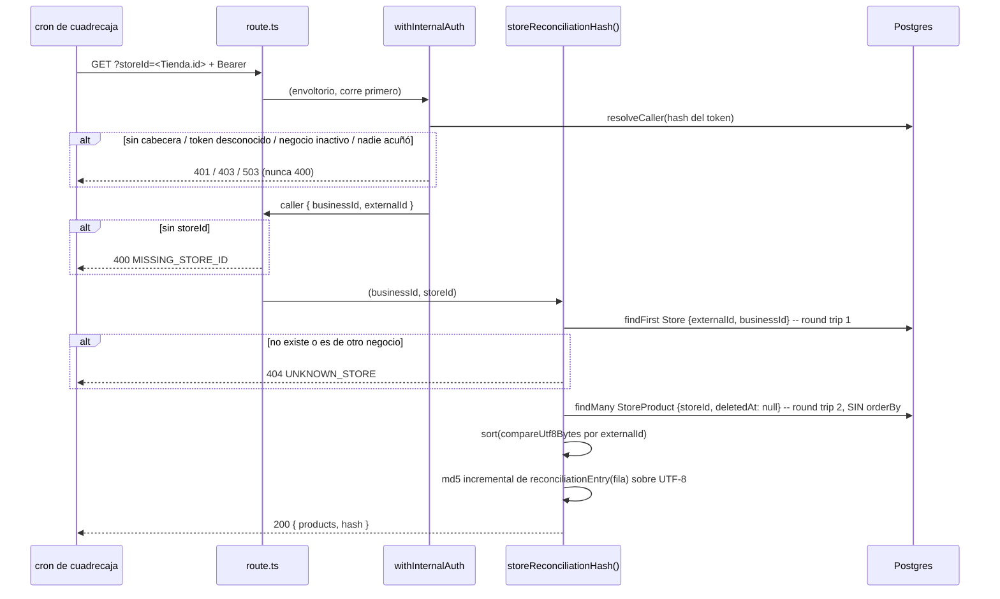

## Estado actual relevante

El endpoint entero existe y **tres de los cinco criterios ya los cumple el
código de hoy**. Lo que falta es una decisión de diseño (el orden), una
documentación (el contrato) y la verificación.

| Archivo                                             | Qué hace hoy                                                                                                                      | Qué le pasa en F-014                              |
| --------------------------------------------------- | --------------------------------------------------------------------------------------------------------------------------------- | ------------------------------------------------- |
| `src/app/api/internal/reconciliation/route.ts`      | 25 líneas: `withInternalAuth`, `400 MISSING_STORE_ID`, `404 UNKNOWN_STORE`, `200 { products, hash }`, `dynamic = "force-dynamic"` | **Nada.** Ni una línea (R16, R18)                 |
| `src/app/api/internal/_lib/guard.ts`                | `503` / `401` / `403` antes del handler                                                                                           | **Nada** (ver § Contratos, E10)                   |
| `src/features/sync/server/reconciliation.ts`        | `findFirst` de la tienda + `findMany` con `orderBy: { externalId: "asc" }` + `md5` incremental                                    | Tres cambios acotados (D1, D3)                    |
| `prisma/schema.prisma`                              | `StoreProduct`, `@@index([storeId, deletedAt, visible])` (línea 449), `enum Availability`                                         | **Nada.** Sin migración (D5)                      |
| `src/features/sync/server/tenantScoping.db.test.ts` | E19: la única prueba viva de `storeReconciliationHash()` (aislamiento entre negocios, I1/I8)                                      | **Nada.** No se duplica ni se mueve               |
| `src/features/marketplace/server/dbFixtures.ts`     | `createFixtureSession()` con `createStore`/`createCanonical`/`createOffer`                                                        | Tres `overrides` opcionales en `createOffer` (D6) |
| `docs/sync-contract.md`                             | § ⑤ con el pseudocódigo; § Endpoints; § «Vocabulario de errores (v5)» sin el `400`                                                | Los tres retoques aditivos de HD1+HD4+HD5         |

Lo que **se reutiliza tal cual**, y por tanto nadie tiene que escribir de nuevo:
el sobre de autenticación (`withInternalAuth`), la resolución de tienda por
`externalId` + `businessId` que produce el `404` indistinguible (I1), el
`select` de cuatro columnas que ya excluye los ocho campos ajenos al sync (I3),
`md5` (R14), las fixtures aisladas por sesión de
`src/features/marketplace/server/dbFixtures.ts`, el estilo de script HTTP de
`scripts/send-catalog-batch.mjs` y `scripts/send-availability-batch.mjs`, y el
patrón de prueba de ruta con `vi.mock` de `@/features/sync/server/caller` que ya
usa `src/app/api/internal/slug-availability/route.test.ts`.

## Decisión

Una frase: **el orden de la cadena canónica deja de delegarse en la colación de
la base y pasa a fijarse en Node por bytes UTF-8**; todo lo demás del endpoint
se queda como está y el resto del feature es documentación y verificación.

### D1 — El orden por bytes (R8) se resuelve ordenando en Node, no en SQL ni con una migración

`findMany` pierde su `orderBy` y el array se ordena en memoria con un
comparador de bytes UTF-8 explícito.

Alternativas descartadas, en una línea cada una:

- **`$queryRaw` con `ORDER BY "externalId" COLLATE "C"`** — correcto, pero
  convierte el código en la misma sentencia SQL que R15, y entonces la prueba
  de C8 compararía una implementación consigo misma; además obliga a
  deserializar `numeric` a mano y pierde el tipado del `select`.
- **Cambiar la colación de la columna (`ALTER TABLE … COLLATE "C"`)** — Prisma
  no representa la colación de una columna Postgres en el schema, así que la
  migración quedaría fuera del modelo declarativo y el siguiente
  `prisma migrate dev` propondría revertirla, exactamente el modo de fallo que
  AGENTS.md § «Cosas que muerden» ya tiene fichado con los cinco índices GIN;
  además reconstruye `@@unique([storeId, externalId])` y cambia el orden de
  cualquier otra consulta sobre esa columna, por un feature que solo necesita
  un orden en un sitio.
- **Dejar `orderBy: { externalId: "asc" }` y confiar** — es el estado de hoy:
  correcto por accidente. Medido abajo: ningún test local puede distinguir el
  fallo.

**Por qué esta y no otra.** El comparador de bytes es una función pura, vive en
`src/lib/`, y **su prueba no toca la base**: se ejecuta igual en musl, en glibc y
en el runner del CI. Eso convierte la regla R8 de «depende del `datcollate` de
quien la corra» en «depende de un `Buffer.compare` que el compilador ve». Y
mantiene C8 honesta: Postgres ordena en su lado con `COLLATE "C"`, Node ordena en
el suyo con `Buffer.compare`, y que coincidan es un acuerdo real entre dos
implementaciones independientes.

**El comparador tiene que ser de bytes UTF-8, no `<` ni `.sort()` ni
`localeCompare`.** El orden por defecto de JavaScript compara unidades de código
UTF-16 y **no** es el orden de bytes. Medido ejecutando sobre el par
`"\uFFFD"` (U+FFFD) y `"\u{10000}"` (U+10000, un par suplente en UTF-16):
`[...].sort()` de JavaScript los deja en el orden `U+10000, U+FFFD`, mientras que
`Buffer.compare` sobre UTF-8 —y Postgres con `COLLATE "C"`— los dejan en el
contrario, `U+FFFD, U+10000`. Ese par es además el **único oráculo que
discrimina**, y por eso C12 gira entero sobre él: los seis `externalId` hostiles
que la spec proponía antes —`A-1`, `Z-9`, `_x`, `a-1`, `a1`, `a_1`— dan **el
mismo** orden con el `ORDER BY` por defecto de Postgres, con `COLLATE "C"`, con
`.sort()` de JavaScript y con `Buffer.compare` (medido). Sirven como caso de
legibilidad, no cuentan como verificación, y **no hace falta escribirlos en la
base**. Ver § Contratos para el detalle y § Riesgos para lo que eso implica.

No hace falta desempate: `@@unique([storeId, externalId])` hace que dentro de
una tienda no haya dos `externalId` iguales, así que el comparador es un orden
total sobre el conjunto que se hashea.

### D2 — El techo declarado es 100 000 filas por tienda, y el índice que hay basta

Medido ejecutando (ver § Escalabilidad para la tabla completa): ~1,3 KB de heap
por fila y 277 ms para 100 000 filas. Se declara el techo en **100 000 filas
vivas por tienda** (≈130 MB de heap de pico, <300 ms de cómputo), con **50 000
como umbral de aviso**. Hoy la tienda más grande de la base local tiene 30
productos vivos y la tabla entera 58: el techo está tres órdenes de magnitud por
encima del dato real, y a ×100 (3 000 filas) el coste es indistinguible de cero.

**No se pagina y no se parte.** Y no hace falta ningún índice nuevo: el
`@@index([storeId, deletedAt, visible])` que ya existe
(`prisma/schema.prisma:449`) es prefijo exacto del `WHERE`, y el `EXPLAIN
(ANALYZE, BUFFERS)` lo confirma usándolo como `Bitmap Index Scan` con 20 000
filas objetivo entre 100 059 de la tabla.

**El techo no se prueba en el CI.** La ficha
`.agent/playbook/search-db-fixture-20k-agota-su-beforeall-en-ci.md` es explícita:
el fixture de 20 000 filas de F-021 ya vive al borde de su presupuesto en un
runner compartido, y una rama que **añade** un `*.db.test.ts` no puede relanzar
el fallo como ajeno. Este feature añade exactamente un archivo a la suite `db`, y
ese archivo siembra **decenas de filas, nunca miles**: la medición del techo la
hizo el arquitecto una vez, está escrita aquí con sus números, y no se paga en
cada `npm test`.

**El techo se escribe además en `docs/despliegue.md`, un renglón** (respuesta del
humano a AP1, PP3 del plan; es el paso 7 y lo escribe el implementador, no este
documento). Motivo del humano: un techo que solo existe en el `architecture.md`
de un feature no lo lee quien recibe la alerta a las tres de la mañana. Nota para
que nadie se alarme al contarlos: eso hace **cuatro** cambios documentales en el
ciclo en vez de tres, pero `docs/despliegue.md` **no es el contrato con
cuadrecaja** — la frontera de HD1 (§ ⑤ + la fila de errores + la frase de § ①)
sigue intacta y el otro equipo no ve nada nuevo.

### D3 — La entrada por fila se construye en un solo sitio; el SQL espejo se duplica **a propósito**

`src/features/sync/server/reconciliation.ts` exporta la construcción de la
entrada de una fila (§ Componentes), y `storeReconciliationHash()` la usa. Ese es
el único sitio de todo el repo donde se escribe la forma
`<externalId>:<precio>:<moneda>:<disponibilidad>|` en TypeScript (R1).

El SQL de R15 **no** se genera desde esa función ni comparte nada con ella: se
escribe a mano, en el archivo de prueba, como traducción literal del SQL de R13
que va al contrato. Es deliberado y es el punto entero de C8: el objetivo es que
**dos implementaciones independientes coincidan**. Si el test compusiera el SQL
desde el mismo código que hashea, pasaría siempre y no probaría nada — la trampa
más fácil de este feature.

Corolario que el implementador tiene que respetar: **la cadena esperada de C9 se
escribe con literales** (`…:1990:…`, `…:1990.5:…`, `…:1990.1:…`, `…:0:…`), nunca
llamando a la función que se está probando.

### D4 — La verificación se reparte en cuatro archivos, y solo uno toca la base

HD6 parte en dos (script HTTP puro / tests contra Postgres) y C12 añadió una
tercera mitad que no es ninguna de las dos, porque prueba una función pura. El
reparto concreto:

1. **scripts/check-reconciliation.mjs (por crear)** — HTTP puro, sin importar
   Prisma. C1, C2, C5, C6, C10.
2. **src/features/sync/server/reconciliation.db.test.ts (por crear)** — **el
   único** archivo que toca la base, proyecto `db`. C3, C4, C8, C9.
3. **src/app/api/internal/reconciliation/route.test.ts (por crear)** — proyecto
   `server`, con `vi.mock` de `@/features/sync/server/caller` y de
   `@/features/sync/server/reconciliation`, **sin base**. C11.
4. **src/lib/byteOrder.test.ts (por crear)** — proyecto `server`, prueba pura del
   comparador de D1. C12 **entero**, con su aserción doble: el comparador ordena
   el par astral `U+FFFD, U+10000` y `.sort()` lo ordena al revés y da un hash
   distinto. No escribe nada en ninguna base y por eso corre igual en musl, en
   glibc y en el runner del CI.

**Un solo archivo `*.db.test.ts` y no cuatro** porque `vitest.config.mts` puso el
proyecto `db` en `fileParallelism: false` cuando F-019 lo llevó al séptimo
archivo, por encima del techo de ~6 que declaró
[ADR 0019](../../../docs/adr/0019-sql-crudo-para-tsvector-y-pruebas-contra-postgres-real.md):
desde entonces cada archivo nuevo cuesta su tiempo **en serie**. Medido hoy: 7
archivos, 77 pruebas, **19,42 s**. El presupuesto para el octavo es ~2 s; si se
pasa, lo que sobra es siembra, no aserciones.

**La prueba de la ruta no va contra la base** — el mismo patrón que
`src/app/api/internal/slug-availability/route.test.ts`. Así C11 no toca el
presupuesto de arriba, y el puente hasta el HTTP se cierra por composición como
dice R15: C8 ata el SQL a la función y C11 ata la función a la ruta.

### D5 — Nada de migración, nada de índice nuevo, nada de schema

Ver D2 y § Modelo de datos. Los dos comandos que AGENTS.md prohíbe no aparecen y
no hacen falta.

### D6 — `dbFixtures.ts` gana dos `overrides` opcionales, no un fixture propio

C9 necesita fijar el precio y la moneda de cada oferta, y `createOffer` hoy los
cablea (`syncedPrice: "1.00"`, `syncedPriceCurrency: "CUP"`). Se añaden **dos**
campos opcionales a su objeto de `overrides` —`syncedPrice` y
`syncedPriceCurrency`— sin tocar ningún llamador existente. `availability` ya es
un `override` desde F-015 y no hay que añadirlo. Alternativa descartada: escribir
las filas con `prisma.storeProduct.create` directamente en el test, que se
saltaría `reindexStoreProduct` y el registro de limpieza de la sesión, y dejaría
filas en una base compartida entre cuatro worktrees.

`externalId` **no** entra en la lista, y eso es una consecuencia directa de cómo
quedó C12: al ser un test unitario del comparador puro, ningún `externalId`
hostil llega nunca a Postgres, así que la fixture no necesita poder fijarlo. El
`externalId` y el `slug` se siguen derivando del token de la sesión, que es lo
que garantiza que dos sesiones simultáneas no choquen contra
`@@unique([storeId, externalId])` ni contra `@@unique([storeId, slug])`.

`syncedPrice` se pasa como **texto decimal exacto** (`"1990.00"`, `"0.00"`),
nunca como `number`: es lo mismo que ya hace el valor cableado de hoy, y un
`number` reintroduciría por la puerta de atrás el redondeo IEEE-754 que R7
existe para evitar.

### D7 — El script escribe solo por el contrato, y dice cómo deshacerlo

`--price` y `--availability` (C2) escriben sobre `seed-tienda-1` a través de
`POST /api/internal/sync/catalog` y `POST /api/internal/sync/availability`, que
es lo que HD6 permite expresamente. No crean filas: modifican dos columnas de dos
productos sembrados, y `npm run seed` las restaura (el upsert del seed escribe
`syncedPrice`/`syncedPriceCurrency` en sus dos ramas). El script lo imprime al
terminar. Tres trampas concretas en § Patrones.

## Componentes

| Componente                                       | Capa                           | Responsabilidad                                                                                                                                              | Archivo                                                           |
| ------------------------------------------------ | ------------------------------ | ------------------------------------------------------------------------------------------------------------------------------------------------------------ | ----------------------------------------------------------------- |
| `compareUtf8Bytes(a, b)`                         | `src/lib/`                     | Comparador puro: orden de bytes de la codificación UTF-8 de dos cadenas. Sin Prisma, sin React. Es la única definición de «orden por bytes» del repo         | src/lib/byteOrder.ts (por crear)                                  |
| `reconciliationEntry(row)`                       | `features/sync/server/`        | Devuelve `` `${externalId}:${syncedPrice.toString()}:${syncedPriceCurrency}:${availability}\|` ``. Único sitio donde se escribe la forma de R1 en TypeScript | `src/features/sync/server/reconciliation.ts` (export nuevo)       |
| `storeReconciliationHash()`                      | `features/sync/server/`        | Igual que hoy, con `orderBy` fuera y `sort(compareUtf8Bytes)` dentro. Misma firma, mismo retorno                                                             | `src/features/sync/server/reconciliation.ts` (modificado)         |
| `GET /api/internal/reconciliation`               | `app/`                         | **Sin cambios**                                                                                                                                              | `src/app/api/internal/reconciliation/route.ts`                    |
| `withInternalAuth`                               | `app/`                         | **Sin cambios**                                                                                                                                              | `src/app/api/internal/_lib/guard.ts`                              |
| `createOffer(..., overrides)`                    | `features/marketplace/server/` | Dos `overrides` opcionales más: `syncedPrice` y `syncedPriceCurrency` (D6)                                                                                   | `src/features/marketplace/server/dbFixtures.ts` (modificado)      |
| Prueba pura del comparador                       | `src/lib/`                     | C12 entero, sin base: el par astral `U+FFFD` / `U+10000` y la aserción doble contra `.sort()`                                                                | src/lib/byteOrder.test.ts (por crear)                             |
| Pruebas del álgebra del hash                     | `features/sync/server/`        | C3, C4, C8, C9 contra Postgres real, fixtures aisladas por sesión                                                                                            | src/features/sync/server/reconciliation.db.test.ts (por crear)    |
| Prueba de la ruta                                | `app/`                         | C11: `200`, `400` sin `storeId`, `404`, y `401`-no-`400` sin cabecera. Con mocks, sin base                                                                   | src/app/api/internal/reconciliation/route.test.ts (por crear)     |
| Verificador del contrato HTTP                    | `scripts/`                     | C1, C2, C5, C6, C10. HTTP puro, sin `import` de Prisma                                                                                                       | scripts/check-reconciliation.mjs (por crear)                      |
| SQL espejo + fila de errores + precondición ≤2 d | `docs/`                        | C7 en sus tres partes (HD1 ampliada por HD4 y HD5)                                                                                                           | `docs/sync-contract.md` § ⑤, § «Vocabulario de errores (v5)», § ① |

src/lib/byteOrder.ts (por crear) es lógica pura y reutilizable sin Prisma ni
React: la capa que AGENTS.md § Arquitectura le asigna. `reconciliationEntry` se
queda en `features/sync/server/` y **no** baja a `src/lib/`, porque su parámetro
es una fila tipada de Prisma (`Prisma.Decimal`) e importar eso cuenta como tocar
Prisma; el mismo criterio que
[ADR 0019](../../../docs/adr/0019-sql-crudo-para-tsvector-y-pruebas-contra-postgres-real.md)
§ Decisión (a) aplica al SQL crudo.

## Flujo de datos



**Dos round-trips por petición, y no se pueden fusionar en uno.** Un único
`findMany` con `where: { store: { externalId, businessId } }` no distingue «la
tienda no existe» (E8 → `404`) de «la tienda existe y está vacía» (E7 → `200` con
`d41d8cd98f00b204e9800998ecf8427e`), que es justo la diferencia que este feature
tiene que sostener. El primer round-trip resuelve por
`Store.externalId @unique`, así que es una búsqueda por índice único.

Ninguna escritura, ningún `$transaction`, ninguna revalidación de caché: R17 se
sostiene por construcción, no por disciplina.

## Contratos

### La función

```ts
// src/features/sync/server/reconciliation.ts — firma SIN CAMBIOS
export async function storeReconciliationHash(
  businessId: string,
  storeExternalId: string,
): Promise<{ products: number; hash: string } | null>;

// export nuevo (D3): la forma de R1, en un solo sitio
export function reconciliationEntry(row: ReconciliationRow): string;
```

`ReconciliationRow` se deriva del propio `select` (`Prisma.StoreProductGetPayload`
sobre el objeto de selección, declarado `as const`), no se reescribe a mano: así
un renombrado de columna rompe la compilación en vez del hash.

```ts
// src/lib/byteOrder.ts (por crear) — puro, sin Prisma
export function compareUtf8Bytes(a: string, b: string): number;
```

Implementación obligada: `Buffer.compare(Buffer.from(a, "utf8"), Buffer.from(b,
"utf8"))`. **Prohibidos** `a < b`, `a.localeCompare(b)`, `[].sort()` sin
comparador e `Intl.Collator`: los cuatro comparan UTF-16 o una locale, no bytes.

Para no re-codificar en cada comparación, el `sort` de
`storeReconciliationHash()` precalcula la clave (`Buffer.from(externalId,
"utf8")`) una vez por fila. Medido sobre 100 000 UUID: **132 ms** con clave
precalculada frente a **312 ms** codificando dentro del comparador.

### Endpoint HTTP — sin ningún cambio

| Código | Cuerpo                               | Cuándo                                                 | Quién lo pone                                |
| ------ | ------------------------------------ | ------------------------------------------------------ | -------------------------------------------- |
| `200`  | `{ products: number, hash: string }` | Tienda del negocio autenticado, exista o no catálogo   | `route.ts`                                   |
| `400`  | `{"error":"MISSING_STORE_ID"}`       | Falta `storeId` o viene vacío, **con token válido**    | `route.ts` (R18: mismo código, mismo cuerpo) |
| `401`  | `{"error":"UNAUTHORIZED"}`           | Sin cabecera, esquema no `Bearer`, o token desconocido | `withInternalAuth`                           |
| `403`  | `{"error":"BUSINESS_INACTIVE"}`      | Token válido de un negocio `active: false`             | `withInternalAuth`                           |
| `404`  | `{"error":"UNKNOWN_STORE"}`          | `storeId` inexistente **o de otro negocio**            | `route.ts`                                   |
| `503`  | `{"error":"SYNC_NOT_CONFIGURED"}`    | Ningún negocio tiene `syncTokenHash`                   | `withInternalAuth`                           |

**E10 describe lo que el guard hace de verdad, y la ruta no necesita nada.**
Comprobado leyendo `src/app/api/internal/_lib/guard.ts:31-58`: el envoltorio
resuelve la identidad **antes** de invocar el handler, así que el `400` de
`route.ts:15-17` es inalcanzable sin autenticar. Un matiz que E10 enuncia como
lista y conviene que el implementador tenga presente al escribir C11: **sin
cabecera** el resultado no es siempre `401` — el guard corre primero la sonda de
configuración (`syncConfigured()`), y responde `503 SYNC_NOT_CONFIGURED` si
ningún negocio tiene token acuñado y `401 UNAUTHORIZED` si alguno lo tiene. Las
dos ramas están en E10 y las dos son correctas; la prueba de C11 tiene que fijar
cuál de las dos está simulando (`syncConfigured` mockeado a `true` para el caso
`401`), como ya hace `src/app/api/internal/slug-availability/route.test.ts`.

### El SQL espejo local (R15), tal cual va en el test

Se escribe **a mano** en src/features/sync/server/reconciliation.db.test.ts (por
crear), con `Prisma.sql` y el `storeId` ligado como parámetro (nunca
`$queryRawUnsafe`, ADR 0019 (a)):

```sql
SELECT count(*) AS products,
       md5(coalesce(string_agg(
              "externalId" || ':' ||
              trim(trailing '.' from
                   trim(trailing '0' from round("syncedPrice"::numeric, 2)::text)) || ':' ||
              "syncedPriceCurrency" || ':' || "availability"::text || '|',
              '' ORDER BY "externalId" COLLATE "C"
            ), '')) AS hash
FROM "StoreProduct"
WHERE "storeId" = $1 AND "deletedAt" IS NULL;
```

Dos detalles de tipos para quien lo implemente: `count(*)` vuelve como `bigint`
(en JS, `BigInt` o cadena según el driver) y hay que compararlo convertido, no
con `toBe(4)` a secas; y la variante **sin normalizar** que exige C8
(`"syncedPrice"::text` a secas) tiene que dar un hash **distinto** — si diera el
mismo, es que el fixture no tiene ningún precio con cero de cola y la aserción
está pasando por casualidad.

Verificado ejecutando durante esta arquitectura, con 100 000 filas de un solo
lote: el SQL de arriba y `storeReconciliationHash()` devolvieron el mismo hash,
`6db1887410958c74c8270533a8efb77e`.

### El script HTTP

`node scripts/check-reconciliation.mjs <modo>`. Estilo y convenciones idénticos a
`scripts/send-catalog-batch.mjs`: `import "dotenv/config"`, `QAB_BASE_URL` con
`http://localhost:3000` por defecto, `QAB_BEARER_TOKEN` o `--token=`, salida
legible, **sin ningún `import` de Prisma**, y código de salida ≠ 0 en cuanto algo
no cuadra.

| Modo               | Criterio | Qué hace                                                                                                                                            |
| ------------------ | -------- | --------------------------------------------------------------------------------------------------------------------------------------------------- |
| `--store=<id>`     | C1       | `GET` con ese `storeId`. Exige `200`, exactamente las claves `products` y `hash`, y `/^[0-9a-f]{32}$/`                                              |
| `--price`          | C2       | hash → `PRODUCT`/`UPDATE` con un `price` nuevo → hash. Falla si el hash no cambió o si `products` cambió                                            |
| `--availability`   | C2       | Fija `AVAILABLE` → hash → fija `OUT_OF_STOCK` → hash → restaura `AVAILABLE`. Falla si los dos hashes son iguales o si `products` cambió             |
| `--unknown-store`  | C5       | `GET` con un `storeId` inventado. Exige `404` y el cuerpo literal `{"error":"UNKNOWN_STORE"}`                                                       |
| `--other-business` | C6       | `GET` con `seed-tienda-7`. Compara **código y cuerpo byte a byte** con los de `--unknown-store`, que ejecuta en la misma corrida. Falla si difieren |
| `--empty`          | C10      | `GET` con `seed-tienda-8`. Exige `200` y `{"products":0,"hash":"d41d8cd98f00b204e9800998ecf8427e"}`. Falla explícitamente si la respuesta es `404`  |
| `--all`            | —        | Corre los seis en orden y sale ≠ 0 si alguno falla. Es lo que se pega en la casilla de progreso                                                     |

El token tiene que ser el de `seed-negocio-1` (`npm run mint:token --
seed-negocio-1`) o los modos de escritura responden `403 BUSINESS_MISMATCH`, la
misma nota que ya llevan los dos scripts existentes.

## Modelo de datos y migraciones

**Ninguna migración. Ningún índice nuevo. `prisma/schema.prisma` no se toca.**

El `@@index([storeId, deletedAt, visible])` de `prisma/schema.prisma:449` cubre
el `WHERE` con prefijo exacto (`storeId` por igualdad, `deletedAt IS NULL` por
igualdad). Medido con `EXPLAIN (ANALYZE, BUFFERS)`, 20 000 filas en la tienda
objetivo y 80 000 de relleno en otra (100 059 en la tabla), tras `ANALYZE`:

| Consulta                                  | Plan                                                                                           | Tiempo     |
| ----------------------------------------- | ---------------------------------------------------------------------------------------------- | ---------- |
| Sin `ORDER BY` (**la que se implementa**) | Bitmap Index Scan `StoreProduct_storeId_deletedAt_visible_idx` → Bitmap Heap Scan, 772 bloques | **4,1 ms** |
| `ORDER BY "externalId"` (la de hoy)       | El mismo scan **+ nodo Sort**, quicksort, 2 331 kB                                             | 14,3 ms    |
| `ORDER BY "externalId" COLLATE "C"`       | El mismo scan **+ nodo Sort**, quicksort, 3 027 kB                                             | 5,8 ms     |

Quitar el `orderBy` no es solo una consecuencia de D1: **elimina un nodo `Sort`**
y deja la consulta 3,5× más rápida en la base local. El nodo de ordenación que
desaparece es además el que, por encima de `work_mem`, se convertiría en un
merge externo a disco.

Un dato que conviene tener escrito porque contradice la intuición: el `COLLATE
"C"` ordena **más rápido** que la colación declarada (5,8 ms frente a 14,3 ms),
porque `en_US.utf8` pasa por `strcoll` y `C` es un `memcmp`. Es lo mismo que hace
`Buffer.compare` en Node.

## Escalabilidad y límites

Medido ejecutando contra `localhost:5433` (PostgreSQL 16.15 sobre
`aarch64-unknown-linux-musl`, Prisma 7.9.1, Node 24.13.1), una sola tienda, con
`storeReconciliationHash()` tal cual está hoy:

| Filas vivas en la tienda | `findMany` + md5 | Δ heap del proceso | Heap por fila |
| ------------------------ | ---------------- | ------------------ | ------------- |
| 1 000                    | 101 ms\*         | 15,3 MB            | —             |
| 5 000                    | 18 ms            | 5,8 MB             | —             |
| 20 000                   | 95 ms            | 25,6 MB            | 1,28 KB       |
| 50 000                   | 164 ms           | 61,4 MB            | 1,26 KB       |
| 100 000                  | 277 ms           | 65,2 MB†           | ~1,3 KB       |

\* Incluye el primer round-trip de conexión del proceso. † El GC corrió a mitad
de la medición; el `heapTotal` llegó a 210 MB. La cifra que hay que usar para
dimensionar es **~1,3 KB de heap por fila**, que incluye el búfer de texto del
driver `pg` y el objeto `Decimal` de Prisma, no solo los cuatro campos.

**Lo que se rompe primero, y a qué número.** No es el tiempo (100 000 filas se
hashean en 277 ms, y el SQL equivalente dentro de Postgres tarda 83 ms): es la
**memoria del proceso**, porque el driver `pg` bufferiza el conjunto entero antes
de que Prisma lo deserialice, y las dos copias conviven un instante. A 1,3 KB por
fila, 100 000 filas son ~130 MB de pico dentro de una función que en Vercel tiene
un techo de memoria fijo. Por eso el techo declarado es **100 000 filas vivas por
tienda** y el umbral de aviso **50 000** (~65 MB): el margen de 2× está para el
pico transitorio y para la fragmentación.

**Multiplicar por 100.**

- **×100 en productos por tienda**: hoy la tienda más grande de la base local
  tiene 30 filas vivas (58 en toda la tabla). ×100 son 3 000 filas: ~4 MB y
  decenas de ms. No se rompe nada; el techo está 33× por encima de eso.
- **×100 en tiendas**: 1 100 tiendas × 1 corrida diaria = 1 100 peticiones al
  día. El coste por petición no depende del número de tiendas (el `WHERE` está
  indexado por `storeId`). Lo único que crece es la **concurrencia** si el cron
  del POS dispara las 1 100 en paralelo: cada petición ocupa una conexión del
  pool (`max: 5` por instancia) contra Supavisor en modo transacción. Está fuera
  del alcance (§ Fuera: el cron es de cuadrecaja), pero conviene decírselo al
  otro equipo cuando se les entregue el SQL: **serializar o limitar la
  concurrencia de su cron**, no abrirlo en abanico.
- **×100 en filas totales de `StoreProduct`** sin que crezca ninguna tienda: no
  cambia nada, el índice hace el trabajo (verificado con 100 059 filas en la
  tabla y 20 000 en la tienda objetivo).

**Pooler, caché, ISR, JavaScript de cliente**: nada de esto aplica. Dos
round-trips secuenciales, ninguno dentro de un `$transaction` (la restricción del
modo transacción de Supavisor que AGENTS.md § «Cosas que muerden» documenta no se
roza); `dynamic = "force-dynamic"` ya está y es correcto (la respuesta depende de
la query y de la cabecera, no se cachea); `/api/internal/*` no renderiza nada, así
que el presupuesto de `npm run check:bundle` no se mueve **ni un byte**.

**Presupuesto de la suite `db`**: hoy 7 archivos / 77 pruebas / **19,42 s** en
serie (`fileParallelism: false`). El archivo nuevo tiene que quedarse en ~2 s;
las fixtures de C3, C4, C8 y C9 suman del orden de 10 filas `StoreProduct` en dos
tiendas de sesión (una con las cuatro formas de precio, otra vacía para el caso
de E7). C12 no aparece en esta cuenta porque no toca la base.

## Patrones a seguir / antipatrones a evitar

**Seguir**

- Las cuatro columnas del `select` y ni una más (R9, I3). AGENTS.md § Arquitectura:
  todo lo que toca Prisma vive en `features/*/server/`.
- `Prisma.sql` con el `storeId` ligado, nunca `$queryRawUnsafe`
  ([ADR 0019](../../../docs/adr/0019-sql-crudo-para-tsvector-y-pruebas-contra-postgres-real.md)
  § Decisión (a)).
- Fixtures aisladas por sesión, jamás truncar ni `prisma migrate reset`
  (AGENTS.md § Comandos prohibidos, ADR 0019 (d)).
- La prosa que se escriba en `.agent/` y en `docs/` pasa por `npm run format`
  **antes** de dar la etapa por buena, y un archivo que aún no existe se cita
  **sin comillas invertidas y con «(por crear)»** (AGENTS.md § «Cosas que
  muerden»; ya costó rojos en F-011, F-017 y en el ciclo anterior de este mismo
  feature).

**Evitar**

- **Usar `src/lib/money.ts` para serializar el precio del hash.** Es la
  equivocación más probable de todo el feature: existe un módulo de dinero, y su
  `Money.amount` es por definición «exact decimal string, **always with 2
  fraction digits**» (`src/lib/money.ts:22`) — o sea `1990.00`, que es exactamente
  la serialización que R4 prohíbe y la que produce el hash equivocado
  (`c9ef1f16…` en vez de `e894ce15…`, medido en la spec). Aquí va
  `Decimal.toString()` de Prisma y nada más.
- **Ordenar por la cadena de la entrada en vez de por `externalId`.** Si dos
  `externalId` son uno prefijo del otro, el orden cambia: `"a"` va antes que
  `"a1"` por bytes, pero `"a:1:CUP:AVAILABLE|"` va **después** de
  `"a1:…"` porque `:` (0x3A) es mayor que `1` (0x31). Se ordena la fila por su
  `externalId`, y luego se concatena.
- **`.sort()` sin comparador, `<`, `localeCompare` o `Intl.Collator`** para el
  orden de R8 (ver D1: no son el orden de bytes).
- **Volver a meter un `orderBy` en el `findMany`.** No es «inofensivo por si
  acaso»: reintroduce la dependencia de la colación que este feature existe para
  quitar, y añade un nodo `Sort` de 2,3 MB.
- **Componer el SQL de la prueba desde el código que se está probando** (D3), y
  **construir la cadena esperada de C9 llamando a `reconciliationEntry`**. Las
  dos convierten una prueba en una tautología.
- **Reutilizar el mismo `eventId` entre corridas del script.** El inbox es
  idempotente por `eventId`: la segunda corrida de `--price` respondería
  `duplicate`, el precio no cambiaría y el modo fallaría por una razón que no es
  la que dice. `scripts/send-catalog-batch.mjs` ya resuelve esto con un sufijo
  `Date.now().toString(36)`; se copia.
- **Reenviar el mismo `price` o el mismo `availability`.** Si el valor no cambia,
  el hash no cambia y el modo falla en verde-falso. `--price` deriva el precio
  del reloj (con **dos decimales como máximo**, R7); `--availability` fuerza
  primero `AVAILABLE` y luego `OUT_OF_STOCK`, para no depender del estado de
  partida (`applyAvailability` actualiza con `NOT: { availability }`, así que
  reenviar el mismo valor aplica 0 filas).
- **Mandar un `updatedAt` rancio** en el `PRODUCT` de `--price`: la guarda
  `sourceUpdatedAt` lo descartaría en silencio.
- **Sembrar miles de filas en el `*.db.test.ts`** (D2 y la ficha
  `.agent/playbook/search-db-fixture-20k-agota-su-beforeall-en-ci.md`).
- **Importar Prisma desde scripts/check-reconciliation.mjs (por crear)** (HD6).

## Riesgos y plan B

**R-A — Ningún dato normal puede fallar por la colación, y eso no cambia.**
Medido: sobre los seis `externalId` hostiles (`A-1`, `Z-9`, `_x`, `a-1`, `a1`,
`a_1`), el orden por defecto de la base local, el `COLLATE "C"`, el `.sort()` de
JavaScript y `Buffer.compare` dan los cuatro el mismo resultado. La base local es
musl y colaciona como `C` aunque declare `en_US.utf8` (confirmado: `PostgreSQL
16.15 on aarch64-unknown-linux-musl`, `datcollate = en_US.utf8`), y en producción
—Supabase sobre glibc— no lo es. **Mitigación, en dos mitades y ya cerrada**: D1
mueve la corrección del entorno al código, y la prueba pura de
src/lib/byteOrder.test.ts (por crear) sí discrimina en cualquier máquina gracias
al par `"\uFFFD"` / `"\u{10000}"`, donde el orden por defecto de JavaScript da lo
contrario que los bytes y que Postgres.

Este riesgo se planteó en el ciclo anterior como una sugerencia a `sdd-spec` —los
seis hostiles no discriminan nada y C12 pasaría con un `.sort()`— y **ya está
resuelto**: la spec reescribió C12 como test unitario sin base sobre el par
astral, con aserción doble al estilo de C8 (el comparador da `U+FFFD, U+10000`;
`.sort()` da el contrario y por tanto un hash distinto). Los seis hostiles siguen
nombrados en la spec como caso de legibilidad, etiquetados como lo que son. Queda
escrito aquí por si alguien los ve en el criterio y los da por verificación.

**R-B — La suite `db` se acerca a su límite.** Octavo archivo, en serie, sobre
19,42 s actuales. **Plan B** si el CI empieza a agotar tiempos: fundir las
pruebas de C3/C4 (que solo necesitan escribir columnas del panel) dentro del
`describe` que ya existe en `src/features/sync/server/tenantScoping.db.test.ts`, y
dejar el archivo nuevo solo con C8/C9. No se hace de entrada porque mezclar
dos features en un archivo se paga en legibilidad para siempre.

**R-C — Una tienda pasa del techo de 100 000 filas.** **Plan B, sin cambiar el
contrato**: mover el cómputo entero a un `$queryRaw` con el SQL de R15, que
calcula el md5 dentro de Postgres (83 ms para 100 000 filas, memoria constante en
Node, un solo round-trip). Es idéntico por construcción y **no altera la cadena
canónica**: lo que R8 y el caso límite de la spec prohíben es partir el hash en
varios trozos, no calcularlo en otro sitio. Precio que hay que pagar con los ojos
abiertos si se activa: C8 pasaría a comparar el SQL consigo mismo y dejaría de
significar nada, así que ese día C8 se sustituye por un hash dorado fijo más los
literales de C9. **No se implementa ahora**: el techo está 3 300× por encima del
dato real.

**R-D — El equipo de cuadrecaja implementa el SQL y no coincide.** El límite
honesto de R15 ya está escrito en la spec y tiene que ir literal en § ⑤: la
prueba de aquí valida el orden, los separadores y la serialización del precio, y
**no** valida los nombres de las columnas del otro lado, ni el `JOIN` con
`Producto`, ni el `coalesce` de `dispPublicada`. **Mitigación aprobada por el
humano y ya firmada como paso 6 del plan**: junto al SQL de § ⑤ va un vector de
prueba —cuatro filas con `1990.00`, `1990.50`, `1990.10` y `0.00`, y el md5 que
tienen que obtener— para que el otro equipo se autoverifique **sin** nuestra
base. Ya no es una recomendación al implementador: es un paso del plan. Es
aditivo y cabe dentro de § ⑤, así que no ensancha la frontera de HD1. Condición
que el implementador no puede saltarse: **ese md5 se calcula ejecutando y se pega
verificado**, nunca a mano — un vector de prueba equivocado es peor que no
tenerlo, porque el otro equipo depuraría contra un número falso.

**R-E — `md5` en un Node con FIPS activado.** Ya está evaluado en R14 y no es el
caso de Vercel ni del entorno local. Sin acción.

## ¿Hace falta una ADR?

**Sí, una: propuesta, no escrita.** El siguiente número libre es **0027** y el
título propuesto es **«El orden de una cadena canónica que cruza la frontera se
fija en el código, no en la colación de la base»**.

Por qué merece ADR y no solo esta arquitectura: sobrevive a F-014. Cualquier
checksum, `ETag`, firma o cursor estable que se compare con cuadrecaja —o con
cualquier otro sistema— tiene el mismo problema, y hoy la respuesta correcta solo
existiría en el `architecture.md` de un feature. La ADR fijaría tres cosas: (1) un
orden que cruza la frontera se determina en el código, nunca por `ORDER BY` sin
`COLLATE`; (2) «orden de bytes» significa `Buffer.compare` sobre UTF-8, y `<` /
`localeCompare` están prohibidos para eso; (3) el entorno de desarrollo (musl,
que colaciona como `C`) **no puede detectar** la violación, así que la
verificación va en una prueba pura con un caso que discrimine. Y registraría el
descarte del `ALTER … COLLATE`, con su motivo: Prisma no modela la colación de
columna y el siguiente `migrate dev` la revertiría.

**Aprobada, y explícitamente diferida a un ciclo posterior a F-014** (respuesta
del humano a AP2, PP2 del plan: «En un ciclo aparte, tras cerrar F-014»). Motivo
del humano: la regla ya está escrita y medida en D1, así que no corre peligro de
perderse, y meter la ADR dentro de este ciclo alargaría la firma de algo que ya
está decidido.

Para quien lo retome: esto es **trabajo aceptado y pendiente**, no una propuesta
sin responder. Ni este agente ni el implementador de F-014 escriben
`docs/adr/0027-…`; se abre después de cerrar el feature, con el razonamiento y el
título de arriba tal cual.

## Preguntas al humano

**Ninguna abierta.** Hubo dos —AP1 y AP2— y el humano las respondió el
2026-08-31, las dos por la opción recomendada. El orquestador se las llevó dentro
de `.agent/specs/F-014/plan.md`, donde figuran como **PP3** y **PP2**. Quedan
aquí con su respuesta porque cambian dónde se escriben dos cosas, y quien
implemente necesita saberlo sin volver a preguntar.

**AP1 (= PP3) — El techo de catálogo se anota también en `docs/despliegue.md`.**
Respuesta: «Sí, un renglón» — la opción (a) recomendada. Un renglón con las dos
cifras: **100 000 filas vivas por tienda, aviso a 50 000**. Motivo del humano: un
techo que solo existe en el `architecture.md` de un feature no lo lee quien
recibe la alerta a las tres de la mañana. **Lo escribe el implementador**, es el
paso 7 del plan, y no lo cuenta ningún criterio. Consecuencia que conviene tener
escrita: los cambios documentales del ciclo pasan a ser **cuatro** en vez de tres,
pero `docs/despliegue.md` no es el contrato con cuadrecaja, así que **la frontera
de HD1 no se mueve** y el otro equipo no ve nada nuevo. Concretado en D2.

**AP2 (= PP2) — La ADR 0027 se aprueba, y se escribe en un ciclo aparte.**
Respuesta: «En un ciclo aparte, tras cerrar F-014» — la opción (b) recomendada.
Motivo del humano: la regla ya está escrita y medida en D1, así que no se pierde,
y abrir la ADR aquí alargaría la firma de algo ya decidido. En este ciclo **no se
crea ningún archivo en `docs/adr/`**. Concretado en § ¿Hace falta una ADR?, donde
queda marcada como trabajo aceptado y pendiente, no como propuesta sin responder.

Y una tercera cosa que no era pregunta mía pero cierra el ciclo: **el aviso sobre
C12 quedó resuelto por `sdd-spec`.** El criterio ya no manda escribir seis
`externalId` hostiles en Postgres; es un test unitario y sin base del comparador
puro, sobre un conjunto que incluye el par astral, con aserción doble. Este
documento está alineado con esa versión: ver D1, D4, D6, § Componentes,
§ Escalabilidad y R-A.
