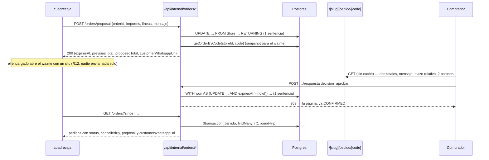

> Entrada: `.agent/specs/F-019/spec.md` (E1–E24, R1–R22, I1–I9) y las **ocho
> decisiones del humano** de `.agent/progress/F-019.md` (tandas 1 y 2). Ninguna
> se reabre aquí: este documento decide **la forma**, que es lo que la spec dejó
> abierto en § «No decidido a propósito».
>
> Lo que aquí se afirma sobre SQL **se ejecutó** contra el Postgres local
> (contenedor `queandabuscando-postgres`, PG 16.15, puerto 5433), en
> transacciones con `ROLLBACK` y sobre tablas temporales con la forma real de
> `Order`/`OrderItem`/`Store`: la sentencia de aprobar (§ DA3) y la de proponer
> (§ DA2) están probadas, incluida la segunda ejecución que afecta 0 filas. Lo
> que son estimaciones va marcado como tal.

## Estado actual relevante

| Pieza                                                 | Hoy                                                                        | Qué se hace con ella                                       |
| ----------------------------------------------------- | -------------------------------------------------------------------------- | ---------------------------------------------------------- |
| `prisma/schema.prisma` (`OrderStatus`)                | Seis valores, línea 41                                                     | +3 valores (R1)                                            |
| `prisma/schema.prisma` (`Order`)                      | `cancelReason String?` sin atribución; sin reloj                           | +12 columnas, todas nullable (§ Modelo de datos)           |
| `prisma/schema.prisma` (`Store`)                      | Sin plazo de vencimiento                                                   | +`orderExpiryHours Int @default(24)`                       |
| `src/features/orders/server/read.ts`                  | `getOrderByCode(storeId, rawCode)` → `OrderSnapshot`; `orderWhatsappUrl()` | Gana la propuesta en el `select` y en el tipo. Mismo query |
| `src/features/orders/server/pull.ts`                  | `pullOrders()` con `include`, marca `PENDING → PULLED`                     | `select` explícito, 3 campos nuevos y el barrido delante   |
| `src/features/orders/server/status.ts`                | `setOrderStatus()` — `updateMany` acotado por `businessId`                 | +`cancelledBy`, enum ampliado. Sin guardas (R15)           |
| `src/features/orders/server/createOrder.ts:87`        | `getOrderByCode(store.slug, code)` — **el bug I2**                         | Pasa a `store.id` (SP6)                                    |
| `src/features/orders/whatsapp.ts`                     | `buildWhatsappUrl()` comprador → tienda, puro                              | Gana dos constructores tienda → comprador (R12)            |
| `src/features/orders/components/OrderStatusBadge.tsx` | `switch` exhaustivo **sin `default`** (I1)                                 | +3 casos. El guardarraíl se conserva                       |
| `src/app/[slug]/pedido/[code]/page.tsx`               | 100% servidor, `dynamic`, `revalidate = 0`, cero módulos de cliente (DP2)  | +bloque de propuesta y +formulario. Sigue con cero         |
| `src/app/api/internal/orders/route.ts`                | `withInternalAuth`, `pullOrders(caller.businessId, …)`                     | Sin cambios: el barrido vive dentro de `pullOrders`        |
| `src/app/api/internal/orders/status/route.ts`         | Zod `z.enum(["CONFIRMED","READY","DELIVERED","CANCELLED"])`                | Enum a seis valores; `AWAITING_CUSTOMER` fuera (E19)       |
| `src/app/api/crons/purge-sso-tokens/route.ts`         | `GET`, `force-dynamic`, `Bearer $CRON_SECRET`, `401`, JSON con el conteo   | Es el patrón; se le extrae el guard compartido             |
| `vercel.json`                                         | **Un** cron diario (`0 4 * * *`)                                           | +1 cron diario (§ El reloj)                                |
| `src/lib/env.ts:12`                                   | `CRON_SECRET` ya en el esquema, opcional                                   | **Sin cambios**: ninguna variable de entorno nueva         |

Se reutiliza **tal cual**, sin tocar: `src/lib/prisma.ts`, `src/lib/money.ts`
(toda la aritmética de importes), `src/lib/orderCode.ts`,
`src/lib/publicSlug.ts`, `src/features/storefront/server/resolve.ts`,
`src/app/api/internal/_lib/guard.ts` y `src/app/api/internal/_lib/issues.ts`,
`src/features/orders/components/OrderLinesTable.tsx`,
`src/features/orders/schemas.ts` (se le añaden esquemas; los existentes no se
tocan) y todo el mecanismo de revalidación por tag — **este feature no invalida
ninguna caché**: la página del pedido nunca se cacheó (R17) y el catálogo no
depende de `Order`.

## Decisión

Seis decisiones, `DA1`–`DA6`. Cada una fija una de las cosas que la spec dejó
abiertas.

### DA1 — La propuesta vive en la propia fila `Order`, no en una tabla aparte

Doce columnas nullable en `Order` —los importes propuestos, el total anterior,
el mensaje, los dos instantes, el desenlace y la atribución— más **una** columna
`Json?` con las líneas propuestas. Cero tablas nuevas, cero `join` nuevos.

**Alternativas descartadas, en una línea cada una.** _Tabla `OrderProposal` 1:1_:
añade una consulta a la página del pedido, que es `force-dynamic` y se pinta en
**cada** visita, incluida la mayoría que no tiene ninguna propuesta.
_`OrderProposal` + `OrderProposalItem` con índice único parcial_ («una sola
propuesta viva»): Prisma no sabe expresar un índice parcial, así que habría que
escribirlo en SQL crudo y **entraría en el club de los cinco índices que
`prisma migrate dev` propone borrar en cualquier diff futuro** (AGENTS.md §
«Cosas que muerden») — ampliar esa lista de cinco a seis es exactamente el tipo
de deuda que ya nos costó caro. _Versionar el pedido_ (una fila `Order` por
versión): el cursor del pull es `Order.id`, así que una versión nueva le llega
al POS como un **pedido nuevo** y rompe el contrato en su punto más sensible.

**Por qué esta forma gana en el criterio que me toca, escalabilidad, con los
números.** La propuesta es el camino **normal**, no la excepción: el disparador
más frecuente es el costo de envío, que se fija al gestionar el pedido, así que
hay del orden de una propuesta por cada pedido de esa modalidad. A 100× de la
escala de hoy —100 tiendas × 50 pedidos/día ≈ 5.000 pedidos/día ≈ 1,8 M de filas
`Order` al año— una tabla de líneas propuestas habría añadido ~4 filas por
propuesta, entre 5 y 9 M de filas al año **cuyo único propósito es copiarse una
vez a `OrderItem` y no volver a leerse jamás**. La forma elegida añade 0 filas.

Los dos caminos calientes no pagan nada:

- **La página del pedido**: sigue con **una** consulta (`getOrderByCode`), la
  misma de hoy con más columnas en el `select`. Con tabla aparte serían dos, en
  una página sin caché.
- **El pull** (cada 2 minutos por negocio, hasta 500 pedidos por página): **0
  consultas nuevas**. Las doce columnas son escalares; el `Json?` de las líneas
  **no entra en el `select`** (§ DA5), así que no viaja ni a la memoria del
  handler ni a la respuesta.

Y el modelo dice la misma verdad que la regla: **solo hay una propuesta viva por
pedido**, que es literalmente lo que R2/E13 exigen («la segunda reemplaza a la
primera»). Un modelo que permitiera dos obligaría a defender con un índice lo
que aquí es imposible por construcción.

**Qué pasa con `OrderItem` al aprobar: se reemplaza.** Las líneas vigentes se
borran y las propuestas se insertan, en la misma sentencia (§ DA3). Consecuencia
aceptada a sabiendas: **las líneas anteriores a una aprobación no se conservan**.
Los importes sí (`previousTotal`), que es lo que R3 y el criterio 1 piden. Y
mientras la propuesta está viva —el único momento en que la comparación importa,
E3— **conviven las dos listas sin duplicar nada**: `OrderItem` tiene las
vigentes (R2: la propuesta no las toca) y `proposedItems` las propuestas. Eso le
deja a `sdd-designer` las dos opciones que tiene abiertas (diferencia línea a
línea o las dos listas completas) sin pedir ni una consulta más.

### DA2 — Proponer: `POST /api/internal/orders/proposal`, una sentencia, sin leer antes de escribir

Ruta interna nueva, hermana de `/api/internal/orders/status`, bajo el mismo
`withInternalAuth` (F-018: la identidad llega como parámetro, no como booleano).
La escritura es **una sola sentencia** `UPDATE … FROM "Store" … RETURNING`, con
`Prisma.sql` —nunca `$queryRawUnsafe`, la convención de
`src/features/marketplace/server/searchVector.ts`—:

```sql
UPDATE "Order" o
   SET status            = 'AWAITING_CUSTOMER'::"OrderStatus",
       "proposedAt"      = now(),
       "expiresAt"       = now() + make_interval(hours => s."orderExpiryHours"),
       "previousTotal"   = o.total,          -- el vigente, leído en la misma sentencia
       "proposedSubtotal" = $3::numeric(14,2), …
       "proposedItems"   = $8::jsonb,
       "proposalMessage" = $9,
       "proposalOutcome" = NULL, "proposalDecidedAt" = NULL,
       "cancelledBy"     = NULL, "cancelReason" = NULL,
       "updatedAt"       = now()
  FROM "Store" s
 WHERE o."storeId" = s.id
   AND o.id = $1 AND o."businessId" = $2
   AND o."currencyCode" = $10
   AND o.status IN ('PULLED','CONFIRMED','AWAITING_CUSTOMER')
RETURNING o.id, o.code, o."storeId", o."expiresAt", o."previousTotal",
          o."proposedTotal", o."currencyCode";
```

Tres cosas que esta forma compra y que un «leer, calcular, escribir» pierde:

1. **`previousTotal = o.total` es atómico.** Si se leyera antes, entre la lectura
   y la escritura el comprador podría aprobar la propuesta anterior (E13 permite
   proponer sobre `AWAITING_CUSTOMER`) y se guardaría como «total anterior» uno
   que ya no lo es. Medido: en la prueba con `ROLLBACK`, `previousTotal` sale
   `100.00` mientras `proposedTotal` es `150.00`, con el `SET` leyendo la fila
   **antes** de la actualización, que es la semántica de SQL.
2. **`Store.orderExpiryHours` no cuesta una consulta**: entra por el `FROM`, y
   `make_interval(hours => …)` calcula `expiresAt` con el reloj **del servidor de
   la base**, el mismo `now()` contra el que después compara todo el mundo. R5
   («reloj absoluto, todo en UTC») y R7 («`expiresAt` se congela al proponer»)
   quedan garantizadas por construcción: nadie recalcula ese instante nunca más.
3. **El estado admisible va en el `WHERE`**, así que un pedido en `PENDING`,
   `READY`, `DELIVERED` o `CANCELLED` afecta 0 filas y no escribe nada (E4).

Con 0 filas afectadas se hace **una** lectura de clasificación (`id`+`businessId`)
para poder responder distinto a «no existe / no es tuyo» (`404`), «moneda
distinta» (`400`) y «estado no proponible» (`409`, con el estado actual). Es la
única consulta extra y solo ocurre en el camino de error.

Con 1 fila afectada se hace **una** lectura más: `getOrderByCode(storeId, code)`,
para construir el `wa.me` desde el snapshot **persistido** y con el slug
canónico, reutilizando exactamente la misma función que usa la página (es la
disciplina que `createOrder.ts` ya documenta: nunca desde una cotización en
memoria). Proponer cuesta entonces **2 round-trips**, y es una acción humana de
frecuencia ~1 por pedido: no hay nada que optimizar ahí.

### DA3 — Aprobar y rechazar: una sentencia con CTE, sin `$transaction`

El pooler de Supabase corre en modo transacción y el cliente global no puede
usarse dentro de un `$transaction` (ficha `pooler-transaccion-deadlock`). Aprobar
necesita **tres** escrituras atómicas —cambiar el pedido, borrar sus líneas,
insertar las propuestas—, y partirlas en tres `await` deja una ventana en la que
el pedido queda `CONFIRMED` con los importes nuevos y las líneas viejas: eso
rompería `Σ lineTotal = subtotal`, una invariante que `docs/sync-contract.md`
promete que **siempre** se sostiene.

La solución es una sola sentencia con CTE modificadoras. Postgres la ejecuta en
su transacción implícita, así que es atómica sin `$transaction` y cuesta **un
round-trip**:

```sql
WITH won AS (
  UPDATE "Order"
     SET status = 'CONFIRMED'::"OrderStatus",
         subtotal = "proposedSubtotal", "discountTotal" = "proposedDiscountTotal",
         "deliveryFee" = "proposedDeliveryFee", total = "proposedTotal",
         "proposalOutcome" = 'APPROVED'::"ProposalOutcome",
         "proposalDecidedAt" = now(), "updatedAt" = now()
   WHERE id = $1 AND "storeId" = $2
     AND status = 'AWAITING_CUSTOMER'::"OrderStatus"
     AND "expiresAt" > now()
  RETURNING id, "proposedItems"
), cleared AS (
  DELETE FROM "OrderItem" WHERE "orderId" IN (SELECT id FROM won) RETURNING 1
), inserted AS (
  INSERT INTO "OrderItem" (id, "orderId", "storeProductId", name, "unitPrice",
                           "currencyCode", quantity, "lineTotal",
                           "originalUnitPrice", "originalCurrencyCode")
  SELECT gen_random_uuid()::text, won.id, li."storeProductId", li.name, li."unitPrice",
         li."currencyCode", li.quantity, li."lineTotal",
         li."originalUnitPrice", li."originalCurrencyCode"
    FROM won, jsonb_to_recordset(won."proposedItems") AS li(…)
  RETURNING 1
)
SELECT id FROM won;
```

**Ejecutado y comprobado** (transacción con `ROLLBACK`, tablas temporales con la
forma real): la fila queda `CONFIRMED` con el total propuesto, la línea vieja
desaparece, entra la propuesta, **`rateSnapshot` queda intacto** —no está en el
`SET`, criterio 6— y la **segunda** ejecución de la misma sentencia devuelve 0
filas y deja `OrderItem` con una sola línea, sin borrar ni insertar nada (E7,
R14).

Cuatro detalles que no son obvios y que el implementador necesita:

- **Las CTE se ordenan por dependencia de datos, no por el orden en que se
  escriben.** `cleared` e `inserted` referencian `won`, así que solo hacen algo
  si el `UPDATE` ganó. Y el `INSERT` **no** ve las filas que `cleared` borra —
  todas las CTE comparten el mismo snapshot—, así que el borrado no se lleva por
  delante lo recién insertado. Es la parte que había que probar, y está probada.
- **`OrderItem.id` es `text` sin `DEFAULT` en la base** (verificado con `\d`):
  Prisma genera el uuid en el cliente. Aquí lo genera Postgres, y hay que
  castear: `gen_random_uuid()::text`.
- **Los importes viajan como `numeric(14,2)`**, nunca como `float`. `Json` los
  guarda como cadenas (el precedente es `Order.rateSnapshot`), y
  `jsonb_to_recordset` los castea al tipo declarado en la lista de columnas.
- **`expiresAt > now()` va en el `WHERE`, no en un `if` previo** (R8, E11). Es la
  defensa 3 de la [ADR 0024](../../../docs/adr/0024-segunda-ruta-publica-de-escritura.md).

Rechazar es la misma sentencia sin las dos CTE de líneas: `status = 'CANCELLED'`,
`cancelledBy = 'CUSTOMER'`, `proposalOutcome = 'REJECTED'`,
`cancelReason = ORDER_REJECTED_BY_CUSTOMER_REASON` (constante del servidor,
`src/constants/orders.ts`: el comprador no aporta texto — defensa 6 de la ADR
0024). Los importes **no** se tocan: rechazar deja el pedido como estaba y lo
cancela.

### DA4 — La respuesta del comprador: route handler con formulario, no Server Action

`POST /[slug]/pedido/[code]/respuesta`, un route handler en
src/app/[slug]/pedido/[code]/respuesta/route.ts (por crear), al que la página
apunta con un `<form method="post">` y dos botones `submit`
(`name="decision"`, `value="aprobar"` / `value="rechazar"`).

**Por qué no una Server Action**, aunque Next las promociona progresivamente:

1. **El guion de humo tiene que poder aprobar con `curl`** (criterio 2: «aprueba
   por la ruta pública»). El identificador de una Server Action lo acuña el build
   y cambia con él: no hay `curl` estable contra ella. Esto solo ya decide.
2. Este repo **no tiene ni una** Server Action. Introducir la primera es una
   decisión de estilo que F-019 no necesita tomar y que nadie ha pedido.
3. R16 exige que responder no dependa del JavaScript. Un `<form method="post">`
   no depende de nada: ni de hidratación, ni del runtime del router, ni de que la
   promoción progresiva se comporte como se espera en el navegador del comprador.
4. La página conserva **cero módulos de cliente propios** (F-010 DP2) y el
   presupuesto de bundle no se mueve ni un KB.

**Un contrato, dos representaciones.** La ruta decide por `Accept`; el cuerpo se
lee siempre con `request.formData()`:

| Resultado                    | Navegador (`Accept: text/html`)                       | Máquina (resto)                                          |
| ---------------------------- | ----------------------------------------------------- | -------------------------------------------------------- |
| Aplicado                     | `303` → `/[slug]/pedido/[code]?r=aprobada\|rechazada` | `200 {"status","applied":true}`                          |
| Repetido (misma decisión)    | `303` → mismo destino                                 | `200 {"status","applied":false}` (E7)                    |
| Decisión contraria           | `303` → `…?r=conflicto`                               | `409 {"error":"PROPOSAL_ALREADY_DECIDED","status"}` (E7) |
| Vencida (fila aún esperando) | `303` → `…?r=vencida`                                 | `409 {"error":"PROPOSAL_EXPIRED","status"}` (E11)        |
| Sin propuesta viva           | `303` → `…?r=no-disponible`                           | `409 {"error":"NO_LIVE_PROPOSAL","status"}` (E8)         |
| Código desconocido / ajeno   | `303` → la página, que responde `404`                 | `404 {"error":"UNKNOWN_ORDER"}` (R22)                    |
| Cuerpo inválido              | `303` → `…?r=no-disponible`                           | `400 {"error":"INVALID_DECISION"}`                       |
| Demasiados intentos          | `303` → `…?r=demasiados-intentos`                     | `429` con `Retry-After`                                  |

El `303` es POST/Redirect/GET: recargar después de responder no reenvía el
formulario, y el estado que el comprador lee lo pinta **la página**, que ya es
dinámica y sabe la verdad. La ruta **nunca** renderiza HTML. Los valores de `r`
y de `decision` van en español, como `?admin=sesion-requerida` de
`src/proxy.ts`, y como constantes en `src/constants/orders.ts` (AGENTS.md
prohíbe los magic strings).

**Cómo se decide `200` idempotente contra `409`.** Regla única, evaluada solo
cuando el `UPDATE` afectó 0 filas y con **una** lectura:

- `proposalOutcome` **coincide** con la decisión recibida → `200`, nada cambió.
- No coincide (incluido `NULL`) → `409` con el estado actual; y si además el
  estado sigue siendo `AWAITING_CUSTOMER`, el error es `PROPOSAL_EXPIRED`,
  porque lo único que pudo fallar es el `expiresAt` (E11, E12).

Esa regla cubre E7, E8 y E11 sin ninguna excepción especial, y es la razón de que
`proposalOutcome` exista como columna en vez de deducirse de `status`: si un
pedido aprobado por el comprador lo cancela después la tienda, `status` deja de
contar la historia y `proposalOutcome` sí.

Las nueve defensas de esta ruta —y por qué es aceptable que sea la **segunda**
ruta pública de escritura del sistema— están en la
[ADR 0024](../../../docs/adr/0024-segunda-ruta-publica-de-escritura.md), que es
donde el humano firma esa decisión.

### DA5 — El barrido del reloj vive dentro del pull, en el mismo round-trip que la lectura

Decisión SP5 del humano: **cron diario + barrido en el pull**. La forma:

```ts
// features/orders/server/pull.ts
const [, rows] = await prisma.$transaction([
  expireProposalsQuery(businessId), // UPDATE condicional, acotado al negocio
  prisma.order.findMany({ … }), // ve el resultado del barrido
]);
```

**Va antes de leer y en el mismo round-trip**, con `$transaction` en **forma de
array** —nunca la interactiva—, que es el patrón que este repo ya usa y documenta
en `src/features/storefront/server/registry.ts:369`: «el cliente global no tiene
un “dentro” que malusar en la forma de array». Es exactamente la prescripción de
AGENTS.md para el pooler: batchear en un solo round-trip en vez de encadenar
llamadas.

Por qué **antes** y no después ni en paralelo: si el barrido corriera después, o
a la vez con `Promise.all`, el POS recibiría como `AWAITING_CUSTOMER` un pedido
que en ese mismo instante acabamos de cancelar, y se enteraría dos minutos más
tarde. Dentro de la misma transacción, el `findMany` ve el `UPDATE` y el POS
recibe `CANCELLED` con su atribución `EXPIRY` en la **primera** entrega (E10,
E17).

Por qué no alarga el pull de forma perceptible, con el número: el barrido es
**un** `UPDATE` condicional sobre `(businessId, status, expiresAt)` que en la
inmensa mayoría de las llamadas afecta **0 filas** y se resuelve como una sonda
del índice existente `Order(businessId, status, id)`. No añade round-trip alguno
—va en el mismo lote que la lectura— y las filas candidatas de un negocio son,
como mucho, sus propuestas vivas: decenas hoy, cientos a 100×. El coste dominante
del pull sigue siendo el `findMany` de hasta 500 pedidos con sus líneas.

Idempotencia (R14, exigida por SP5): la condición incluye
`status = 'AWAITING_CUSTOMER'`, y el propio barrido saca de ahí a las filas que
toca. **Un segundo barrido afecta 0 filas** porque no queda ninguna fila que
cumpla la condición — no porque nadie lleve la cuenta de si ya se ejecutó. Dos
barridos solapados, o el cron y el pull a la vez, se serializan en el bloqueo de
fila de Postgres y el segundo re-evalúa el `WHERE` sobre la versión nueva: la
salta. Es el mismo mecanismo que resuelve E14.

Y el `select` del pull pasa a ser **explícito** en vez de `include`: hoy trae
todas las columnas escalares de `Order`, y con DA1 eso incluiría el `Json` de las
líneas propuestas. Con `select` explícito ese JSON no se lee nunca en el pull.

### DA6 — `IN_TRANSIT` y `REJECTED_BY_STORE` entran por la ruta de reporte que ya existe

Ninguna ruta nueva (R15, R19). `POST /api/internal/orders/status` amplía su
`z.enum` a seis valores —`CONFIRMED`, `READY`, `IN_TRANSIT`, `DELIVERED`,
`CANCELLED`, `REJECTED_BY_STORE`— y **no** admite `AWAITING_CUSTOMER`, que cae
como `400 INVALID_BODY` con su `issue` (E19): ese estado solo lo pone la acción
de proponer, que es la única que fija un `expiresAt`.

`setOrderStatus` gana una línea: `cancelledBy = "STORE"` cuando el estado
reportado es `CANCELLED` o `REJECTED_BY_STORE`, y `null` en los demás. Se calcula
en TypeScript desde la entrada, no desde la fila vieja, así que sigue siendo
**un** `updateMany` y no hace falta un `CASE`. **No se tocan las columnas de la
propuesta**: `expiresAt` no se limpia nunca. No hace falta — toda escritura
condicionada exige `status = 'AWAITING_CUSTOMER'`, así que un `expiresAt` viejo
no puede provocar ninguna escritura equivocada, y conservarlo deja el rastro de
cuándo vencía.

## Componentes

| Componente                                                | Capa                          | Responsabilidad                                                                          | Archivo                                                          |
| --------------------------------------------------------- | ----------------------------- | ---------------------------------------------------------------------------------------- | ---------------------------------------------------------------- |
| `proposeOrderChange()`                                    | `features/orders/server/`     | La sentencia de DA2 + clasificación del 0-filas + el `wa.me` hacia el comprador          | src/features/orders/server/proposal.ts (por crear)               |
| `respondToProposal()`                                     | `features/orders/server/`     | Las dos sentencias de DA3 y la regla `200`/`409`                                         | src/features/orders/server/respond.ts (por crear)                |
| `expireProposalsQuery()`                                  | `features/orders/server/`     | El `UPDATE` condicional del vencimiento, sin `await`, para el lote de DA5 y para el cron | src/features/orders/server/expiry.ts (por crear)                 |
| `proposalState()`, `remainingLabel()`                     | `features/orders/`            | Puro: vive/vencida/decidida y «te quedan unas N horas» (R18)                             | src/features/orders/deadline.ts (por crear)                      |
| `buildProposalWhatsappUrl()`, `buildCustomerContactUrl()` | `features/orders/`            | Puros: los dos mensajes tienda → comprador (R12, R13)                                    | `src/features/orders/whatsapp.ts`                                |
| `fixedWindow()`                                           | `lib/`                        | Límite de tasa por clave, ventana fija, reloj inyectado (defensa 9 de la ADR 0024)       | src/lib/rateLimit.ts (por crear)                                 |
| Esquemas Zod de la propuesta                              | `features/*/schemas.ts`       | Forma del cuerpo de proponer + aritmética de importes                                    | `src/features/orders/schemas.ts`                                 |
| Tipos de hilo                                             | `features/orders/`            | `ProposalPayload`, `ProposalResponse`, `ProposalDecision`                                | `src/features/orders/types.ts`                                   |
| Constantes                                                | `src/constants/`              | Motivos fijos, valores de `decision` y de `?r=`, tope de intentos                        | `src/constants/orders.ts`                                        |
| Ruta de proponer                                          | `app/`                        | HTTP ↔ `proposeOrderChange()`, bajo `withInternalAuth`                                   | src/app/api/internal/orders/proposal/route.ts (por crear)        |
| Ruta de responder                                         | `app/`                        | HTTP ↔ `respondToProposal()`; `formData`, `Accept`, `303`/JSON                           | src/app/[slug]/pedido/[code]/respuesta/route.ts (por crear)      |
| Cron de vencimiento                                       | `app/`                        | Barrido global diario, red de seguridad                                                  | src/app/api/crons/expire-proposals/route.ts (por crear)          |
| Guard de crons                                            | `app/`                        | `Bearer $CRON_SECRET` o `401`, extraído de la ruta que ya lo hace                        | src/app/api/crons/\_lib/guard.ts (por crear)                     |
| Bloque de la propuesta                                    | `features/orders/components/` | Los dos totales, el mensaje, el plazo y el formulario. **Copia: `sdd-designer`**         | src/features/orders/components/OrderProposalCard.tsx (por crear) |
| Insignia de estado                                        | `features/orders/components/` | +3 casos en el `switch` exhaustivo. **Copia: `sdd-designer`**                            | `src/features/orders/components/OrderStatusBadge.tsx`            |
| Guion de modos                                            | `scripts/`                    | `--propose --approve --reject --expire --outcomes --transit --link-on-create`            | scripts/renegotiate-order.mjs (por crear)                        |
| Envoltorio de humo                                        | `.agent/specs/F-019/`         | Prefija `SMOKE FAIL` para que el sensor lo pesque                                        | .agent/specs/F-019/smoke.sh (por crear)                          |

Ningún componente rompe la tabla de capas de AGENTS.md: **lo único que toca
Prisma** son los tres módulos de `features/orders/server/`; `src/app/` solo mapea
a HTTP; `src/lib/` no ve Prisma ni React; la insignia y el bloque de propuesta
son componentes de servidor **sin** `"use client"`.

## Flujo de datos



## Contratos

### `POST /api/internal/orders/proposal` (nuevo, interno, `withInternalAuth`)

```ts
// features/orders/schemas.ts — server-only, como el resto de este archivo
const proposalItemSchema = z.object({
  storeProductId: z.string().uuid().nullish(),
  name: z.string().trim().min(1).max(200),
  unitPrice: decimalStringSchema, // ^\d+(\.\d+)?$ — un negativo no pasa la forma
  currencyCode: z.string().length(3),
  quantity: z.string().regex(/^\d+(\.\d{1,3})?$/),
  lineTotal: decimalStringSchema,
  originalUnitPrice: decimalStringSchema.optional(),
  originalCurrencyCode: z.string().length(3).optional(),
});

export const proposeOrderChangeSchema = z
  .object({
    orderId: z.string().min(1),
    currencyCode: z.string().length(3),
    subtotal: decimalStringSchema,
    discountTotal: decimalStringSchema.default("0"),
    deliveryFee: decimalStringSchema,
    total: decimalStringSchema,
    message: z.string().trim().max(ORDER_NOTES_MAX_LENGTH).nullish(),
    items: z.array(proposalItemSchema).min(1).max(CART_MAX_LINES), // 50, el tope de F-010
  })
  .superRefine(
    /* Σ lineTotal = subtotal; total = subtotal − discountTotal + deliveryFee;
                   toda línea en la misma moneda que el cuerpo — con lib/money, no con Number */
  );
```

Respuesta `200`:

```jsonc
{
  "ok": true,
  "status": "AWAITING_CUSTOMER",
  "expiresAt": "2026-08-31T14:19:43.000Z",
  "currencyCode": "CUP",
  "previousTotal": "880.00",
  "proposedTotal": "1180.00",
  "orderUrl": "https://…/tienda-demo/pedido/A7K3M9PQR2",
  "customerWhatsappUrl": "https://wa.me/5355555555?text=…", // hacia el COMPRADOR
  "customerWhatsappReason": null, // "NO_PHONE_DIGITS" cuando el enlace es null (R13)
}
```

| Código | Cuerpo                                      | Cuándo                                                             |
| ------ | ------------------------------------------- | ------------------------------------------------------------------ |
| `400`  | `{"error":"INVALID_JSON"}`                  | El cuerpo no es JSON                                               |
| `400`  | `{"error":"INVALID_BODY","issues":[…]}`     | Zod: forma, aritmética, 0 líneas, >50 líneas, importe negativo     |
| `400`  | `{"error":"INVALID_ORDER_ID"}`              | `orderId` no es un entero                                          |
| `400`  | `{"error":"CURRENCY_MISMATCH"}`             | La moneda propuesta no es la de `Order.currencyCode` (R10)         |
| `404`  | `{"error":"UNKNOWN_ORDER"}`                 | No existe **o es de otro negocio** — el mismo código, a propósito  |
| `409`  | `{"error":"ORDER_NOT_PROPOSABLE","status"}` | El pedido no está en `PULLED`/`CONFIRMED`/`AWAITING_CUSTOMER` (E4) |
| `500`  | `{"error":"PROPOSAL_FAILED"}`               | Cualquier otra cosa; nada escrito                                  |

### `POST /[slug]/pedido/[code]/respuesta` (nuevo, público, sin sesión)

Cuerpo: `application/x-www-form-urlencoded`, tope **1 KB**, un solo campo útil:
`decision` ∈ `aprobar` · `rechazar`. Tabla de respuestas y regla `200`/`409`: §
DA4. Defensas: [ADR 0024](../../../docs/adr/0024-segunda-ruta-publica-de-escritura.md).

### `POST /api/internal/orders/status` (existente, ampliado)

`status` ∈ `CONFIRMED` · `READY` · `IN_TRANSIT` · `DELIVERED` · `CANCELLED` ·
`REJECTED_BY_STORE`. `AWAITING_CUSTOMER` → `400`. Sin guardas de transición (R15:
el POS es la autoridad, R7 de F-007).

### `GET /api/internal/orders` (existente, tres campos nuevos)

```jsonc
{
  "id": "42",
  "status": "AWAITING_CUSTOMER", // el enum pasa de 6 a 9 valores — NO es aditivo
  "cancelledBy": null, // "CUSTOMER" | "EXPIRY" | "STORE" | null  (R9)
  "customerWhatsappUrl": "https://wa.me/…", // hacia el comprador; null sin dígitos (E24, I3)
  "proposal": {
    // presente SOLO mientras status = AWAITING_CUSTOMER
    "proposedAt": "2026-08-30T14:19:43.000Z",
    "expiresAt": "2026-08-31T14:19:43.000Z",
    "previousTotal": "880.00",
    "subtotal": "1000.00",
    "discountTotal": "0",
    "deliveryFee": "180.00",
    "total": "1180.00",
    "message": "El envío a Playa cuesta 180.",
  },
}
```

`proposal.items` **no** viaja: las líneas las compuso el propio POS y devolvérselas
son ~400 B por pedido × 500 pedidos por página sin que nadie los use. Los importes
sí, porque son lo que el POS necesita para conciliar sin guardar estado.

### Tipos de hilo

`ProposalPayload`, `ProposalResponse` y `ProposalDecision` van en
`src/features/orders/types.ts` y los esquemas Zod se comprueban contra ellos con
`satisfies`, como ya hace ese archivo — así la validación del servidor no puede
derivar en silencio de lo que el contrato publica. Ninguno de los tipos nuevos
llega al árbol de cliente (no hay árbol de cliente aquí).

## Modelo de datos y migraciones

### Enums

```prisma
enum OrderStatus {
  PENDING
  PULLED
  AWAITING_CUSTOMER  // nuevo
  CONFIRMED
  READY
  IN_TRANSIT         // nuevo
  DELIVERED
  CANCELLED
  REJECTED_BY_STORE  // nuevo
}

/// Quién cerró el pedido. `cancelReason` sigue siendo el mensaje humano; esto
/// es lo que se puede decidir por programa (I4, R9).
enum OrderCancelledBy { CUSTOMER  EXPIRY  STORE }

/// Cómo terminó la ÚLTIMA propuesta. Separado de `status` a propósito: el POS
/// puede mover el estado después y la historia de la propuesta no se pierde.
enum ProposalOutcome { APPROVED  REJECTED  EXPIRED }
```

### `Order` — doce columnas, todas nullable

| Columna                 | Tipo                         | Para qué                                                                |
| ----------------------- | ---------------------------- | ----------------------------------------------------------------------- |
| `expiresAt`             | `DateTime?`                  | R5/R7. Se congela al proponer y **no se limpia nunca**                  |
| `proposedAt`            | `DateTime?`                  | Cuándo se propuso (E13 reinicia el reloj)                               |
| `proposalMessage`       | `String?` (≤500)             | El mensaje de la tienda (E2)                                            |
| `previousTotal`         | `Decimal? @db.Decimal(14,2)` | R3. El «total anterior» que ve el comprador                             |
| `proposedSubtotal`      | `Decimal? @db.Decimal(14,2)` | Los cuatro importes propuestos; se copian a las columnas                |
| `proposedDiscountTotal` | `Decimal? @db.Decimal(14,2)` | vigentes **solo** al aprobar (R2)                                       |
| `proposedDeliveryFee`   | `Decimal? @db.Decimal(14,2)` |                                                                         |
| `proposedTotal`         | `Decimal? @db.Decimal(14,2)` |                                                                         |
| `proposedItems`         | `Json?`                      | Líneas propuestas, importes como **cadenas** (igual que `rateSnapshot`) |
| `proposalOutcome`       | `ProposalOutcome?`           | La regla `200`/`409` de DA4                                             |
| `proposalDecidedAt`     | `DateTime?`                  | Cuándo se resolvió; único dato para «cuánto tardó el comprador»         |
| `cancelledBy`           | `OrderCancelledBy?`          | R9, criterio 5. `null` mientras el pedido no esté cerrado               |

`Store` gana `orderExpiryHours Int @default(24)` (R5). Es **de queandabuscando**
(R20): el handler del sync escribe una lista explícita de columnas
(`src/features/sync/server/handlers/store.ts`), así que ningún evento `STORE`
puede pisarla — la propiedad no depende de que nadie la recuerde.

### Índices: **ninguno nuevo**, con el umbral escrito

Las dos consultas del reloj son:

- barrido del pull → `WHERE businessId = … AND status = 'AWAITING_CUSTOMER' AND expiresAt < now()`,
  que entra por el prefijo del índice existente `Order(businessId, status, id)`;
- barrido del cron → `WHERE status = 'AWAITING_CUSTOMER' AND expiresAt < now()`,
  por el prefijo de `Order(status, id)`.

`AWAITING_CUSTOMER` es un estado **transitorio**: sus filas son, como mucho, las
propuestas vivas de la plataforma. Con el default de 24 h y 5.000 pedidos/día a
100×, eso son del orden de **cientos** de filas, no millones; filtrar `expiresAt`
sobre ese conjunto es gratis y no justifica pagar un índice más en la tabla más
escrita del sistema. **Umbral para reabrirlo**: si las filas vivas en
`AWAITING_CUSTOMER` pasan de ~10.000 en la plataforma, se añade
`@@index([status, expiresAt])` — declarado en el schema, no en SQL crudo, para
que Prisma lo vea.

### La migración

Un solo archivo, prisma/migrations/&lt;timestamp&gt;\_order_renegotiation/migration.sql
(por crear), generado con `npm run db:migrate` (`prisma migrate dev`) y
**revisado antes de aplicarlo**. `prisma migrate reset` y `prisma db push` están
prohibidos por AGENTS.md y aquí no hacen falta: todo es aditivo y nullable salvo
`Store.orderExpiryHours`, que trae `DEFAULT 24` y no reescribe ninguna fila de
`Order`.

Tres cosas que hay que mirar en el `migration.sql` generado:

1. **Quitar los cinco `DROP INDEX`** de los índices GIN/parciales que no están en
   el schema (`CanonicalProduct_searchVector_idx`, `CanonicalProduct_name_trgm_idx`,
   `StoreProduct_visible_catalog_idx`, `StoreProduct_searchVector_idx`,
   `StoreProduct_searchDocument_trgm_idx`). Prisma los propone borrar en
   cualquier diff, tenga que ver o no; aplicarlo sin mirar no rompe ningún test y
   deja la búsqueda haciendo scans secuenciales en producción (AGENTS.md § «Cosas
   que muerden», ficha `prisma-migrate-dev-borra-indices-gin-no-declarados`).
2. **`ALTER TYPE … ADD VALUE` y la transacción.** Prisma envuelve cada migración
   en una transacción, y Postgres **no deja usar** una etiqueta de enum recién
   añadida dentro de la misma transacción que la añadió. Esta migración no la
   necesita —no hay backfill que escriba `AWAITING_CUSTOMER` ni ninguno de los
   otros dos valores—, así que un solo archivo basta. **Si alguien añade después
   un `UPDATE` que use una etiqueta nueva, tiene que ir en una migración
   separada.**
3. El orden importa: `CREATE TYPE` de los dos enums nuevos antes del `ALTER TABLE`
   que los usa. Prisma ya lo genera así; hay que confirmarlo, no suponerlo.

Sin backfill: `cancelledBy` queda `NULL` en los pedidos ya cancelados (no hay
forma de saber quién los canceló y el contrato dice que `null` significa
exactamente eso, «no consta»).

## El reloj

Tres piezas, y ninguna es la única defensa del plazo.

1. **La condición de escritura** (R8). Toda transición que saque a un pedido de
   `AWAITING_CUSTOMER` por decisión del comprador lleva `expiresAt > now()` en el
   mismo `WHERE`. Aunque el cron y el barrido no corrieran nunca, una propuesta
   vencida **no se puede aprobar** (E11) y la página la lee como vencida (E12,
   con `proposalState()` recalculado en cada petición porque esa página no se
   cachea, R17).
2. **El barrido del pull** (DA5). Acotado al `businessId` que llama, en el mismo
   lote que la lectura, cada ~2 minutos. Es el que de verdad mantiene fresco el
   estado que ve el POS.
3. **El cron diario**, src/app/api/crons/expire-proposals/route.ts (por crear):
   `GET`, `dynamic = "force-dynamic"`, `Authorization: Bearer $CRON_SECRET`,
   `401` si falta o no coincide, y JSON `{ "expired": n }` — el mismo patrón,
   línea por línea, que `src/app/api/crons/purge-sso-tokens/route.ts`, cuyo
   guard se extrae a src/app/api/crons/\_lib/guard.ts (por crear) y se usa desde
   las dos rutas (mismo comportamiento, cero duplicación de autenticación).
   Corre el barrido **sin `businessId`**: es la red de seguridad para las tiendas
   que no pullean. En `vercel.json`, `"schedule": "0 5 * * *"` — una hora después
   de la purga de tokens, para no solaparlas.

**La carrera entre aprobar y vencer** (E14) la resuelve Postgres, no el código.
Los dos son `UPDATE` condicionales sobre la misma fila: el segundo espera al
bloqueo del primero y, al despertar, **re-evalúa su `WHERE` contra la versión
nueva** —`READ COMMITTED`— y ya no encuentra `status = 'AWAITING_CUSTOMER'`. Gana
exactamente uno; el perdedor afecta 0 filas y **no escribe nada**. El pedido
queda `CONFIRMED` **o** `CANCELLED`/`EXPIRY`, nunca a medio camino.

**Por qué un segundo barrido afecta 0 filas**: porque el primero cambió `status`,
que está en la condición. No hay marca de «ya ejecutado» que mantener, ni fecha
de última ejecución que guardar, ni riesgo de que dos crons solapados hagan el
trabajo dos veces. Esa es la definición operativa de idempotente que pide R14 y
la que verifica el criterio 4(b) contra Postgres real, en
src/features/orders/server/expiry.db.test.ts (por crear).

## Los siete puntos del contrato

`docs/sync-contract.md` necesita una **Versión 5**. Este documento la
**especifica y no la escribe**: al otro lado hay otro equipo y el texto lo
aprueba el humano. Lo que la v5 tiene que decir, punto por punto:

1. **Encabezado y § «Cambios respecto a la v4»**: la versión pasa a
   `**Versión 5**` con su fecha (el criterio 8 hace `grep -n 'Versión 5'`), y
   **la primera frase tiene que decir que NO es aditiva**, con las mismas
   palabras con que la v4 lo dijo del `payload` de `PRODUCT`: _«Esta versión NO
   es aditiva en el enum de estados de pedido»_. Un lector con un `switch`
   exhaustivo —el mismo patrón que este repo usa en su insignia— se rompe con los
   tres valores nuevos (I5). Decirlo es el punto entero.
2. **§ ③④, el enum del pull pasa de 6 a 9 valores**, con cuándo aparece cada uno:
   `AWAITING_CUSTOMER` (hay una propuesta esperando al comprador; solo la pone
   `/orders/proposal`), `IN_TRANSIT` (entre `READY` y `DELIVERED`, lo reporta el
   POS) y `REJECTED_BY_STORE` (la tienda no pudo atenderlo; **no** es un
   `CANCELLED`).
3. **§ ③④, `POST /orders/status` amplía su enum** a `IN_TRANSIT` y
   `REJECTED_BY_STORE`, y **rechaza `AWAITING_CUSTOMER` con `400`**. La línea
   vigente —«`status` ∈ `CONFIRMED` · `READY` · `DELIVERED` · `CANCELLED`. Sin
   cambios en la v2»— **deja de ser cierta** y hay que reescribirla, no ampliarla
   de paso.
4. **Endpoint nuevo en la tabla de § Endpoints y su apartado propio**:
   `POST /api/internal/orders/proposal`, con el cuerpo, la respuesta y las dos
   reglas que el POS tiene que respetar: los importes llegan **ya en
   `Order.currencyCode`** (aprobar no reconvierte nada, y `rateSnapshot` no se
   toca jamás) y `Σ lineTotal = subtotal` se sigue exigiendo también aquí. La
   respuesta incluye `expiresAt` y el `wa.me` **hacia el comprador** —o `null`
   con `customerWhatsappReason`, R13— y el POS debe entender que **queandabuscando
   no envía ese mensaje**: lo abre una persona (R12, decisión SP3).
5. **§ ③④, cómo se distinguen los tres desenlaces**: campo `cancelledBy` en el
   payload del pull, con `"CUSTOMER"` (el comprador rechazó), `"EXPIRY"` (venció
   sin respuesta, con `cancelReason` = «La propuesta venció sin respuesta»),
   `"STORE"` (lo cerró la tienda) y `null` (no consta / pedido no cerrado).
   `REJECTED_BY_STORE` se distingue por `status`, no por este campo. Más los dos
   campos nuevos **aditivos** del payload: `proposal` (solo con
   `status = AWAITING_CUSTOMER`) y `customerWhatsappUrl`.
6. **§ Vocabulario de errores, dos filas nuevas**:
   `409 ORDER_NOT_PROPOSABLE` (con el `status` actual en el cuerpo) y
   `400 CURRENCY_MISMATCH`. El `400 INVALID_BODY` y el `404 UNKNOWN_ORDER` ya
   existen y valen tal cual — y `UNKNOWN_ORDER` sigue siendo el mismo código para
   «no existe» y «es de otro negocio».
7. **`Store.orderExpiryHours` es de queandabuscando** (R20): el POS no lo envía,
   no aparece en el `payload` de `STORE` y un evento `STORE` no lo pisa. Y sigue
   valiendo **todo lo demás**: el cursor por negocio, el `404` idéntico para un
   recurso ajeno, que el pull nunca borra un pedido y que solo `PENDING` pasa a
   `PULLED` — un pedido en `AWAITING_CUSTOMER` **no** lo pisa el pull (E18).

## Escalabilidad y límites

Volumen de referencia: hoy, 1 negocio y 1 pedido en la base local. Escala de
trabajo a 100×: **100 tiendas × ~50 pedidos/día ≈ 5.000 pedidos/día ≈ 1,8 M de
filas `Order` al año**, con una propuesta por cada pedido con envío.

| Camino                | Round-trips                    | Coste                                                                               |
| --------------------- | ------------------------------ | ----------------------------------------------------------------------------------- |
| Proponer (POS)        | 2 (3 si falla)                 | 1 `UPDATE … FROM` + 1 `getOrderByCode`. Frecuencia ~1 por pedido                    |
| Responder (comprador) | **1**, 2 en el camino de error | 1 sentencia con CTE. Cero filas creadas si falla                                    |
| Barrido en el pull    | **0 adicionales**              | Va en el mismo `$transaction([…])` que el `findMany`; afecta 0 filas casi siempre   |
| Pull completo         | igual que hoy                  | `select` explícito en vez de `include`: el `Json` de la propuesta **nunca** se lee  |
| Cron diario           | 1                              | Un `UPDATE` sobre cientos de filas como mucho                                       |
| Página del pedido     | igual que hoy                  | La propuesta viaja en la **misma** fila; 0 consultas nuevas                         |
| JavaScript de cliente | **+0 KB**                      | Formulario nativo y route handler; la página conserva cero módulos de cliente (DP2) |

**Qué se rompe primero al multiplicar por 100.** Por orden:

1. **El tamaño de la página del pull.** `customerWhatsappUrl` añade ~200 B por
   pedido (el mensaje hacia el comprador es corto a propósito: saludo, código,
   tienda y URL — no es un recibo). Con el `limit` máximo de 500 pedidos son
   ~100 KB extra por respuesta. Es el primer número que conviene vigilar; si
   molesta, la salida es emitirlo solo para pedidos en estado no terminal, lo que
   lo divide aproximadamente por dos.
2. **`proposedItems` en filas históricas.** Hasta 50 líneas × ~120 B ≈ 6 KB por
   propuesta, que Postgres saca de línea (TOAST) por encima de 2 KB y que **solo**
   se lee en la página del pedido y dentro de la sentencia de aprobar. A 1,8 M de
   pedidos/año son del orden de 3–10 GB/año de TOAST si todos tuvieran propuesta:
   el candidato natural a purga (y la razón de que `select` explícito en el pull
   no sea un detalle).
3. **Las filas vivas en `AWAITING_CUSTOMER`.** Cientos a 100×; a partir de ~10.000
   toca el índice de § Índices.

Nada de esto toca ISR ni el `matcher` de `src/proxy.ts`: el proxy **no** debe
tocar `/[slug]`, y la ruta nueva de respuesta vive bajo `/[slug]` precisamente
para no pedirle nada al proxy. Es un route handler, siempre dinámico; no lleva
`export const revalidate`, así que tampoco puede caer en la trampa del literal.

## Patrones a seguir / antipatrones a evitar

- **Nunca «leer y después escribir»** para decidir una transición. `UPDATE`
  condicional y «filas afectadas = 0» (R14; misma disciplina que la idempotencia
  del checkout, defensa 1 de la ADR 0016).
- **`$transaction` solo en forma de array**, nunca la interactiva con el cliente
  global dentro (AGENTS.md § «Cosas que muerden», ficha
  `pooler-transaccion-deadlock`; precedente
  `src/features/storefront/server/registry.ts:369`).
- **SQL crudo siempre con `Prisma.sql`**, nunca `$queryRawUnsafe` ni
  interpolación de cadenas (`src/features/marketplace/server/searchVector.ts`).
- **Prisma solo en `features/*/server/`** — la ruta de respuesta vive en
  `src/app/` y no puede importar Prisma; ESLint lo impide (AGENTS.md §
  Prohibiciones).
- **El `switch` sin `default` de `OrderStatusBadge` es un guardarraíl** (I1): se
  le añaden los tres casos, **no** se le pone un `default` que apague el
  typecheck.
- **Cero magic strings**: los motivos fijos, los valores de `decision` y los de
  `?r=` van a `src/constants/orders.ts`.
- **Sin `"use client"`**: nada de lo que se añade tiene estado ni eventos.
- **Idempotencia y guarda anti-rancio del sync intactas**: este feature no añade
  ningún handler de sync, y `Store.orderExpiryHours` queda fuera de la lista de
  columnas que el handler de `STORE` escribe.
- **Los importes, con `src/lib/money.ts`**; nunca `Number` sobre un decimal.

## Riesgos y plan B

| Riesgo                                                                                                                | Plan B                                                                                                                         |
| --------------------------------------------------------------------------------------------------------------------- | ------------------------------------------------------------------------------------------------------------------------------ |
| **`vercel.json` pasa a tener 2 crons**, que es justo el tope del plan Hobby. Un tercer cron futuro exige plan de pago | El barrido del pull es el que hace el trabajo real; si el plan estorba, el cron diario se puede colgar del mismo pull o quitar |
| El `wa.me` no llega si el encargado no hace clic (R12): el pedido vence solo                                          | Es el diseño (SP3), y R6 lo cierra sin dejar nada colgado. Si duele, el paso siguiente es un proveedor, y eso es otro feature  |
| La sentencia con CTE de DA3 es el trozo más denso del feature                                                         | Está ejecutada y probada aquí, y va aislada en un módulo con test contra Postgres real (`--project db`)                        |
| `prisma migrate dev` propone borrar los cinco índices GIN/parciales                                                   | Revisar el `migration.sql` antes de aplicar; la ficha está en el playbook y el paso está escrito en § La migración             |
| Una propuesta desechada por E13 se pierde para siempre                                                                | AP4. Si el humano la quiere, es una tabla append-only que no toca el camino vivo                                               |
| El límite de tasa en memoria no defiende en serverless                                                                | Dicho en voz alta en la ADR 0024 (defensa 9) y en AP1                                                                          |
| El POS al otro lado tiene que migrar a la v5, que no es aditiva                                                       | AP2: hay que confirmar que sigue sin haber consumidor vivo (el HD5 que sostuvo la v3 y la v4)                                  |

## Lo que NO se hace

- **No hay historial de propuestas**: la segunda sobrescribe a la primera (E13).
- **No se archivan las líneas anteriores** a una aprobación; los importes sí
  (`previousTotal`).
- **No hay panel en queandabuscando para proponer**: quien propone es el
  encargado desde cuadrecaja, por el API interno (§ Alcance de la spec).
- **No se envía ningún mensaje automáticamente** (SP3): se construyen enlaces.
- **No hay horarios ni zona horaria** (F-022 sigue en `passes: false`, R5/I9).
- **No hay reserva de stock** (ADR 0003).
- **No se crea ningún índice nuevo**, con el umbral escrito para reabrirlo.
- **No se toca `rateSnapshot`** en ninguna de las sentencias nuevas (criterio 6).
- **No se marca `PULLED` nada distinto de `PENDING`** (F-007 R3, E18).
- **No se brandea `StoreId`** para que el compilador hubiera pescado el bug I2.
  Costaría tocar el resolver de F-017 y media docena de llamadores; el arreglo de
  SP6 es cambiar `store.slug` por `store.id` en
  `src/features/orders/server/createOrder.ts:87` y añadir **dos** asertos: uno en
  el test que hoy mockea `getOrderByCode` (comprobar **con qué argumentos** se
  llama) y otro en el guion de modos, que exige que `POST /api/orders` devuelva un
  `whatsappUrl` con la URL del pedido dentro. El test actual no lo pesca porque
  mockea la función y nunca mira sus argumentos: esa es la lección, y va a la
  bitácora.

## ¿Hace falta una ADR?

**Sí, y ya está escrita**:
[`docs/adr/0024-segunda-ruta-publica-de-escritura.md`](../../../docs/adr/0024-segunda-ruta-publica-de-escritura.md)
— «La segunda ruta pública de escritura: el comprador responde a la propuesta sin
sesión». Enumera **nueve** defensas una por una (las seis que el humano tenía
delante al decidir I7, más el tope de cuerpo, el `Origin` cruzado y el límite de
tasa), el alcance de lo que esa ruta puede tocar, las alternativas descartadas y
los **dos límites que se aceptan a sabiendas**: que un formulario no puede exigir
`content-type: application/json`, así que esta ruta pierde el _preflight_ CORS
que era la defensa 4 de la ADR 0016; y que quien tenga el enlace del pedido puede
decidir por el comprador, que es el mismo alcance que la 0016 ya aceptó para la
lectura. Queda en **Propuesta** hasta que el humano firme `plan.md`.

Las demás decisiones de este documento no piden ADR: DA1–DA3 y DA5–DA6 son forma
dentro de decisiones ya tomadas (ADR 0002, 0013, 0016, 0019) y ninguna las
contradice.

## Preguntas al humano

**AP1 — ¿Te vale el límite de tasa en memoria de la instancia para la ruta
pública de respuesta?**
_Qué falta:_ la defensa 9 de la ADR 0024. La ADR 0016 ya decidió que un contador
en memoria «no defiende en serverless» y que el persistido obligaría a guardar la
IP, dato personal que hoy no se guarda.
_Por qué bloquea:_ es una defensa que tú listaste al decidir I7, y la ADR no
puede quedar diciendo «hay rate limit» si el que hay es simbólico.
_Opciones:_ (a) en memoria por `(storeId, code)`, 10/min, con la limitación
escrita en la ADR, coste 0; (b) persistido por IP: columna o tabla nueva,
migración, retención y un dato personal más; (c) ninguno, apoyándose en los 50
bits del `code` y en que un intento fallido no escribe nada; (d) el firewall de
Vercel, que es configuración y no código.
_Recomendación:_ **(a)**, que es lo que está escrito, con la cláusula «reabrir
cuando aparezca abuso real medido» de la propia 0016.

**AP2 — La v5 del contrato no es aditiva. ¿Sigue sin haber consumidor vivo al
otro lado?**
_Qué falta:_ confirmar HD5 —«en cuadrecaja no hay nada desarrollado de esta
integración todavía»—, que es lo que permitió a la v3 y a la v4 romper sin
periodo de convivencia.
_Por qué bloquea:_ si ya hay algo corriendo, ampliar el enum de estados rompe su
`switch` y hay que negociar una ventana, no publicar una versión.
_Opciones:_ (a) sigue sin consumidor vivo → se publica la v5 y se avisa; (b) hay
consumidor → los tres estados nuevos se entregan detrás de una bandera por
negocio hasta que migren, lo que es un feature aparte.
_Recomendación:_ **(a)** si sigue siendo cierto; si no lo es, esto deja de ser
una nota y pasa a ser trabajo.

**AP3 — `Store.orderExpiryHours` no tiene dónde cambiarse.**
_Qué falta:_ no hay panel de pedidos en queandabuscando y R20 dice que el POS no
sincroniza este campo; queda el `@default(24)` para todo el mundo.
_Por qué bloquea:_ si una tienda quiere 6 horas, hoy la única forma es un `UPDATE`
a mano en la base.
_Opciones:_ (a) dejarlo en 24 h para todos hasta que exista el panel, y cambiarlo
por SQL cuando alguien lo pida; (b) añadirlo al formulario de branding del panel
(fuera del alcance de la spec, ~medio día); (c) dejar que el POS lo envíe en el
evento `STORE` (contradice R20 y la frontera de la ADR 0017).
_Recomendación:_ **(a)**. El default de 24 h es generoso a propósito (R5) y nadie
ha pedido otro valor todavía.

**AP4 — ¿Hace falta guardar las propuestas descartadas?**
_Qué falta:_ con DA1, una segunda propuesta sobrescribe a la primera y las líneas
anteriores a una aprobación no se conservan.
_Por qué bloquea:_ si mañana hay una discusión con un comprador («yo acepté
otra cosa»), no habrá rastro de la propuesta descartada.
_Opciones:_ (a) sin historial, como está escrito; (b) una tabla append-only
`OrderProposalLog` que solo se escribe al proponer y no participa de ningún camino
de lectura vivo (~medio día, +1 tabla, +1,8 M filas/año a 100×); (c) volcar la
propuesta anterior a un `Json` acumulativo en la misma fila.
_Recomendación:_ **(a)** ahora, **(b)** el día que aparezca la primera disputa
real. Cambiar de (a) a (b) no obliga a tocar nada de lo que este documento
decide.
