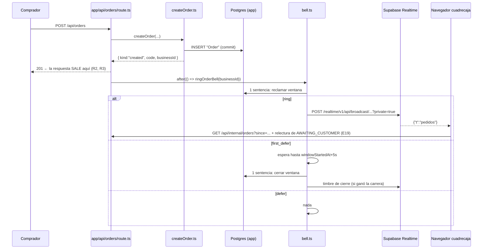

## Estado actual relevante

Lo que ya existe y se reutiliza tal cual:

| Pieza                                                                            | Qué aporta a F-020                                                                                                                                              |
| -------------------------------------------------------------------------------- | --------------------------------------------------------------------------------------------------------------------------------------------------------------- |
| `src/features/orders/server/createOrder.ts` (`prisma.order.create`)              | El primer disparador. Devuelve `{ kind: "created", code, … }`; hoy **no** devuelve el `businessId`, y va a tener que devolverlo                                 |
| `src/features/orders/server/respond.ts`                                          | El segundo disparador. `approve()`/`reject()` ya hacen `RETURNING code`; el `kind: "applied"` es exactamente «hubo escritura» (R8/E14)                          |
| `src/app/api/orders/route.ts`, `src/app/[slug]/pedido/[code]/respuesta/route.ts` | Las dos rutas donde se compone el HTTP. Es donde se llama a `after()` (DA2)                                                                                     |
| `src/app/api/internal/_lib/guard.ts` (`withInternalAuth`)                        | Bearer por negocio → `hashSyncToken` → `resolveCaller` → `InternalCaller`. El endpoint de credencial **no** inventa autenticación: se envuelve en esto          |
| `src/features/sync/server/caller.ts` (`resolveCaller`)                           | Única resolución de hash a `Business`. Da `businessId` y `externalId` ya validados y con `active` comprobado                                                    |
| `src/lib/supabase/storage.ts`                                                    | El precedente de «llamada de servidor a un servicio de Supabase que nunca lanza»: resultado discriminado, `console.error`, `SUPABASE_SERVICE_ROLE_KEY` opcional |
| `src/lib/auth/ssoToken.ts`, `scripts/storage-dev-keys.mjs`                       | `jose` ya es dependencia y ya se firma HS256 en este repo. No hace falta librería nueva                                                                         |
| `docker-compose.yml` + `docker/supabase-gateway.conf`                            | El patrón «un servicio de Supabase = su propio contenedor, su propia base, su propio volumen, colgado del gateway del 54321»                                    |
| `docker/storage-roles.sql`, `docker/auth-roles.sql`                              | El patrón de roles Supabase por `docker-entrypoint-initdb.d` sobre un volumen vacío                                                                             |
| `vitest.config.mts` proyecto `db`                                                | `*.db.test.ts` contra Postgres real, `fileParallelism: false`. Es la única capa donde se puede demostrar I5                                                     |
| `.agent/verify.sh` `correr_smoke`                                                | Levanta `next dev` en 3100 y exporta `SMOKE_BASE_URL`. Y su guardián `SERVIDOR_ERROR_RE`, que decide cómo se puede loguear                                      |
| `scripts/renegotiate-order.mjs`, `scripts/place-order.mjs`                       | El modelo de guion de runtime multi-modo que invoca el `smoke.sh` del feature                                                                                   |

Lo que **no** existe hoy y este feature crea: ningún servicio de Realtime en
`docker-compose.yml`; ninguna política RLS versionada en ninguna parte;
ninguna migración de `prisma/migrations/` que mencione `realtime.`, `auth.` ni
`storage.`; ningún estado compartido entre peticiones que no sea una fila de la
base.

## Decisión

Un **timbre sin datos** emitido por HTTP contra el endpoint REST de Broadcast de
Supabase Realtime, **después** de que la respuesta HTTP haya salido (`after()`),
con la ventana de coalescencia de 5 s guardada en **una fila de Postgres por
negocio** —no en memoria de proceso— y con un canal privado autorizado por una
política RLS sobre `realtime.messages` que **no** es una migración de Prisma.

Siete decisiones, DA1..DA7. Las tres que este ciclo tenía que cerrar son DA3
(I5), DA4 (I3) y DA5 (I9).

### DA1 — El emisor: `fetch` contra el endpoint REST, no un cliente de Supabase

El transporte es una sola petición HTTP:

```
POST {NEXT_PUBLIC_SUPABASE_URL}/realtime/v1/api/broadcast/negocio:{businessId}/events/pedidos?private=true
apikey: {SUPABASE_SERVICE_ROLE_KEY}
content-type: application/json

{"t":"pedidos"}
```

Es la API documentada de Broadcast por REST (verificado contra
`https://supabase.com/docs/guides/realtime/broadcast.md`, sección «Send messages
› REST»). `?private=true` es obligatorio y simétrico: «a public broadcast only
reaches public channels and a private broadcast only reaches private channels».

Alternativas descartadas, una línea cada una:

- **`@supabase/supabase-js` (`createClient(...).channel(t).send(...)`)** —
  construye un `RealtimeClient` con temporizadores para hacer, por dentro, esta
  misma petición; no aporta nada en servidor y complica el tope duro de R3.
- **Un websocket persistente del emisor** — imposible en un runtime efímero, y
  es el mismo desajuste FaaS↔broker que ADR 0015 ya rechazó.
- **`realtime.send()` desde Postgres** (la tercera vía de Broadcast) — exige que
  Realtime lea **nuestra** base por replicación lógica, que es justo lo que DA4
  evita, y ataría el timbre a un trigger SQL en vez de a una decisión de negocio.

Consecuencia que resuelve I4 sin tocar nada: el emisor **no importa
`@supabase/*`**, así que la lista blanca de `src/features/account/boundaries.test.ts`
no cambia y no hay un quinto importador. El criterio 14 de la spec sigue siendo
verificable —el guardián sigue en verde y `npm run check:bundle` no se mueve—,
solo que por una razón mejor que la que preveía: no hay módulo emisor que añadir
a la lista, porque no importa la librería. Es un endurecimiento de R13, no una
excepción.

Capas (AGENTS.md § Arquitectura):

- El **transporte** (HTTP, cero Prisma, cero React) va a
  `src/lib/realtime/broadcast.ts`, al lado de `src/lib/supabase/storage.ts`
  y con su mismo contrato: **nunca lanza**, devuelve un resultado discriminado.
- La **decisión de si suena** (Postgres) va a `src/features/orders/server/bell.ts`, porque toca Prisma y `features/*/server/` es lo único que puede.
- La **llamada** la hace `src/app/`, que es donde vive `after()`.

### DA2 — El timbre suena en `after()`, después de la respuesta

`after()` de `next/server` (`node_modules/next/dist/docs/01-app/03-api-reference/04-functions/after.md`)
ejecuta un callback **cuando la respuesta ya está terminada**. Se llama desde las
dos rutas:

- `src/app/api/orders/route.ts`, solo en `result.kind === "created"` (E16: el 200
  idempotente y los 400/404/409/429 no llaman a nada).
- `src/app/[slug]/pedido/[code]/respuesta/route.ts`, solo en
  `result.kind === "applied"` (E14/R8: `idempotent`, `already_decided`, `expired`,
  `no_live_proposal` y `unknown_order` no timbran).

Con esto R2 y R3 dejan de ser disciplina y pasan a ser estructura:

- **R2 (un fallo al emitir nunca falla la escritura)**: el `201` ya se envió
  antes de que el emisor exista. No hay forma de que cambie el código de
  respuesta.
- **R3 (nunca retrasa la escritura más de un tope explícito)**: el retraso
  medido contra la respuesta es **0 ms**, con Realtime sano, caído o
  agujero negro. El tope sigue existiendo, como exige R3, pero protege la
  _invocación_, no la respuesta: `REALTIME_BELL_EMIT_TIMEOUT_MS = 1000` en
  `src/constants/realtime.ts`, aplicado con
  `AbortSignal.timeout(...)` sobre el `fetch`. El criterio 11 (mediana de 5
  `POST /api/orders` contra `203.0.113.1`) sale por construcción.
- **E5/E6**: `201` igual que siempre y el pedido en el siguiente pull; el fallo
  queda en el registro.

Cómo se registra el fallo sin poner roja la etapa smoke — esto es load-bearing,
porque el criterio 3 **ejercita a propósito un emisor que falla** mientras
`.agent/verify.sh` corre su guardián sobre la salida de `next dev`:

```
SERVIDOR_ERROR_RE='(⨯|Unhandled|^[[:space:]]*([A-Z][A-Za-z]*)?Error([^A-Za-z0-9_]|$))'
```

La regla, la misma que `src/lib/env.ts` ya documenta para su `console.warn`:
**una sola línea, que empieza por `[realtime]`, con el motivo como string dentro
de un objeto y nunca el objeto `Error`**. Pasar el `Error` haría que Node
imprimiera su traza, cuya primera línea empieza por `Error:` / `TypeError:` y
dispara el guardián.

```ts
console.error("[realtime] bell not emitted", { businessId, reason });
// reason = error instanceof Error ? error.message : String(error)
```

Y `ringOrderBell()` **nunca rechaza**: un `after()` cuyo callback lanza deja que
Next imprima la excepción, que sí dispararía el guardián. Todo va envuelto.

### DA3 — I5: la coalescencia vive en una fila de Postgres, no en el proceso

ADR 0015 cierra la puerta a un broker y Postgres es lo que hay. Una tabla nueva
con **una fila por negocio** y **una sola sentencia** que decide, atómicamente,
cuál de los tres desenlaces le toca a este evento:

```sql
WITH rang AS (
  INSERT INTO "OrderBellWindow" ("businessId", "windowStartedAt", "pendingSince")
  VALUES ($1, now(), NULL)
  ON CONFLICT ("businessId") DO UPDATE
     SET "windowStartedAt" = now(),
         "pendingSince"    = NULL
   WHERE "OrderBellWindow"."windowStartedAt" <= now() - $2::interval
  RETURNING "windowStartedAt"
), deferred AS (
  UPDATE "OrderBellWindow"
     SET "pendingSince" = now()
   WHERE "businessId" = $1
     AND "pendingSince" IS NULL
     AND NOT EXISTS (SELECT 1 FROM rang)
  RETURNING "windowStartedAt"
)
SELECT (SELECT count(*) FROM rang)                    AS rang,
       (SELECT count(*) FROM deferred)                AS deferred,
       (SELECT "windowStartedAt" FROM deferred)       AS window_started_at
```

Tres desenlaces, y solo tres:

| Desenlace     | Cuándo                                                   | Qué hace el emisor                                                          |
| ------------- | -------------------------------------------------------- | --------------------------------------------------------------------------- |
| `ring`        | No había ventana viva. La abre y la reclama              | Emite **ya** el timbre de entrada (E7)                                      |
| `first_defer` | Ventana viva y **primer** evento diferido de esa ventana | No emite. Programa el timbre de cierre para `windowStartedAt + 5 s` (E8/E9) |
| `defer`       | Ventana viva y ya había un evento diferido               | No hace **nada** (ni emite ni programa): el cierre ya está programado       |

Y el cierre, otra sentencia atómica:

```sql
UPDATE "OrderBellWindow"
   SET "windowStartedAt" = now(), "pendingSince" = NULL
 WHERE "businessId" = $1
   AND "pendingSince" IS NOT NULL
   AND "windowStartedAt" <= now() - $2::interval
RETURNING "businessId"
```

Una fila devuelta → se emite el timbre de cierre, que **abre la ventana
siguiente** `[t0+5 s, t0+10 s)` exactamente como pide E8. Cero filas → otro ya lo
hizo, o un evento posterior ya reclamó la ventana y su timbre de entrada cubre lo
pendiente. En los dos casos no se emite nada.

Por qué esto cumple R10 **medido desde el suscriptor** y no desde el proceso:

- La condición `windowStartedAt <= now() - 5s` la evalúa **Postgres**, con
  `now()` de Postgres, contra una fila que ven las N instancias. Diez `POST`
  en diez procesos hacen diez veces la misma sentencia: Postgres serializa por
  el bloqueo de fila del `ON CONFLICT DO UPDATE`, el segundo re-evalúa el `WHERE`
  contra la versión **ya actualizada** (READ COMMITTED) y falla. Sale exactamente
  un `ring`, un `first_defer` y ocho `defer` (criterio 4: `1 <= recibidos <= 2`).
- El techo de E11 —un timbre cada 5 s por negocio, ≤13 en un minuto— es una
  propiedad de la fila, no del despliegue.
- No hay `$transaction`: es **una** sentencia, un round-trip, y el cliente global
  nunca entra en un bloque transaccional. Es la misma forma que `respond.ts` ya
  usa por el mismo motivo (AGENTS.md § Cosas que muerden, «el pooler corre en
  modo transacción»).

**Cómo se verifica que NO es memoria de proceso.** Un test que solo pase con un
`next dev` no vale, así que la prueba decisiva es un `*.db.test.ts` (proyecto
`db`, Postgres real) en `src/features/orders/server/bell.db.test.ts`
con estos tres casos:

1. **Ventana abierta desde fuera del proceso.** El test escribe la fila
   directamente con SQL (`insert into "OrderBellWindow" values ($1, now(), null)`)
   y **después** llama a `claimBell(businessId)`. Tiene que devolver
   `first_defer`. Una implementación con un `Map` de módulo devuelve `ring`,
   porque su memoria está vacía: **este es el test que se pone rojo y ningún
   otro lo hace**.
2. **Cierre reclamado desde fuera del proceso.** El test pone `pendingSince` con
   SQL y retrasa `windowStartedAt` 6 s con SQL; `closeBellWindow()` devuelve
   `true` una vez y `false` la segunda. La memoria de proceso no puede ver
   ninguno de los dos cambios.
3. **Concurrencia real.** Diez `claimBell` en `Promise.all` sobre **dos
   `PrismaClient` distintos** apuntando a la misma base (dos conexiones, como
   dos instancias): exactamente un `ring` y exactamente un `first_defer`.

Y un guardián estático barato, en `src/features/orders/server/bell.test.ts`, al estilo del de `src/features/account/boundaries.test.ts`: el texto de
bell.ts no contiene `new Map(`, `new Set(` ni un `let` en ámbito de módulo. Es un
patrón de texto, no análisis semántico, y su trabajo es pescar la regresión que
nadie pretendía.

El smoke (criterios 4 y 9) sigue haciendo falta, pero **por sí solo no verifica
I5**: corre contra un único `next dev`. Queda escrito en el propio guion.

**El único hueco, aceptado y dicho:** si la instancia que programó el cierre
muere entre el `first_defer` y el `windowStartedAt + 5 s`, ese timbre de cierre
se pierde. No se emite después. Es exactamente el caso de E17/R11 —un timbre
perdido es inocuo— y el pedido llega por el cron de 2 minutos, que es
literalmente el comportamiento anterior a F-020 para ese pedido concreto. Ver
§ Qué NO se hace, punto 4.

### DA4 — I3: Realtime corre contra su propia base, y la política RLS no es una migración de Prisma

Dos mitades.

**Mitad 1 — en local, Realtime no ve la base de la app.** El servicio nuevo
apunta a un `realtime-db` propio, con su propio volumen, exactamente como
`storage-db` y `auth-db` (F-028). Se puede porque ADR 0014 eligió **Broadcast, no
Postgres Changes**: la autorización de un canal privado se evalúa **solo** contra
`realtime.messages` y los claims del JWT —`realtime.topic()` y
`current_setting('request.jwt.claims')`—, y no lee ni una fila de nuestras
tablas. Realtime no necesita ver `Order`, `Business` ni nada nuestro.

Lo que se gana:

- `prisma/migrations/` sigue **sin mencionar** `realtime.`, `auth.` ni
  `storage.`, y la base de `DIRECT_URL` sigue sin contener un solo objeto de un
  esquema de Supabase. La propiedad que F-028 tenía por construcción
  (`.agent/specs/F-028/architecture.md`, § Modelo de datos y migraciones) sobrevive
  intacta, y por el mismo motivo: **otra base, otro contenedor**.
- Nuestra Postgres **no** cambia de `wal_level`, no gana roles `anon` /
  `authenticated` / `service_role`, no gana la publicación `supabase_realtime` y
  no gana un slot de replicación. Nada de eso toca `queandabuscando-pgdata`, que
  es un volumen con datos en la máquina de cada quien.
- Los roles y el `wal_level` que Realtime sí exige se aplican a `realtime-db`
  desde `docker-entrypoint-initdb.d`, que **corre garantizado** porque ese
  volumen nace vacío. Es justo lo que `docker/storage-roles.sql` explica que no
  se puede hacer sobre la base de la app.

**Mitad 2 — la política RLS es un guion versionado, no una migración.** El SQL
vive en `docker/realtime-policies.sql` y se aplica en dos sitios
distintos con **el mismo archivo como fuente**:

- **En local**, un contenedor de un solo disparo, `realtime-init`, calcado de
  `storage-bucket-init`: `postgres:16-alpine` (imagen ya descargada), un bucle de
  reintentos con `psql` que espera a que `to_regclass('realtime.messages')` deje
  de ser nulo —esa tabla la crean las migraciones del propio Realtime, no
  nosotros— y entonces aplica el archivo. Idempotente: `drop policy if exists`
  antes del `create policy`, así que un `docker compose up -d` en frío dos veces
  seguidas sale 0 las dos veces (criterio 12).
- **En producción**, un paso manual escrito en `docs/despliegue.md`: pegar ese
  mismo archivo en el editor SQL del proyecto, una vez. En producción el esquema
  `realtime` ya existe —lo trae cualquier proyecto Supabase— así que F-020 no
  «mete el primer objeto de esquema Supabase» en ningún sitio: añade **una
  política** a una tabla que ya estaba.

Por qué no una migración de Prisma, en tres razones y no una:

1. **Dependería de que un contenedor haya corrido antes.** `realtime.messages`
   la crean las migraciones de Realtime. Una migración de Prisma que le cuelgue
   una política falla en cualquier base donde Realtime no haya arrancado todavía
   —incluida la de CI en `npx prisma migrate deploy` sobre una base vacía, que es
   un paso del `verify` de `.github/workflows/ci.yml`—.
2. **La tabla no es nuestra.** La documentación de Supabase lo dice explícito:
   «Realtime locks down the `realtime` schema… Creating a table or function in
   `realtime` is expected to fail with `permission denied for schema realtime`.
   Managing RLS policies on `realtime.messages` is allowed». Versionar en
   `prisma/migrations/` DDL sobre un esquema de otro producto es exactamente la
   ambigüedad que F-028 evitó.
3. **No haría falta para que `migrate diff` siga limpio.** Prisma introspecciona
   solo el esquema del datasource (`public`, sin `multiSchema`): la existencia
   del esquema `realtime` en una base no aparece en
   `npx prisma migrate diff --from-config-datasource --to-schema prisma/schema.prisma --script`.
   En local, además, la cuestión no se plantea: ese esquema no está en nuestra
   base. **El implementador ejecuta ese comando después de levantar Realtime y
   comprueba que sigue vacío** — no se da por bueno leyendo.

La política, tal cual va al archivo:

```sql
-- Un negocio solo oye su canal (R5). Fail-closed por construcción: sin claim
-- `business_id`, current_setting(...) da NULL, la concatenación da NULL, el
-- predicado no es TRUE y no hay política que aplique -> denegado (E4).
drop policy if exists "negocio_lee_solo_su_canal" on realtime.messages;
create policy "negocio_lee_solo_su_canal"
on realtime.messages
for select
to authenticated
using (
  realtime.messages.extension = 'broadcast'
  and (select realtime.topic()) =
      'negocio:' || ((current_setting('request.jwt.claims', true))::json ->> 'business_id')
);
```

**No hay política de `insert`, y es deliberado**: un suscriptor puede oír su
canal y no puede emitir en él. R11 —«el canal no es una vía de entrega»— deja de
ser una convención del cliente. El emisor no necesita esa política porque
presenta la clave `service_role`, que tiene `BYPASSRLS` (en producción por
defecto; en local lo crea así `docker/realtime-roles.sql`, igual que ya
hace `docker/storage-roles.sql`).

Nada de esto pone RLS sobre **nuestras** tablas. `public` sigue sin una sola
política, como hoy.

### DA5 — I9: la credencial de suscripción

**El endpoint.** Uno nuevo bajo `/api/internal/*`, envuelto en el
`withInternalAuth` que ya existe — no una autenticación nueva:

```
POST /api/internal/realtime/credential
Authorization: Bearer <el mismo token por negocio de /api/internal/orders>
(sin cuerpo)
```

`200`:

```jsonc
{
  "url": "https://<ref>.supabase.co", // NEXT_PUBLIC_SUPABASE_URL
  "apikey": "<anon key>", // pública por definición
  "channel": "negocio:9f3c…", // SU canal, derivado del bearer
  "event": "pedidos",
  "token": "<JWT HS256>",
  "expiresAt": "2026-09-01T05:52:03.000Z",
  "expiresInSeconds": 3600,
}
```

Cuatro decisiones dentro de esa forma:

- **`POST` y no `GET`**: acuñar una credencial es una acción, y una URL que
  devuelve un token no debe poder quedarse en la caché ni en el log de un proxy.
- **El `businessId` no viaja en la petición.** Sale de `InternalCaller`, es
  decir del hash del bearer. Con el bearer de B es imposible pedir el canal de A:
  no hay parámetro que manipular (criterio 13, E18).
- **`expiresAt` explícito** (R15): el POS renueva sin adivinar. TTL
  `REALTIME_CREDENTIAL_TTL_SECONDS = 3600`, el mismo `GOTRUE_JWT_EXP` que ya usa
  el emulador de Auth.
- **`url` y `apikey` en la respuesta**: el POS no tiene que configurar nada más
  que su bearer. La anon key es pública (es `NEXT_PUBLIC_`), así que devolverla
  no filtra nada, y evita que cuadrecaja mantenga una copia que se desincronice.

Errores, y todos los del guard llegan gratis:

| Código | Cuerpo                    | Cuándo                                                                |
| ------ | ------------------------- | --------------------------------------------------------------------- |
| 401    | `UNAUTHORIZED`            | Sin cabecera, malformada, o hash que no resuelve (`withInternalAuth`) |
| 403    | `BUSINESS_INACTIVE`       | `Business.active = false` (`withInternalAuth`)                        |
| 503    | `SYNC_NOT_CONFIGURED`     | Ningún negocio tiene `syncTokenHash` (`withInternalAuth`)             |
| 503    | `REALTIME_NOT_CONFIGURED` | Falta `SUPABASE_JWT_SECRET`, `NEXT_PUBLIC_SUPABASE_URL` o la anon key |

El 503 es el que hace verdadera la precondición de la spec: sin Realtime
configurado el endpoint dice que no puede, y el POS sigue con su cron (R9/R15).
Nunca bloquea un pedido: es otra ruta.

**El token.** HS256 con `jose`, en `src/lib/realtime/subscriptionToken.ts` —lógica pura, sin Prisma, al lado de `src/lib/auth/ssoToken.ts`—:

```jsonc
{
  "iss": "queandabuscando",
  "aud": "authenticated",
  "role": "authenticated",   // Realtime hace `set role` con esto: la política es `to authenticated`
  "sub": "<businessId>",
  "business_id": "<businessId>",  // el claim que lee la política de DA4
  "iat": …, "exp": …
}
```

`business_id` es un claim de **primer nivel que acuñamos nosotros**, no
`user_metadata` de nadie: la advertencia clásica de Supabase («`user_metadata` es
editable por el usuario, nunca lo uses para autorizar») no aplica aquí porque
ningún usuario puede escribir en este token.

**Con qué se firma, y por qué hace falta variable nueva.** Realtime valida el
token del suscriptor contra el secreto JWT del inquilino (`API_JWT_SECRET` en
autoalojado; el _JWT Secret_ del proyecto en Supabase alojado). Ninguna de las
dos variables que ya existen sirve:

- `SUPABASE_SERVICE_ROLE_KEY` es un token **firmado con** ese secreto, no el
  secreto.
- `STORAGE_JWT_SECRET` **es** ese secreto en local —`scripts/storage-dev-keys.mjs`
  firma con él la anon key y la service key—, pero `.env.example` dice
  literalmente «Read by docker-compose.yml only… The application never reads
  it», y en producción no está puesta en ningún sitio: allí Storage y Auth son
  alojados. Reutilizar ese nombre en producción obligaría a explicar por qué la
  app necesita «un secreto de Storage» cuando Storage es de Supabase.

Por tanto: **`SUPABASE_JWT_SECRET`, server-only, `optional()` en el esquema Zod de
`src/lib/env.ts`** (como `SUPABASE_SERVICE_ROLE_KEY`: hacerla obligatoria rompería
todas las rutas que no la tocan). En local, `scripts/storage-dev-keys.mjs` la
escribe con **el mismo valor** que `STORAGE_JWT_SECRET` —cuatro líneas en vez de
tres— para que la anon key ya existente valga también contra Realtime; en
producción es el _JWT Secret_ del proyecto, copiado del panel. Va a
`.env.example` y a `docs/despliegue.md`. Ver AP1: el humano decide si acepta ese
secreto en el entorno del runtime público.

### DA6 — El servicio de Realtime en `docker-compose.yml`

Tres piezas nuevas (`realtime-db`, `realtime`, `realtime-init`) más un `location`
en el gateway que ya existe. Todas opcionales en local (R17).

```yaml
realtime-db:
  image: postgres:16-alpine # ya descargada
  # wal_level=logical: el inquilino que siembra SEED_SELF_HOST trae la extensión
  # postgres_cdc_rls aunque solo usemos Broadcast. Aquí no cuesta nada; sobre la
  # base de la app habría sido un cambio de configuración con datos dentro.
  command: postgres -c wal_level=logical -c max_replication_slots=5 -c max_wal_senders=5
  volumes:
    - queandabuscando-realtime-pgdata:/var/lib/postgresql/data
    - ./docker/realtime-roles.sql:/docker-entrypoint-initdb.d/realtime-roles.sql:ro

realtime:
  image: supabase/realtime:v2.102.3
  # El nombre NO es cosmético: Realtime deduce el inquilino del PRIMER segmento
  # del Host. `realtime-dev.<lo que sea>` -> inquilino `realtime-dev`, que es el
  # que siembra SEED_SELF_HOST. Es la misma razón por la que el compose oficial
  # de Supabase llama a su contenedor `realtime-dev.supabase-realtime`.
  container_name: realtime-dev.queandabuscando-realtime
  environment:
    PORT: 4000
    DB_HOST: realtime-db
    DB_USER: supabase_admin
    DB_NAME: realtime
    DB_AFTER_CONNECT_QUERY: "SET search_path TO _realtime"
    DB_ENC_KEY: supabaserealtime # 16 bytes exactos, literal inerte del compose oficial
    API_JWT_SECRET: "${SUPABASE_JWT_SECRET:?missing, run node scripts/storage-dev-keys.mjs --write}"
    SECRET_KEY_BASE: "${SUPABASE_JWT_SECRET:?…}" # Phoenix exige >=64 chars; el secreto los tiene
    SEED_SELF_HOST: "true"
    RUN_JANITOR: "true"
    ERL_AFLAGS: -proto_dist inet_tcp
    DNS_NODES: "''"
  healthcheck: # con la anon key, como el compose oficial
    test:
      [
        "CMD",
        "curl",
        "-sSfL",
        "--head",
        "-o",
        "/dev/null",
        "-H",
        "Authorization: Bearer ${NEXT_PUBLIC_SUPABASE_ANON_KEY}",
        "http://127.0.0.1:4000/api/tenants/realtime-dev/health",
      ]

realtime-init: # un solo disparo, idempotente, calcado de storage-bucket-init
  # Espera a que to_regclass('realtime.messages') deje de ser nulo y aplica
  # docker/realtime-policies.sql. Sale 0 también en la segunda corrida.
```

Y en `docker/supabase-gateway.conf`, un tercer `location` — con **dos
diferencias** respecto a los dos que ya hay, y las dos deciden si funciona:

```nginx
location /realtime/v1/ {
  proxy_pass http://realtime-dev.queandabuscando-realtime:4000/;
  # NO `$host`: aquí el Host es lo que elige el inquilino. Con `$host` llegaría
  # "localhost", sin subdominio, y Realtime respondería 401 «tenant not found».
  proxy_set_header Host "realtime-dev.queandabuscando-realtime";
  proxy_http_version 1.1;                       # el websocket de /realtime/v1/websocket
  proxy_set_header Upgrade $http_upgrade;
  proxy_set_header Connection "upgrade";
  proxy_read_timeout 3600s;                     # o el canal se corta cada 60 s
}
```

Con esto `NEXT_PUBLIC_SUPABASE_URL=http://localhost:54321` sigue siendo **una
sola URL** para Storage, Auth y Realtime, igual que en un proyecto alojado. El
emisor y el suscriptor no distinguen local de producción.

`.agent/init.sh` gana un bloque `== Realtime ==` **sin un solo `bad`** (R17,
criterio 12), del mismo molde que `== Auth ==`: `ok` si
`/realtime/v1/api/tenants/realtime-dev/health` responde, y si no, `warn
"emulador de Realtime no responde — ejecuta: docker compose up -d"`. `ENTORNO
LISTO` sigue saliendo con el servicio parado.

Y una trampa concreta en `.github/workflows/ci.yml`: el `--wait` de ese job
excluye los servicios de un solo disparo con
`docker compose config --services | grep -vx storage-bucket-init`. `realtime-init`
es el segundo, así que ese `grep -vx` tiene que pasar a `grep -vxE
'storage-bucket-init|realtime-init'` o el job se pone rojo por un contenedor que
terminó bien. El comentario que ya está ahí explica por qué eso «pasó semanas en
verde y luego falló dos veces seguidas».

### DA7 — El contrato y el despliegue

`docs/sync-contract.md` gana una sección **dentro de § ③④ Pedidos**, titulada al
estilo de «El SQL espejo (aclaración aditiva, sin bump de versión)» de § ⑤ y con
el literal `negocio:` en el título, que es lo que busca el criterio 6. La versión
sigue siendo **5** (R16). Contenido mínimo, todo el que exige la spec:

1. El canal (`negocio:{businessId}`), el evento (`pedidos`) y el payload
   (`{"t":"pedidos"}`), con el aviso de que **no transporta datos y no es una vía
   de entrega**: nada se deriva del timbre (R11).
2. Los **dos** disparadores y solo esos (R7), y que el timbre **no dice cuál
   fue** (R14).
3. Que un timbre **puede perderse** y que el cron de 2 minutos sigue siendo la
   garantía (R9).
4. Las **dos** lecturas al oírlo (E19, I6): el pull incremental con el cursor
   **y** una relectura de los `AWAITING_CUSTOMER`, porque `pullOrders` filtra
   `id > since` (`src/features/orders/server/pull.ts`) y una propuesta resuelta
   ocurre sobre un pedido ya pulleado. Sin esto, el timbre del segundo disparador
   dispara un pull que responde `{ orders: [], nextCursor: null }`.
5. **Un solo pull en vuelo por negocio** aunque timbren N pestañas (E20, I7), con
   el enlace a la advertencia del único poller que ya está en esa misma sección.
6. Cómo se obtiene la credencial: el endpoint, la respuesta, el TTL y que
   renovarla es pedirla otra vez (E18, R15).

`docs/despliegue.md` gana cinco líneas (criterio 15): habilitar Realtime en el
proyecto; aplicar `docker/realtime-policies.sql` una vez en el editor
SQL; **desactivar «Allow public access»** en Realtime Settings, que es lo que la
documentación de Supabase exige para que los canales privados sean privados de
verdad; poner `SUPABASE_JWT_SECRET`; y vigilar el pico de conexiones concurrentes
(~$10 por cada 1.000, ADR 0014). Con una nota sobre el modo de falla: si la
política falta, RLS deniega a todos —falla cerrado— y el sistema degrada a solo
cron, que es ruidosamente inofensivo y por eso hay que anotarlo aquí, donde
ningún sensor llega.

## Componentes

| Componente                          | Capa                 | Responsabilidad                                                                                                           | Archivo                                                                              |
| ----------------------------------- | -------------------- | ------------------------------------------------------------------------------------------------------------------------- | ------------------------------------------------------------------------------------ |
| `broadcastBell()`                   | `lib/`               | Una petición HTTP al endpoint REST de Broadcast, con `AbortSignal.timeout`. **Nunca lanza**; resultado discriminado       | `src/lib/realtime/broadcast.ts`                                                      |
| `realtimeAvailability()`            | `lib/`               | ¿Hay URL y service key? Config-only, como `storageAvailability()` de `src/lib/supabase/storage.ts`                        | `src/lib/realtime/broadcast.ts`                                                      |
| `mintSubscriptionToken()`           | `lib/`               | Firma HS256 con `jose` el JWT de suscripción y devuelve `{ token, expiresAt }`. Sin Prisma                                | `src/lib/realtime/subscriptionToken.ts`                                              |
| `claimBell()` / `closeBellWindow()` | `features/*/server/` | Las dos sentencias de DA3. Lo único que toca Prisma                                                                       | `src/features/orders/server/bell.ts`                                                 |
| `ringOrderBell()`                   | `features/*/server/` | Orquesta reclamo → emisión → cierre programado. Envuelve todo: nunca rechaza                                              | `src/features/orders/server/bell.ts`                                                 |
| Constantes del timbre               | `constants/`         | Canal, evento, payload, ventana, tope y TTL. Ningún número suelto                                                         | `src/constants/realtime.ts`                                                          |
| Endpoint de credencial              | `app/`               | `withInternalAuth` + `mintSubscriptionToken`. Solo mapea a HTTP                                                           | `src/app/api/internal/realtime/credential/route.ts`                                  |
| Llamada al timbre (1)               | `app/`               | `after(() => ringOrderBell(businessId))` si `kind === "created"`                                                          | `src/app/api/orders/route.ts`                                                        |
| Llamada al timbre (2)               | `app/`               | `after(() => ringOrderBell(businessId))` si `kind === "applied"`                                                          | `src/app/[slug]/pedido/[code]/respuesta/route.ts`                                    |
| `businessId` en el resultado        | `features/*/server/` | `CreateOrderResult.created` y `RespondToProposalResult.applied` lo llevan. El `RETURNING` de `approve`/`reject` ya existe | `src/features/orders/server/createOrder.ts`, `src/features/orders/server/respond.ts` |
| Modelo `OrderBellWindow`            | `prisma/`            | Una fila por negocio: `windowStartedAt`, `pendingSince`                                                                   | `prisma/schema.prisma`                                                               |
| Política RLS                        | infraestructura      | `negocio_lee_solo_su_canal` sobre `realtime.messages`. Idempotente                                                        | `docker/realtime-policies.sql`                                                       |
| Roles de `realtime-db`              | infraestructura      | `anon`, `authenticated`, `service_role` (con `bypassrls`), `supabase_admin`, publicación vacía                            | `docker/realtime-roles.sql`                                                          |
| Suscriptor de prueba                | `scripts/`           | Se suscribe, cuenta mensajes, mide latencias. Reutilizable fuera del sensor                                               | `scripts/realtime-bell.mjs`                                                          |
| Guion de runtime                    | `.agent/`            | Traduce los fallos del anterior a `SMOKE FAIL`, como hace `.agent/specs/F-019/smoke.sh`                                   | `.agent/specs/F-020/smoke.sh`                                                        |

## Flujo de datos



El orden **INSERT commit → respuesta → timbre** es lo que garantiza E2: cuando el
timbre suena la fila lleva rato visible, así que el pull inmediato la encuentra.
Es imposible invertirlo por accidente: el emisor no tiene forma de correr antes
de que `createOrder` haya devuelto.

## Contratos

**Canal, evento y payload** (§ Datos y contrato de la spec, sin cambios):

```jsonc
// canal: negocio:{businessId}   ·   evento: pedidos   ·   private: true
{ "t": "pedidos" }
```

`REALTIME_BELL_PAYLOAD` es una constante `as const`, no un objeto construido: R1
—cero datos derivados del pedido— se cumple porque no hay nada que derivar. El
criterio 1 compara campo por campo contra ella.

**`broadcastBell`** (`src/lib/realtime/broadcast.ts`):

```ts
export type BellFailureReason =
  "missing_service_role_key" | "missing_supabase_url" | "unreachable" | "rejected" | "timeout";
export type BellResult = { ok: true } | { ok: false; reason: BellFailureReason };
export function broadcastBell(businessId: string): Promise<BellResult>;
```

Mismo vocabulario que `StorageFailureReason` de `src/lib/supabase/storage.ts`, a
propósito: el que lea uno entiende el otro. `timeout` se separa de `unreachable`
porque son los dos casos que la spec distingue (E5 rechaza, E6 se traga la
conexión).

**`claimBell` / `closeBellWindow`** (`src/features/orders/server/bell.ts`):

```ts
export type BellClaim =
  { kind: "ring" } | { kind: "first_defer"; closesAt: Date } | { kind: "defer" };
export function claimBell(businessId: string): Promise<BellClaim>;
export function closeBellWindow(businessId: string): Promise<boolean>;
export function ringOrderBell(businessId: string): Promise<void>; // nunca rechaza
```

**Endpoint de credencial**: cuerpo, respuesta y tabla de errores en DA5. Sin Zod
de entrada porque no hay cuerpo que validar; la respuesta se tipa como
`RealtimeCredentialResponse` en `src/lib/realtime/subscriptionToken.ts`,
un solo tipo compartido por la ruta y su test (AGENTS.md § Prohibiciones,
«duplicar interfaces»).

**Constantes** (`src/constants/realtime.ts`):

| Constante                         | Valor              | Por qué                                                                    |
| --------------------------------- | ------------------ | -------------------------------------------------------------------------- |
| `REALTIME_BELL_CHANNEL_PREFIX`    | `"negocio:"`       | El canal se compone en un solo sitio, y la política RLS repite ese literal |
| `REALTIME_BELL_EVENT`             | `"pedidos"`        | Spec § Datos y contrato                                                    |
| `REALTIME_BELL_PAYLOAD`           | `{ t: "pedidos" }` | R1                                                                         |
| `REALTIME_BELL_WINDOW_MS`         | `5000`             | Decisión del humano (SP1)                                                  |
| `REALTIME_BELL_EMIT_TIMEOUT_MS`   | `1000`             | R3. Corta contra una dirección que no responde                             |
| `REALTIME_CREDENTIAL_TTL_SECONDS` | `3600`             | R15. El mismo `GOTRUE_JWT_EXP` del emulador de Auth                        |

## Modelo de datos y migraciones

Una tabla, tres columnas, sin índices nuevos más allá de su clave primaria:

```prisma
/// F-020 — la ventana de coalescencia del timbre (architecture.md DA3). Una
/// fila por negocio, compartida entre TODAS las instancias: es lo que hace
/// que R10 sea del sistema y no del proceso.
model OrderBellWindow {
  businessId      String    @id
  /// Inicio de la ventana viva. El timbre de entrada la abre; el de cierre la renueva.
  windowStartedAt DateTime  @default(now())
  /// No nulo si hubo al menos un evento dentro de la ventana que aún no timbró.
  pendingSince    DateTime?

  business Business @relation(fields: [businessId], references: [id], onDelete: Cascade)
}
```

Y en `model Business`, la contraparte `bellWindow OrderBellWindow?`.

**Ninguna migración toca `realtime.`, `auth.` ni `storage.`** (DA4). La única
migración es `CREATE TABLE "OrderBellWindow"` con su FK: una tabla nuestra, en
`public`, como cualquier otra.

Al generarla con `npm run db:migrate`, la trampa conocida: **`prisma migrate dev`
va a proponer `DROP INDEX` de los cinco índices GIN y parciales que no están en
el schema** (`CanonicalProduct_searchVector_idx`, `CanonicalProduct_name_trgm_idx`,
`StoreProduct_visible_catalog_idx`, `StoreProduct_searchVector_idx`,
`StoreProduct_searchDocument_trgm_idx`). Se quitan esas líneas del
`migration.sql` generado antes de aplicarlo (AGENTS.md § Cosas que muerden).
Ninguna de las dos órdenes prohibidas —`prisma migrate reset`, `prisma db push`—
hace falta: es un `CREATE TABLE` aditivo sobre una base con datos.

`prisma/seed.ts` **no** siembra nada aquí: la fila la crea el primer `ON CONFLICT`
del primer pedido de cada negocio.

## Escalabilidad y límites

Números, no adjetivos.

- **Round-trips por pedido**: +1 (la sentencia de reclamo), y **fuera** de la
  ruta crítica. El `POST /api/orders` sigue costando exactamente lo que costaba.
- **Mensajes por negocio**: techo duro de 1 cada 5 s = 12/min = 17.280/día. La
  cuota gratuita de Realtime es 100 mensajes/s: harían falta ~500 negocios
  timbrando **sin parar** para acercarse. Los mensajes no son la restricción, y
  la coalescencia los desacopla del ritmo de pedidos.
- **Conexiones concurrentes, que sí son la restricción** (ADR 0014): una por
  pestaña de cuadrecaja. 200 en Free, 500 en Pro, ~$10 por cada 1.000 de pico.
  **Criterio de corte explícito**: con 2 pestañas por negocio, el plan Free
  aguanta ~100 negocios y el Pro ~250. Superado eso, la factura crece lineal y
  previsible; si llegara a ~10.000 conexiones de pico (~$100/mes) es el momento
  de reabrir ADR 0015, y el disparador que ese ADR ya nombra —«un segundo
  consumidor independiente del mismo stream»— sigue siendo el criterio, no el
  precio.
- **Filas de `OrderBellWindow`**: una por negocio que haya recibido un pedido
  alguna vez. 1.000 negocios = 1.000 filas. No crece con los pedidos, no hay que
  purgarla nunca, no hace falta cron de limpieza.
- **Contención**: la sentencia bloquea **una fila, la de ese negocio**. Diez
  pedidos simultáneos del mismo negocio se serializan en microsegundos sobre esa
  fila; pedidos de negocios distintos no se ven entre sí. Lo primero que se
  rompería al multiplicar por 100 no es esto.
- **Coste del cierre programado**: hasta 5 s de invocación extra, y **solo**
  cuando llega un segundo evento dentro de una ventana viva. Con un pedido cada
  varios minutos por negocio —el caso real— el `first_defer` no ocurre nunca y el
  coste es cero. En una ráfaga de 10 pedidos hay exactamente **un** durmiente, no
  diez, porque el segundo desenlace es `defer` y no programa nada.
  Si el tope de invocación de la plataforma quedara por debajo de
  `(duración de la petición + 5 s)`, se añade `export const maxDuration` a esas
  dos rutas — y **como literal**, nunca como constante importada: es la misma
  mordida que AGENTS.md documenta para `export const revalidate`.
- **Endpoint de credencial**: una firma HS256 (sub-milisegundo) sobre el lookup
  indexado que el guard ya hacía. Con TTL de 1 h y 1.000 negocios son 0,3 req/s.
- **JavaScript de cliente**: **0 bytes**. El emisor es de servidor y usa `fetch`;
  no hay importación nueva de `@supabase/*` en ninguna parte de `src/`
  (DA1, R13). `npm run check:bundle` no se mueve y su `BUDGET_KB` no se toca.
- **Coste local en memoria**: dos contenedores que se quedan arriba (Realtime
  ~120 MB, un cuarto Postgres ~50 MB) ≈ 170 MB sobre lo de hoy, recuperables
  parándolos (R17). Es la pieza más pesada del stack local, y el humano lo eligió
  a sabiendas (I8).

## Patrones a seguir / antipatrones a evitar

**A seguir:**

- **Una sentencia, no `$transaction`** para el reclamo y el cierre. AGENTS.md
  § Cosas que muerden: el pooler corre en modo transacción y el cliente global no
  puede entrar en un bloque transaccional. Es la forma que `respond.ts` ya usa.
- **Un módulo que habla con un servicio externo nunca lanza**: resultado
  discriminado, como `src/lib/supabase/storage.ts`.
- **Log de una línea, string plano, empezando por `[realtime]`**, nunca el objeto
  `Error`. La razón está en DA2 y el precedente en `src/lib/env.ts`.
- **Los números en `src/constants/`**, incluida la ventana de 5 s.
- **La ruta compone, el feature decide**: `src/app/` llama a `after()` y mapea
  HTTP; `features/orders/server/` es lo único que toca Prisma.

**A evitar:**

- **Un `Map` de módulo para la ventana.** Es I5 entero. El test de
  `src/features/orders/server/bell.db.test.ts` que abre la ventana con SQL desde
  fuera es el que lo pesca; el guardián de texto es el cinturón.
- **Reintentar la emisión.** El timbre es best-effort por definición (R9): un
  reintento solo añade latencia a una invocación que ya respondió.
- **Meter cualquier cosa en el payload.** Ni el `code`, ni un contador, ni el
  disparador (R14). El día que alguien quiera saber «qué cambió», la respuesta es
  el pull, no el canal.
- **Timbrar desde `expiry.ts` o desde `pullOrders`.** El barrido del vencimiento
  lo resuelve el reloj (E15) y el pull lo hizo el propio POS. Los dos
  disparadores son dos, y están en dos rutas concretas.
- **Poner `realtime` en `datasource.schemas`** o versionar su DDL en
  `prisma/migrations/`. DA4.
- **Citar entre comillas invertidas un archivo que aún no existe** en cualquier
  documento del arnés: pone rojo `npm run check:harness` y con él el criterio 7.

## Riesgos y plan B

| #   | Riesgo                                                                                                                         | Plan B                                                                                                                                                                                                                                   |
| --- | ------------------------------------------------------------------------------------------------------------------------------ | ---------------------------------------------------------------------------------------------------------------------------------------------------------------------------------------------------------------------------------------- |
| 1   | La configuración de `supabase/realtime` autoalojado (inquilino por subdominio, roles, publicación) solo se prueba ejecutándola | Es la primera etapa del plan y su puerta es el criterio 12 (`docker compose up -d` dos veces). Si el inquilino no resuelve por Host, la salida es `Host` explícito o exponer el 4000 directo y apuntar solo el suscriptor de pruebas ahí |
| 2   | Divergencia local↔producción: en local `realtime.messages` está en `realtime-db`, en producción en la base del proyecto        | **El archivo de política es el mismo** en los dos sitios, y es SQL puro sin referencias a tablas nuestras. Lo que se verifica en local es exactamente lo que se pega en el panel                                                         |
| 3   | El paso de producción es manual y ningún sensor lo comprueba                                                                   | Falla **cerrado**: sin política, RLS deniega y nadie oye nada; el cron cubre. Queda escrito en `docs/despliegue.md`, que es donde AGENTS.md manda lo que ningún sensor alcanza                                                           |
| 4   | `after()` recortado por el tope de invocación de la plataforma, perdiendo el timbre de cierre                                  | `maxDuration` literal en las dos rutas. Y si aun así se pierde: un timbre perdido es inocuo (R11, E17)                                                                                                                                   |
| 5   | El suscriptor de Node (`scripts/realtime-bell.mjs`) depende del `WebSocket` global                                             | Node 24 lo trae. Si fallara, `ws` como devDependency solo para `scripts/`, que está fuera de `src/` y fuera del bundle                                                                                                                   |
| 6   | El secreto JWT «legacy» de Supabase está anunciado como en camino de deprecación                                               | AP1. La salida es registrar un JWKS propio (`API_JWT_JWKS` existe en el compose oficial y el alojado admite emisores externos): cambia dónde vive la clave, no el diseño                                                                 |

## ¿Hace falta una ADR?

**No.** ADR 0014 ya decide lo de fondo (Broadcast, canal autorizado por RLS, el
cron se queda), ADR 0002 no se toca —el criterio 5 sigue siendo verdad: no hay
URL ni secreto de salida hacia el POS— y ADR 0015 no se contradice: la
coalescencia sale de Postgres precisamente porque un broker está descartado.

Si el humano quiere dejar constancia de DA4 —«la política RLS de
`realtime.messages` no es una migración de Prisma, y Realtime no ve la base de la
app»—, el número siguiente libre es `docs/adr/0027-*` y el título propuesto sería
«La RLS de Realtime se aplica fuera de las migraciones». Lo dejo como opción, no
como requisito: es una consecuencia de 0014, no una decisión que la supere.

## Qué NO se hace, y por qué

1. **Postgres Changes**: descartado en ADR 0014 y no se evalúa. Como efecto,
   Realtime no necesita leer ninguna tabla nuestra (DA4).
2. **Un broker**: ADR 0015. Y no haría falta: el estado compartido que I5 pedía
   cabe en una fila.
3. **Reintentos del emisor**: R9. Reintentar solo añade latencia a algo que ya
   respondió, y el pull llega igual.
4. **Un cron de barrido que rescate el timbre de cierre perdido** cuando muere la
   instancia que lo programó. Los dos crons de `vercel.json` son **diarios**, así
   que un barrido llegaría con horas de retraso; y el hueco que taparía ya lo
   tapa el pull cada 2 minutos, que es exactamente el comportamiento anterior a
   F-020 para ese pedido. Añadir un cron nuevo sería un componente más para
   recuperar un timbre que R11 declara inocuo perder.
5. **Cambiar `pullOrders`**: el filtro `id > since`
   (`src/features/orders/server/pull.ts`) se queda como está. I6 se resuelve en el
   **contrato** (E19: dos lecturas), no cambiando un endpoint que el POS ya
   implementa. Cambiarlo sería un bump de versión, y R16 dice que no lo hay.
6. **Serializar el pull por nosotros** (I7). El «único poller por negocio» es y
   sigue siendo responsabilidad de cuadrecaja; lo que hacemos es escribirlo más
   fuerte en el contrato, porque el timbre lo vuelve más fácil de violar.
7. **Notificar al comprador**, y **que el panel de administración escuche el
   canal**: los dos están fuera de alcance en la spec.
8. **Añadir el emisor a la lista blanca de `@supabase/*`** (I4): con `fetch` no
   hay importación que autorizar. Se resuelve por no necesitarlo.
9. **Tocar `src/proxy.ts`**: nada de esto pasa por el proxy, y el `matcher` no se
   acerca a `/[slug]`.
10. **RLS sobre nuestras tablas**: `public` sigue sin una sola política. La única
    política de todo el repositorio vive sobre una tabla de Realtime.
11. **Subir el presupuesto de bundle**: no hay un byte nuevo de cliente.

## Preguntas al humano

**AP1 — ¿Aceptas `SUPABASE_JWT_SECRET` en el entorno del runtime público?**
Para que Realtime acepte la credencial del POS hay que firmarla con el secreto
JWT del proyecto. Ninguna variable actual sirve (DA5).

- **Opción A (recomendada)**: variable nueva `SUPABASE_JWT_SECRET`, server-only,
  opcional en Zod; en local la escribe `scripts/storage-dev-keys.mjs` con el mismo
  valor que `STORAGE_JWT_SECRET`, en producción se copia del panel. Funciona hoy
  en los dos entornos y no añade integración con nada. El riesgo incremental es
  pequeño y conviene decirlo entero: ese secreto permite acuñar un token
  `service_role`, pero la app **ya tiene** `SUPABASE_SERVICE_ROLE_KEY`, así que
  no amplía lo que un atacante con acceso al entorno podría hacer. Lo que sí
  cambia es que ahora hay que rotarlo con cuidado: rotar el JWT Secret del
  proyecto invalida la anon key y la service key a la vez.
- **Opción B**: registrar un JWKS propio en el proyecto y firmar con una clave
  nuestra (asimétrica) que Realtime valide como emisor externo. Mejor aislamiento
  y a prueba de la deprecación anunciada del secreto legacy, pero añade
  configuración en el panel de Supabase y un par de claves que gestionar. Es la
  salida del riesgo 6 si algún día hace falta.

**AP2 — El criterio 4 sigue mal redactado y la vía para arreglarlo es tuya.**
Ya lo anotaste como pendiente en la bitácora: «Diez pedidos en un minuto producen
menos de diez timbres» es **falso** contra una implementación correcta (diez
pedidos repartidos uniformemente caen uno cada 6 s, cada uno en silencio, y
producen diez timbres correctos — I1). La regla 3 de `features.json` prohíbe
modificar un `acceptance_criteria` ya escrito, así que un agente no puede
tocarlo.

- **Opción A (recomendada)**: lo editas tú, ya que la regla 3 vincula a los
  agentes y `features.json` es tuyo, dejando el texto del criterio 17 de la spec:
  «Diez pedidos del mismo negocio creados en menos de cinco segundos producen
  como mucho dos timbres».
- **Opción B**: se añade un feature correctivo (regla 3, segunda mitad) que
  reemplaza ese criterio, y F-020 se cierra verificando la ráfaga con una nota.

Mientras tanto **no bloquea nada**: el guion de runtime verifica la ráfaga, que
es lo que el criterio quiere decir, y lo dice en su propia salida.

**AP3 — ¿Extiendo el job `auth` de `.github/workflows/ci.yml` o creo uno nuevo?**
Ese job ya levanta el compose entero y ya corre un smoke de feature. Añadirle
Realtime cuesta ~1 minuto de arranque más; un job aparte pagaría otra vez el
`npm ci`, las migraciones y el seed.

- **Opción A (recomendada)**: extender el job existente con un paso final
  `bash .agent/verify.sh F-020 --only smoke`, y arreglar de paso su `grep -vx
storage-bucket-init` para que excluya también `realtime-init` (DA6).
- **Opción B**: un job `realtime` independiente, más lento y con más duplicación,
  a cambio de que un fallo de F-020 no enmascare uno de F-028.
