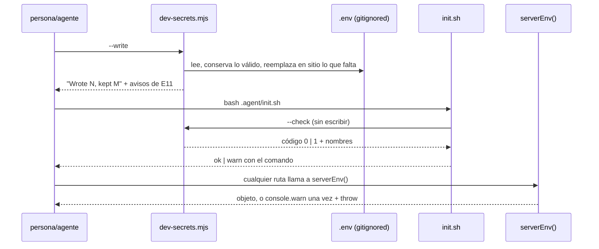

> Este documento cierra las **dos** decisiones que
> `.agent/specs/F-029/spec.md` § No decidido a propósito me dejó por nombre —la
> forma del generador y cómo avisa `.agent/init.sh` de tres variables que ya no
> aparecen en su bucle— y añade las que ninguna spec puede tomar sin leer el
> código: dónde vive el estado de R7, qué contrato consumen los dos guiones de
> humo y en qué orden se construye todo.
>
> Las reglas R1-R10 y los escenarios E1-E11 de la spec **no se reabren**.
> Tampoco las decisiones ya cerradas por el humano (el registro va en
> `serverEnv()`, `src/lib/auth/adminSession.ts` no se toca, `CRON_SECRET` sigue
> `.optional()`, el salto de `.agent/specs/F-012/smoke.sh` pasa a fallo duro).
>
> No hay preguntas que bloqueen la firma del plan: las dos que devuelvo (AP1,
> AP2) son de procedimiento de verificación y llevan recomendación.

## Estado actual relevante

### Lo que ya existe y se reutiliza tal cual

| Pieza                                           | Qué aporta a F-029                                                                                                                                                                             |
| ----------------------------------------------- | ---------------------------------------------------------------------------------------------------------------------------------------------------------------------------------------------- |
| `scripts/storage-dev-keys.mjs`                  | El patrón entero del generador: valor aleatorio por máquina, reemplazo **en sitio** con `RegExp("^NAME=.*$", "m")`, `.env` obligatorio para escribir, mensaje de salida con el siguiente paso. |
| `.agent/init.sh:83-94` (bloque `== Storage ==`) | El precedente literal del aviso dedicado: variables que **no** viven en el repo, excluidas del bucle genérico (`.agent/init.sh:53`), avisadas aparte con `warn` y con su comando.              |
| `.agent/init.sh:44-59`                          | La extracción de un valor de `.env` que hay que imitar para que «presente» signifique lo mismo en los cuatro sitios: `grep -E "^KEY=" .env`, `cut -d= -f2-`, `tr -d '"'` y comillas simples.   |
| `src/lib/env.ts:19-30`                          | La caché de éxito (`cached`) y el punto exacto donde nace el error. El registro de R7 se instala aquí y en ningún otro sitio.                                                                  |
| `src/lib/prisma.test.ts:29-38`                  | El patrón de prueba obligatorio para cualquier módulo con estado: `vi.resetModules()` + `vi.stubEnv` en `beforeEach`, `vi.unstubAllEnvs()` en `afterEach`, `await import()` dentro del caso.   |
| `.agent/specs/F-012/smoke.sh:46-54`             | El ayudante `env_val`, que lee `.env` con `dotenv` sin depender de que el shell lo tenga exportado. El guion de humo nuevo hereda ese contrato y el `cd` a la raíz del repo.                   |
| `scripts/mint-sso-token.mjs`                    | Acuña el token SSO de un negocio del seed y respeta `QAB_BASE_URL`, así que el humo puede apuntarlo al puerto que levanta `.agent/verify.sh`.                                                  |
| `src/proxy.ts:35-40`                            | `/admin` sin la cookie redirige (307) **antes** de la página: es la aserción negativa que da valor al 200 del escenario E4.                                                                    |

### Lo que hoy produce el fallo

`.env.example:69`, `:73` y `:77` entregan las tres claves como `=""`;
`src/lib/env.ts:10-12` exige `.min(32)`, `.min(32)` y `.min(16).optional()`. Un
`.env` recién copiado hace que `serverEnv()` lance, y `getAdminSession()`
(`src/lib/auth/adminSession.ts:52-65`) se traga el `throw` en su `catch`. Medido
hoy en este worktree: las cuatro variables valen cadena vacía
(`SSO_JWT_SECRET`, `ADMIN_SESSION_SECRET`, `CRON_SECRET` y `QAB_BEARER_TOKEN`).

Dos hechos que condicionan el diseño y que verifiqué en el archivo, no de memoria:

1. `.agent/verify.sh:295` y `.agent/verify.sh:380` ponen la etapa en rojo si la
   salida del servidor casa con `(⨯|Unhandled|Error:)`. Ninguna de las tres
   subcadenas puede aparecer en la línea que se añade (R8).
2. `.github/workflows/ci.yml:181-183` fija las tres con frases de 48, 46 y 31
   caracteres — por encima de los mínimos 32, 32 y 16. El chequeo nuevo, por
   tanto, **no pone rojo a CI**; y CI solo corre la etapa `smoke` para F-028
   (`.github/workflows/ci.yml:223`), no para F-012.

## Decisión

### D1 — Un generador propio, scripts/dev-secrets.mjs (por crear), sin unificar con el de Storage

Se confirma la propuesta de la spec, con argumentos propios y no por inercia:

- **Los dos generadores no comparten postcondición.** Regenerar las claves de
  Storage obliga a `docker compose up -d --force-recreate storage
supabase-gateway auth`; regenerar estas tres no obliga a nada (a lo sumo
  invalida sesiones de admin abiertas). Un solo comando imprimiría siempre las
  dos instrucciones y la mitad no aplicaría: es exactamente la clase de ruido que
  entrena a no leer la salida.
- **Tampoco comparten conducta.** El de Storage **siempre** reescribe las tres
  (los dos JWT tienen que estar firmados con el secreto recién creado, así que
  conservar uno y regenerar otro sería incoherente). El nuevo **conserva por
  omisión** lo que ya cumple el mínimo (E2b), porque `SSO_JWT_SECRET` puede ser
  un valor acordado con cuadrecaja. Fusionarlos exigiría una bandera que
  significara cosas distintas según la clave.
- **Tampoco comparten dependencias**, y esto decide el resto del diseño: el de
  Storage importa `jose` porque tiene que firmar; el nuevo solo necesita
  `node:crypto` y `node:fs`. **Se prohíbe expresamente importar nada de
  `node_modules`** —ni `dotenv`, ni `jose`— para que `.agent/init.sh` pueda
  invocarlo en un clon recién hecho, antes de `npm ci`, sin que el chequeo se
  convierta en un error de importación.
- **Nada de extraer un módulo común de «upsert en .env» en este ciclo.** Serían
  seis líneas compartidas a cambio de editar `scripts/storage-dev-keys.mjs`, que
  hoy funciona y cuyo modo de fallo (emuladores respondiendo 401 opacos) es caro
  de depurar. La duplicación honesta gana; si aparece un tercer generador, esa
  será la señal para extraerlo.

**Nombre:** se mantiene el que propone la spec, scripts/dev-secrets.mjs (por
crear). El par queda legible: `scripts/storage-dev-keys.mjs` se llama por el
consumidor de sus claves (el emulador), y el nuevo por su ámbito (los secretos
que la app se firma a sí misma en desarrollo). Al no cambiarlo, no se mueve
ningún archivo: `.env.example`, `.agent/init.sh`, los dos guiones de humo y la
propia spec citan el mismo literal. La ambigüedad razonable —«¿incluye las de
Storage?»— se cierra en dos sitios baratos: la cabecera del guion remite a
`scripts/storage-dev-keys.mjs`, y su salida nombra una por una las variables que
escribió.

**Sin alias en `package.json`.** El comando se cita en `.env.example`, en
`.agent/init.sh`, en dos guiones de humo y en la ficha del playbook; dos formas
de invocarlo (`npm run …` y `node scripts/…`) es justo la deriva que
`npm run check:harness` existe para pescar. `scripts/storage-dev-keys.mjs` ya
fijó el precedente de invocarse con `node` a pelo.

**Bandera de regeneración: `--force`.** Se elige sobre `--rotate` y
`--regenerate` porque «rotar» sugiere un procedimiento de revocación que aquí no
existe, y porque `--force` ya se lee con ese sentido en el comando hermano que
aparece dos líneas más abajo en `.env.example`, el
`docker compose up -d --force-recreate` de los emuladores.

### D2 — `.agent/init.sh` gana un bloque dedicado que delega el predicado en el generador

Es el riesgo principal del feature: al comentar las tres claves en
`.env.example` desaparecen del bucle de `.agent/init.sh:53`
(`grep -oE '^[A-Z_]+='` no ve una línea que empieza por `#`), y el aviso de hoy
se convertiría en **silencio**. Forma exacta:

1. **Un bloque nuevo, `== Secretos de desarrollo ==`**, después del bloque
   `== Variables de entorno ==` y antes de `== Base de datos ==`, calcado en
   estructura del bloque `== Storage ==` (`.agent/init.sh:83-94`): título,
   comentario que explica **por qué** existe (las tres no están en `.env.example`
   como asignación, así que el bucle genérico no puede verlas) y aviso con el
   comando literal.
2. **El predicado no se reimplementa en bash: lo responde el generador**, con un
   tercer modo, `--check`, que no escribe nada. Razón: «¿están las tres
   utilizables?» hace falta en **tres** sitios —este bloque, el guion de humo de
   F-029 y el de F-012— y los mínimos (32, 32, 16) ya viven duplicados en
   `src/lib/env.ts` y en el generador. Una cuarta y una quinta copia en prosa de
   shell es como se desincroniza esto. `--check` tolera que `.env` no exista
   (equivale a las tres ausentes) y no importa nada de `node_modules`, así que se
   puede llamar antes que `npm ci`.
3. **Comprueba presencia _y_ longitud mínima**, no solo presencia (§ Casos
   límite, «Clave presente pero corta»): una clave de doce caracteres pasa el
   `[ -z "$val" ]` del bucle genérico y sin embargo hace que `serverEnv()` lance
   exactamente igual que si estuviera vacía. Ese es el fallo que este feature
   persigue, así que el chequeo mide `${#val}` contra el mínimo de cada clave.
4. **Ramas exhaustivas, ninguna silenciosa.** Se distinguen tres casos por código
   de salida y no solo por «salida vacía», porque un generador roto devolvería
   una lista vacía y el bloque imprimiría `ok` — el mismo silencio que venimos a
   matar:

```bash
echo "== Secretos de desarrollo =="
if [ -f .env ]; then
  # Las tres NO se asignan en .env.example (un valor vacío rompe serverEnv()
  # y .optional() de Zod permite ausente, nunca ""), así que el bucle de
  # arriba no puede verlas: este chequeo es su sustituto, no un duplicado.
  SECRETS_OUT="$(node scripts/dev-secrets.mjs --check 2>/dev/null)"
  SECRETS_CODE=$?
  if [ "$SECRETS_CODE" -eq 0 ]; then
    ok "secretos de desarrollo con valor válido (SSO, sesión de admin, cron)"
  elif [ "$SECRETS_CODE" -eq 1 ] && [ -n "$SECRETS_OUT" ]; then
    warn "sin generar o por debajo del mínimo: $(echo "$SECRETS_OUT" | tr '\n' ' ')— ejecuta: node scripts/dev-secrets.mjs --write"
  else
    warn "no se pudo comprobar los secretos de desarrollo — ejecuta: node scripts/dev-secrets.mjs --check"
  fi
fi
```

5. **`warn`, nunca `bad`** (R3), por tres razones y en este orden:
   - El criterio 6 exige que con las tres sin valor `bash .agent/init.sh` termine
     en `ENTORNO LISTO`. `bad` incrementa `FAIL` (`.agent/lib.sh`) y el guion
     saldría con código 1: sería incumplir el criterio, no interpretarlo.
   - La regla que ya aplica este archivo es «`bad` solo si algo que el sensor
     ejecuta se pondría rojo». Postgres es `bad` porque el proyecto `db` de
     Vitest falla sin él; el emulador de Storage es `warn` porque una sesión que
     no toca imágenes no lo necesita. Estas tres claves están del lado de
     Storage: las nueve etapas de `--full`
     (`harness typecheck lint format test prisma build theme bundle`) pasan hoy
     con las tres vacías, que es el estado real de este worktree.
   - Volverlas obligatorias castigaría a quien viene a tocar el catálogo o el
     sync, que son la mayoría de las sesiones. El pago del feature es que **quien
     sí las necesita se entera en tres sitios** (init, el propio `serverEnv()` y
     los dos humos), no que nadie pueda trabajar sin ellas.
6. **No se toca la lista de exclusión de `.agent/init.sh:53`.** Las tres salen
   del bucle por sí solas al quedar comentadas; añadirlas a la exclusión sugeriría
   que siguen siendo asignaciones y envejecería mal.
7. **`.agent/init.sh` no llama al generador con `--write`** — decidido en la
   spec, se respeta: escribir en `.env` sin que nadie lo pida es magia que
   después nadie encuentra.

### D3 — El registro de R7 vive en `src/lib/env.ts`, junto a la caché de éxito

Un `let warned = false;` a nivel de módulo, hermano de `let cached` en
`src/lib/env.ts:19`, y el registro dentro de `if (!parsed.success)`, **antes del
`throw`**. Ni la firma de `serverEnv()` ni el tipo `ServerEnv` cambian, y no se
exporta ninguna función de reinicio: una API que solo existe para las pruebas es
código de producción que nadie más llama, y `vi.resetModules()` ya da un módulo
nuevo (§ Pruebas).

**Cómo interactúan los dos estados**, que es lo que hay que entender para
probarlos:

- `cached` solo se escribe en el camino de éxito; `warned` solo en el de fallo.
  Son excluyentes por construcción: una instancia del módulo que llegó a cachear
  nunca vuelve a evaluar el `safeParse`, así que nunca puede registrar; y una que
  registró es porque no cacheó.
- Los dos son **por instancia de módulo**, no por proceso. En `next dev` puede
  aparecer una línea por cada grafo de módulos compilado (servidor y, si lo
  hubiera, runtime distinto): eso no es una fuga, es la frontera del módulo, y es
  literalmente lo que R7 promete («por instancia del módulo»).
- Coste: el camino de éxito sigue siendo una comparación booleana; el de fallo,
  dos.

**Forma de la línea** (inglés, AGENTS.md § Idioma; texto plano, nunca un objeto
`Error`, R8):

```text
[env] Invalid server environment — SSO_JWT_SECRET: …; ADMIN_SESSION_SECRET: … . In local development, generate the missing secrets with: node scripts/dev-secrets.mjs --write
```

Comprobado contra `.agent/verify.sh:295` y `.agent/verify.sh:380`: no contiene
`⨯`, ni `Unhandled`, ni la subcadena `Error:` (la palabra `Error` no aparece; el
`new Error(...)` que se lanza después es el mismo de hoy y no cambia). La pista
del comando se redacta con «In local development» a propósito: la misma línea
puede salir en un despliegue, donde el generador no aplica, y así no manda a
nadie a ejecutarlo en producción.

`serverEnv()` sigue lanzando el mismo mensaje que hoy, así que `getAdminSession()`
sigue devolviendo `null` (R4) y ninguna ruta cambia de comportamiento
observable: lo único que cambia es que ahora hay rastro.

### D4 — Los dos guiones de humo comparten el mismo guardián, y ninguno escribe `.env`

`node scripts/dev-secrets.mjs --check` es también el guardián de los dos humos
(R10): no escribe, y su código de salida distinto de 0 se traduce en una línea
`SMOKE FAIL` que **nombra el generador**. En .agent/specs/F-029/smoke.sh (por
crear) va al principio, antes de cualquier petición. En
`.agent/specs/F-012/smoke.sh` sustituye el `ADMIN_SECRET_LEN`/`wc -c` de la línea
405 y sube **al principio del guion**, abortando la corrida entera (ver AP1).

## Componentes

| Componente                          | Capa                     | Responsabilidad                                                                                                                       | Archivo                                       |
| ----------------------------------- | ------------------------ | ------------------------------------------------------------------------------------------------------------------------------------- | --------------------------------------------- |
| Generador de secretos de desarrollo | herramienta (`scripts/`) | Acuñar tres valores aleatorios, conservarlos si ya sirven, escribirlos en `.env` y responder «¿están utilizables?» sin escribir nada. | scripts/dev-secrets.mjs (por crear)           |
| Registro del entorno inválido       | `src/lib/`               | Una línea por instancia de módulo, antes del `throw`, con las variables culpables y el comando que las genera.                        | `src/lib/env.ts`                              |
| Documentación de las tres variables | raíz                     | Nombrarlas sin asignarlas: para qué sirve cada una, cuál es obligatoria en producción y con qué comando se generan.                   | `.env.example`                                |
| Chequeo dedicado del entorno        | arnés                    | Bloque `== Secretos de desarrollo ==` con `warn` y el comando literal.                                                                | `.agent/init.sh`                              |
| Prueba del registro y del parseo    | pruebas (`server`)       | E6, E7, R7 y R8, con `vi.resetModules()` y `vi.stubEnv`.                                                                              | src/lib/env.test.ts (por crear)               |
| Prueba del camino opaco             | pruebas (`server`)       | E5 y R4: `getAdminSession()` devuelve `null` **y** quedó registrada la línea. Sin tocar el módulo que prueba.                         | src/lib/auth/adminSession.test.ts (por crear) |
| Humo del feature                    | arnés                    | E4: sesión de admin real por HTTP con las claves generadas, sin escribir `.env`.                                                      | .agent/specs/F-029/smoke.sh (por crear)       |
| Humo de F-012, mitad de admin       | arnés                    | E10: el salto de cuatro aserciones pasa a fallo duro que nombra el generador.                                                         | `.agent/specs/F-012/smoke.sh`                 |

Son **siete** sitios que se tocan o se crean, más la ficha
`.agent/playbook/env-optional-secreto-vacio-rompe-serverenv.md`, cuya § Cómo se
arregla queda obsoleta al cerrar (I6): es tarea de cierre, no una etapa del plan.

## Flujo de datos



El único dato que cruza es el contenido de `.env`, que nunca sale del disco de la
máquina (R1: `.gitignore:45-48`).

## Contratos

### CLI del generador

| Invocación              | Escribe   | Salida estándar                                                          | Código |
| ----------------------- | --------- | ------------------------------------------------------------------------ | ------ |
| sin banderas            | nada (E3) | las tres líneas `NOMBRE="<64 base64url>"`                                | 0      |
| `--write`               | `.env`    | cuántas escribió y cuántas conservó, más los avisos de E11               | 0      |
| `--write --force`       | `.env`    | ídem, regenerando también las válidas, con el aviso de sesiones cerradas | 0      |
| `--check`               | nada      | un nombre por línea de cada clave ausente o corta                        | 0 / 1  |
| `--write` sin `.env`    | nada      | (a `stderr`) copia `.env.example` primero                                | 1      |
| `--force` sin `--write` | nada      | (a `stderr`) `--force` solo tiene sentido con `--write`                  | 2      |

Detalles que fijan la conducta y no quedan a criterio del implementador:

- **Valores:** `randomBytes(48).toString("base64url")` → 64 caracteres, el mismo
  material que `scripts/storage-dev-keys.mjs`, holgado sobre los tres mínimos
  (32, 32, 16) y sin caracteres que obliguen a entrecomillar. Aun así se escribe
  `NOMBRE="valor"`, como el precedente. Uno **independiente por clave**: nunca el
  mismo valor repetido.
- **Mínimos:** tabla constante en el guion —`SSO_JWT_SECRET` 32,
  `ADMIN_SESSION_SECRET` 32, `CRON_SECRET` 16— que refleja `src/lib/env.ts:10-12`.
  El guion comprueba que lo que va a escribir supera su propio mínimo antes de
  escribirlo, y src/lib/env.test.ts (por crear) fija los tres números para que
  subir uno en el schema ponga rojo el test en vez de dejar al generador
  produciendo valores cortos.
- **Lectura de `.env`:** con una expresión regular propia (`^NAME=(.*)$`,
  multilínea) quitando comillas y espacios de los extremos, exactamente el mismo
  criterio que `.agent/init.sh:48`. Sin `dotenv`.
- **Escritura:** reemplazo en sitio con `RegExp("^NAME=.*$", "m")`, y si la clave
  no existía se añade al final normalizando el salto de línea, igual que
  `scripts/storage-dev-keys.mjs:64-70`. El resto de `.env` queda intacto (R2) y
  nunca aparece una segunda definición de la misma variable.
- **Idempotencia (E2b):** una clave cuyo valor actual ya supera su mínimo se
  **conserva** y se cuenta como «kept». `--force` la reemplaza.
- **Avisos (E11):** al escribir o regenerar `SSO_JWT_SECRET`, que un valor
  aleatorio sirve en local pero **rompe** el SSO real contra cuadrecaja, que
  exige el mismo valor a los dos lados (`docs/despliegue.md:151`). Al **regenerar**
  `ADMIN_SESSION_SECRET` (solo entonces), que invalida las sesiones de admin
  abiertas.
- **Directorio de trabajo:** resuelve `.env` relativo al cwd, como el precedente.
  Los tres llamadores (`.agent/init.sh` y los dos humos) ya hacen `cd` a la raíz
  del repo.

### `.env.example`

Las tres dejan de ser asignaciones y pasan a un bloque de comentarios que las
nombra, dice para qué sirve cada una, cuál es obligatoria en producción y con qué
comando se generan en local. Restricciones duras:

- Ninguna línea puede empezar por `SSO_JWT_SECRET=`, `ADMIN_SESSION_SECRET=` ni
  `CRON_SECRET=` (criterio 5, más estricto que el `=""` del enunciado).
- Tampoco se deja una asignación comentada del tipo `#CRON_SECRET=""`: invita a
  descomentarla y a recrear el problema exacto que este feature borra.
- El archivo sigue siendo la lista completa de lo que la app lee (R5): los tres
  nombres aparecen, indentados dentro del comentario.
- `QAB_BEARER_TOKEN` no se toca: sigue como `=""` y sigue avisándose por el bucle
  genérico.

### Salida de `--check` consumida por el arnés

Un nombre por línea en `stdout`, sin adornos, ordenados como en `src/lib/env.ts`.
Es el contrato que leen `.agent/init.sh` y los dos guiones de humo; cambiarlo
rompe a los tres a la vez, así que se documenta en la cabecera del generador.

## Modelo de datos y migraciones

Ninguna. Ni tabla, ni índice, ni endpoint, ni dependencia nueva, ni contacto con
`docs/sync-contract.md`. El guion de humo de F-029 crea una fila de `SsoTokenUse`
por corrida (`prisma/schema.prisma:695-701`, `jti` es la clave primaria y viene
aleatorio de `scripts/mint-sso-token.mjs`) y la borra al terminar, con el mismo
patrón de limpieza acotada que `.agent/specs/F-012/smoke.sh` (su R12).

## Pruebas

### src/lib/env.test.ts (por crear) — proyecto `server`

`beforeEach`: `vi.resetModules()`, `vi.stubEnv("DATABASE_URL", …)` y el espía
`vi.spyOn(console, "warn").mockImplementation(() => {})`. `afterEach`:
`vi.unstubAllEnvs()` y `vi.restoreAllMocks()`. Cada caso hace
`const { serverEnv } = await import("./env")` **dentro** del caso, después de
fijar el entorno: es el patrón de `src/lib/prisma.test.ts:29-38` y es obligatorio
aquí porque `cached` y `warned` viven en el módulo. El proyecto `server` no carga
`dotenv/config` (cabecera de `vitest.config.mts`), así que el `.env` de la máquina
no puede colarse; `vi.stubEnv` es la única fuente.

| Caso  | Qué fija                                                                    | Qué asserta                                                                                                                                                                     |
| ----- | --------------------------------------------------------------------------- | ------------------------------------------------------------------------------------------------------------------------------------------------------------------------------- |
| E6    | las tres en `""`                                                            | `serverEnv()` lanza y el mensaje contiene los **tres** nombres                                                                                                                  |
| E7    | las tres con 64 caracteres                                                  | devuelve el objeto, no lanza, no registra nada                                                                                                                                  |
| E7b   | `CRON_SECRET` **ausente** (`vi.stubEnv("CRON_SECRET", undefined)`)          | parsea igual: es lo que `.optional()` promete y hoy `.env.example` impide                                                                                                       |
| R7    | las tres en `""`, dos llamadas seguidas (la 2ª con `expect(...).toThrow()`) | `console.warn` se llamó **exactamente una vez**; tras `vi.resetModules()` y reimportar, vuelve a llamarse una vez                                                               |
| R8    | las tres en `""`                                                            | la línea empieza por `[env]`, contiene `Invalid server environment` y **no** contiene la subcadena que pondría roja la etapa smoke; el argumento es una `string`, no un `Error` |
| drift | —                                                                           | los mínimos del schema siguen siendo 32, 32 y 16, que es lo que el generador replica                                                                                            |

El caso R7 es el que la caché haría inobservable: sin `vi.resetModules()` el
segundo caso heredaría el `warned` del primero y pasaría por la razón
equivocada. La segunda mitad (reimportar y volver a ver una línea) es la que
demuestra que el silencio es de la instancia y no un efecto global del espía.

### src/lib/auth/adminSession.test.ts (por crear) — proyecto `server`

Sin tocar `src/lib/auth/adminSession.ts` (F-008 está cerrado). Simula
`next/headers` con un `cookies()` que devuelve un valor cualquiera para
`qab-admin-session` —hace falta que **haya** cookie, o `getAdminSession()`
devuelve `null` antes de llegar a `secret()` y el caso pasaría sin probar nada—,
fija las tres claves en `""`, espía `console.warn`, importa el módulo con
`await import()` tras `vi.resetModules()` y comprueba las dos mitades de E5: el
resultado es `null` (R4) **y** se registró una línea con
`Invalid server environment`. Un segundo caso, con secretos válidos y una cookie
ilegible, comprueba que sigue devolviendo `null` sin registrar nada: es lo que
distingue «no hay sesión» de «el entorno está roto», que es la confusión que
costó una hora en F-012.

Nota para quien lo escriba: el archivo es `.test.ts`, así que cae en el proyecto
`server` (node). Ponerlo en jsdom rompería `jose` por el `instanceof` de
`Uint8Array` (AGENTS.md § Cosas que muerden).

### .agent/specs/F-029/smoke.sh (por crear)

`cd` a la raíz del repo y `BASE="${SMOKE_BASE_URL:-http://localhost:3100}"`, como
la plantilla `.agent/templates/smoke.sh`. Precondición documentada en la cabecera:
Postgres arriba y `npm run seed` aplicado (usa `seed-negocio-1`,
`seed-usuario-1`, `seed-tienda-1`).

1. **Guardián (R10):** `node scripts/dev-secrets.mjs --check`; si no sale 0,
   `SMOKE FAIL` nombrando el comando y salida 1. No escribe `.env`.
2. **Testigo:** guarda el `sha256` de `.env` al empezar y lo compara al terminar;
   si cambió, `SMOKE FAIL`. Es la prueba mecánica de «sin tocar `.env` a mano ni
   revertir nada después» del criterio 7.
3. **Negativo primero:** `GET /admin` sin cookie → 307 (lo devuelve `src/proxy.ts`
   antes de la página). Sin esto, el 200 del paso 5 no probaría nada.
4. **Acuñar y canjear:** `QAB_BASE_URL="$BASE" node scripts/mint-sso-token.mjs`
   imprime la URL; `curl -c "$JAR"` sobre ella → 307 y la cookie
   `qab-admin-session` en el frasco.
5. **El pago (E4):** `GET /admin` con esa cookie → **200**.
6. **Cookie basura:** `GET /admin` con `qab-admin-session=no-es-un-jwt` → 307. Es
   la aserción que separa «cookie presente» de «cookie válida», que es
   exactamente lo que la ficha del playbook describe como indistinguible.
7. **Limpieza acotada:** borra la fila de `SsoTokenUse` cuyo `jti` es el del token
   de esta corrida (se lee decodificando el payload del token, sin consultar por
   fecha), para que repetir el humo sea idempotente.

### `.agent/specs/F-012/smoke.sh`

El bloque de la línea 405 pierde el `ADMIN_SECRET_LEN`/`wc -c` (que además cuenta
el salto de línea y solo mira una de las tres claves) y las cuatro aserciones del
criterio 5 quedan sin condición: se ejecutan siempre. El guardián sube al
principio del guion, junto al `cd`, con el mismo `--check` y una línea
`SMOKE FAIL` que nombra el generador. El comentario que hoy cita a F-029 «sin
arreglar» se reescribe; la prosa fechada de `.agent/specs/F-012/tests.md` **no**
se toca (§ Fuera de la spec).

## Escalabilidad y límites

No hay tráfico que escalar aquí, así que los números son los de coste y ruido:

- **`serverEnv()`, camino de éxito:** una comparación booleana por llamada, cero
  asignaciones. Sin cambios respecto a hoy.
- **`serverEnv()`, camino de fallo:** el registro es O(1) por instancia de
  módulo. Una ruta que la llame en cada petición, a 100 peticiones por segundo
  durante un día, escribe **1** línea, no 8,6 millones (R7). Sin `warned`, ese
  volumen de log es el que hace inservible la consola de un despliegue mal
  configurado, que es justo cuando hace falta leerla.
- **Generador:** lee un `.env` de ~2 KB, tres `randomBytes(48)`, un
  `writeFileSync`. Milisegundos. Es lineal en el tamaño de `.env`; se rompería
  con un `.env` de megabytes, que no existe.
- **`.agent/init.sh`:** un proceso `node` más. El guion ya lanza 14 en el bloque
  de scripts declarados y uno más para Postgres; el añadido es del orden de 50 ms
  sobre una ejecución que ya tarda segundos por las comprobaciones de red.
- **Humo de F-029:** una acuñación local, cuatro peticiones HTTP y un `DELETE`
  por corrida. Añade un `next dev` ya contabilizado por la etapa `smoke`.
- **Lo primero que se rompe al multiplicar por 100:** nada de esto; el límite real
  es el número de claves. Con veinte variables generables, la tabla constante del
  generador y la del schema se desincronizarían y tocaría importar los mínimos de
  un único sitio. Con tres, y con el caso de deriva en el test, no compensa.

## Patrones a seguir / antipatrones a evitar

- **Inglés** en el guion, sus comentarios y la línea de registro; **español** en
  `.agent/init.sh` y en los guiones de humo, que ya lo son (AGENTS.md § Idioma).
- **Nada con forma de clave en un archivo versionado** (R1, ficha
  `.agent/playbook/secretos-de-desarrollo-en-env-example.md`): ni real, ni de
  demostración, ni de ejemplo. Tampoco en un test: los valores de prueba se
  construyen con `"a".repeat(32)`, como ya hace `src/features/admin/schemas.test.ts`.
- **`.min()` no es lo mismo que «tiene valor»**: cualquier chequeo nuevo mide
  longitud contra el mínimo, nunca `-z`.
- **No exportar utilidades solo para las pruebas** desde `src/lib/env.ts`. El
  módulo se reinicia con `vi.resetModules()`.
- **Prettier formatea todo `.md` del arnés**, y `npm run format:check` es lo que
  valida el CI: cada documento que este ciclo escriba pasa por `npm run format`
  antes de darse por bueno. A `.env.example` no lo toca.
- **Un archivo que aún no existe se cita sin comillas invertidas y con «(por
  crear)»** (AGENTS.md § Cosas que muerden). Este documento lo cumple; el plan que
  lo destile tiene que cumplirlo también, o `npm run check:harness` —primera etapa
  de `--full`— tumba el criterio 8.

## Orden de construcción

Siete pasos, cada uno con lo que lo verifica. El orden no es estético: cada paso
usa el literal que fijó el anterior.

1. **Generador** — scripts/dev-secrets.mjs (por crear). Verifica: sin banderas
   imprime tres líneas y `stat` de `.env` no cambia (criterio 2); `--write` sobre
   un `.env` sin las claves las escribe (criterio 1) y `git status --porcelain`
   queda vacío; repetirlo deja `grep -c` en 1 por clave y dice que las conservó
   (E2b); `--write --force` las regenera con los avisos de E11; `--check` sale 0;
   sin `.env`, `--write` sale 1 con la instrucción; `--force` a secas sale 2.
2. **`src/lib/env.ts` + src/lib/env.test.ts (por crear)** — el registro y sus seis
   casos. Verifica: `npx vitest run src/lib/env.test.ts` en 0 (criterio 3) y
   `npm run typecheck`. Va después de (1) porque el mensaje cita el comando.
3. **src/lib/auth/adminSession.test.ts (por crear)** — verifica:
   `npx vitest run src/lib/auth/adminSession.test.ts` en 0 (criterio 4). Ni una
   línea de `src/lib/auth/adminSession.ts` cambia: `git diff --stat` sobre ese
   archivo tiene que salir vacío.
4. **`.env.example`** — verifica: `grep -nE '^(SSO_JWT_SECRET|ADMIN_SESSION_SECRET|CRON_SECRET)=' .env.example`
   sin coincidencias (criterio 5) y `grep -c` de los tres nombres dentro de
   comentarios en 1 o más (R5).
5. **`.agent/init.sh`** — va después de (1) y (4): necesita el generador y
   necesita que las tres hayan salido ya del bucle. Verifica, sobre una copia de
   `.env` sin las tres claves: código de salida 0, la cadena `ENTORNO LISTO` y el
   nombre del generador en la salida (criterio 6); y con las tres generadas, que
   la línea pasa a `ok`.
6. **.agent/specs/F-029/smoke.sh (por crear)** — verifica:
   `bash .agent/verify.sh F-029 --smoke` en 0 con Postgres, el seed y las claves
   generadas (criterio 7), y el `sha256` de `.env` idéntico antes y después.
7. **`.agent/specs/F-012/smoke.sh`** — verifica: `bash .agent/verify.sh F-012 --smoke`
   en 0 y sin `SALTADO` para el criterio 5 (criterio 9 propuesto). La mitad
   negativa, ver AP2.

Al final, y solo al final: `bash .agent/verify.sh F-029 --full` en 0 (criterio 8).
Tarea de cierre, fuera de los siete pasos: actualizar § Cómo se arregla de
`.agent/playbook/env-optional-secreto-vacio-rompe-serverenv.md`, que hoy manda
rellenar `.env` a mano (I6).

## Qué NO hago, y por qué

- **No toco `src/lib/auth/adminSession.ts`.** F-008 está cerrado y el humano
  decidió que el registro va en `serverEnv()` (R6). El criterio 4 se cumple igual
  porque el registro nace aguas arriba.
- **No cambio la firma de `serverEnv()` ni el tipo `ServerEnv`.** Ni un parámetro
  de opciones, ni un `serverEnvSafe()`. El registro va dentro, antes del `throw`.
- **No arreglo I1 ni I2.** `SSO_JWT_SECRET` y `CRON_SECRET` siguen en
  `serverSchema` (el criterio 3 lo exige) y sus consumidores reales
  (`src/app/admin/sso/route.ts:20`, `scripts/mint-sso-token.mjs:24`,
  `src/app/api/crons/_lib/guard.ts:11`) siguen leyéndolas de `process.env`. Están
  fichadas en la spec.
- **No unifico las dos convenciones de `.env.example`** (I5): las tres claves de
  Storage siguen como `=""`. Tocarlas arrastraría `docker-compose.yml` y F-028.
- **No toco `.github/workflows/ci.yml`.** Sus tres valores de relleno son frases
  en inglés, no material con forma de clave, y superan los mínimos: el guardián
  nuevo no lo pone rojo.
- **No añado nada a `docs/despliegue.md`.** En producción las tres se siguen
  fijando en el entorno del despliegue, como describe su § 4; el generador es de
  desarrollo local y no introduce paso operativo nuevo.
- **No hay diseño de interfaz.** Nada de esto se ve desde la tienda; `sdd-designer`
  no participa en este feature.
- **No propongo ADR.** Ver abajo.

## Riesgos y plan B

| Riesgo                                                                                                | Mitigación                                                                                                                                                       |
| ----------------------------------------------------------------------------------------------------- | ---------------------------------------------------------------------------------------------------------------------------------------------------------------- |
| **El aviso se vuelve silencio** al salir las tres del bucle de `.agent/init.sh:53` (riesgo principal) | Bloque dedicado (D2) con tres ramas, incluida «no se pudo comprobar»; el criterio 6 lo verifica ejecutando `bash .agent/init.sh` sobre un `.env` sin las claves. |
| Alguien vuelve a asignarlas en `.env.example` en el futuro                                            | El comentario del bloque dice por qué no se asignan; el criterio 5 lo pesca con un `grep` en cuanto se ejecute.                                                  |
| La línea nueva pone roja la etapa smoke de otro feature                                               | R8 verificado contra `.agent/verify.sh:295` y `:380`, y fijado como caso de prueba (`not.toContain`) para que un cambio de redacción se detecte en `npm test`.   |
| La caché de módulo hace inobservable R7                                                               | `vi.resetModules()` + `await import()` dentro del caso, y un caso que reimporta a propósito para ver la segunda línea.                                           |
| Los mínimos se desincronizan entre schema, generador e init                                           | Un solo predicado (`--check`) para los tres consumidores del arnés, y un caso de deriva que fija 32/32/16.                                                       |
| El generador falla y el chequeo pasa por bueno                                                        | La rama `else` avisa por código de salida inesperado, no por lista vacía.                                                                                        |
| El humo de F-012 aborta entero en una máquina sin claves                                              | Es la conducta pedida por el humano; se pregunta el alcance en AP1, con plan B de degradar a fallo del criterio 5 sin abortar.                                   |
| `--check` se invoca antes de `npm ci`                                                                 | El generador solo importa `node:crypto` y `node:fs`.                                                                                                             |

## ¿Hace falta una ADR?

**No.** No hay decisión estructural: ninguna capa cambia, no hay contrato con
cuadrecaja, no se contradice ninguna de las 26 ADR existentes (la más cercana,
`docs/adr/0005-dos-sistemas-de-auth.md`, sigue describiendo exactamente lo mismo)
y todo lo decidido aquí es reversible borrando un archivo y cuatro bloques. Lo
que sí deja lección es la ficha del playbook que ya existe y que este feature
ejecuta.

## Preguntas al humano

**AP1 — ¿El guardián del humo de F-012 aborta la corrida entera o solo falla el
criterio 5?** El humano decidió que el salto pase a fallo duro; lo que no está
dicho es el radio. (a) Guardián al principio, `SMOKE FAIL` y salida 1 sin ejecutar
nada más: el veredicto es inequívoco —«entorno mal montado, ejecuta el
generador»— pero se pierde la cobertura del resto de F-012 en esa corrida.
(b) Guardián en el sitio de hoy (línea 405): las cuatro aserciones fallan y las
demás se ejecutan. **Recomiendo (a)**: un informe con treinta `ok` y un fallo
enseña a convivir con el fallo, y con el generador a un comando de distancia el
coste de arreglarlo es de segundos. Si se prefiere (b), cambia una línea del
guion y nada más de este documento.

**AP2 — ¿Se autoriza a `sdd-tester` a vaciar temporalmente `ADMIN_SESSION_SECRET`
en su `.env` para verificar la mitad negativa de E10?** R10 prohíbe que un guion
de humo escriba `.env`, y eso se respeta; pero comprobar «con
`ADMIN_SESSION_SECRET` vacío, termina distinto de 0» exige un `.env` roto a
propósito. (a) Copia de seguridad + `trap` que restaura + `node
scripts/dev-secrets.mjs --check` en 0 al final como prueba de que quedó como
estaba. (b) Dar por buena la mitad negativa leyendo el guion, sin ejecutarla —
que es exactamente lo que la regla 1 de `.agent/features.json` prohíbe.
(c) Añadir al generador una bandera para apuntar a otro archivo de entorno.
**Recomiendo (a)**: es acotado, dura segundos y no añade superficie al generador.
Descarté (c) porque un guardián que puede leer un `.env` distinto del que cargó
el servidor es un guardián que puede mentir.
