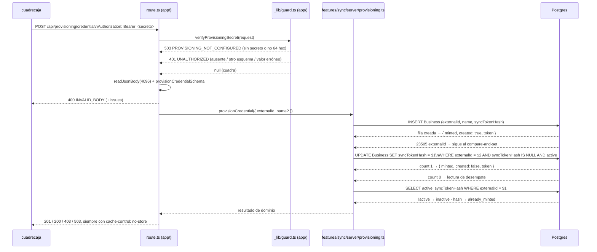

## Estado actual relevante

Lo que ya existe y esta arquitectura **reutiliza tal cual**, sin tocarlo:

| Pieza                                                                     | Qué aporta a F-034                                                                                                                                                 |
| ------------------------------------------------------------------------- | ------------------------------------------------------------------------------------------------------------------------------------------------------------------ |
| `src/lib/syncAuth.ts`                                                     | `mintSyncToken()` (R2), `hashSyncToken()` (el SHA-256 hex de los dos lados de R7), `readBearerToken()` (la forma de la cabecera), `SYNC_AUTH_SCHEME`               |
| `src/lib/httpJson.ts`                                                     | `readJsonBody(request, { maxBytes })` y `serializableIssues()` — el `400 INVALID_BODY` de E8 sale de aquí, sin reimplementar el parseo ni el tope de bytes         |
| `src/features/orders/server/prismaErrors.ts`                              | `isUniqueViolation(error, target)`, con la forma real del P2002 de Prisma 7 + `@prisma/adapter-pg` (`meta.driverAdapterError.cause.constraint.fields`)             |
| `src/app/api/crons/_lib/guard.ts`                                         | El precedente de forma: guard de área en `_lib/`, secreto leído de `process.env`, devuelve `NextResponse \| null`. Su `!==` y su 401 sin secreto NO se copian (I3) |
| `src/features/sync/server/caller.ts`                                      | El **lector** de `Business.syncTokenHash`. El escritor nuevo vive en el mismo directorio a propósito                                                               |
| `src/app/api/internal/boundaries.test.ts`                                 | La técnica del test de fronteras que lee el disco — el gemelo de `/api/provisioning` (I10) se escribe con ella                                                     |
| `src/features/marketplace/server/dbFixtures.ts`                           | `createFixtureSession()`, `makeToken()` y `sweepStaleFixtures()` — el aislamiento de las pruebas contra la base compartida                                         |
| `src/app/api/orders/_lib/body.ts` · `src/app/api/account/_lib/respond.ts` | El precedente de `NO_STORE` por área y del tope de bytes como constante (`ORDER_MAX_BODY_BYTES` en `src/constants/orders.ts`)                                      |
| `scripts/mint-sync-token.ts` · `prisma/seed.ts`                           | Sobreviven sin cambios (R18). El seed aporta la **semántica** de «acuña solo si es nulo»; no aporta código reutilizable (§ Los cuatro escritores)                  |
| `.agent/specs/F-028/smoke.sh`                                             | El precedente de SQL dentro de un smoke: `node -e` + `dotenv/config` + `pg`, y limpieza de **solo** las filas que esa corrida creó                                 |

Y el estado de partida del que hay que arrancar en frío: hoy el alta de un
negocio es `npm run mint:token -- <externalId>` desde una terminal con
`DATABASE_URL`, y ese comando **rota** si el negocio ya tenía token
(`scripts/mint-sync-token.ts:43-48`).

## Decisión

Tres archivos nuevos y un corte por capas que no negocia nada:

1. **`POST /api/provisioning/credential`** compone HTTP y nada más: llama al
   guard, lee el cuerpo con `readJsonBody`, lo valida con Zod y traduce un
   resultado de dominio a un código de estado. No importa Prisma.
2. **Un guard de área** en `_lib/` que responde 503 o 401 y, si todo cuadra,
   devuelve `null`. Es el **único** sitio del repo que conoce
   `PROVISIONING_SECRET_SHA256`, y ahí vive el `timingSafeEqual` (criterio 12).
3. **Un módulo de servidor** que es el único que toca Prisma y hace la escritura
   de R12 en dos sentencias autocommit: `create` y, si el `externalId` ya
   existía, un `updateMany` con `syncTokenHash: null` en el `where`
   (compare-and-set). Sin `$transaction`, sin `SELECT` previo, sin `upsert`.

**Por qué esta forma y no otra**, alternativa por línea:

- **`withProvisioningAuth(handler)` en vez de un guard que devuelve
  `NextResponse | null`**: descartada. El envoltorio de
  `src/app/api/internal/_lib/guard.ts` existe porque tiene que **entregar una
  identidad** (`InternalCaller`) que el handler no puede obtener de otro modo, y
  eso es lo que hace que una ruta sin guard no compile. Aquí no viaja ninguna
  identidad —el secreto autentica al integrador, no a un negocio (R5)—, así que
  el envoltorio no compraría la garantía del tipo, solo la apariencia. El riesgo
  real («la segunda ruta de `/api/provisioning` se olvida el guard») se cierra
  con el test de fronteras de § Pruebas, que es donde ese riesgo se puede
  comprobar de verdad.
- **Comparar en un módulo puro de `src/lib/`**: descartada, y el motivo está en
  el criterio 12, que es literal — `grep -n timingSafeEqual` **sobre el guard de
  la ruta** no puede salir vacío. Un módulo puro dejaría en el guard una
  llamada a otra función y el criterio solo se salvaría con un comentario que
  mencione la palabra: un criterio satisfecho por prosa es peor que no tenerlo.
  El guard queda aislado y testeable igual —`src/app/api/crons/_lib/guard.test.ts`
  es el precedente exacto: función pura de `Request` a `NextResponse | null`, con
  `process.env` intervenido— y lo único que compone son helpers ya puros de
  `src/lib/syncAuth.ts` (§ Contratos).
- **`upsert` con `update: { syncTokenHash: hash }`** (lo que hace el guion):
  prohibida por R12; rota el token vivo en un reintento.
- **`upsert` con `update: {}`**: prohibida por R12; deja al negocio de E3 sin
  token para siempre.
- **`SELECT` y luego `update`** (lo que hace `ensureSyncToken` del seed):
  descartada. Pierde la carrera de E11 en silencio y entrega al segundo llamante
  un token que ya no resuelve.
- **`$queryRaw` con `INSERT … ON CONFLICT ("externalId") DO UPDATE … WHERE
"syncTokenHash" IS NULL RETURNING (xmax = 0) AS created`**: es correcta y
  ahorra un round-trip, y aun así se descarta. Cuando el `DO UPDATE` no aplica
  no devuelve fila, así que hace falta la **misma** lectura de desempate para
  distinguir E4 de E9; y esconde las dos ramas de P2002 (E10 y E12) que la spec
  exige distinguir con `isUniqueViolation`. Se pierde legibilidad y no se gana
  ninguna garantía. Queda anotada como plan B si algún día el round-trip importa.
- **Una ruta bajo `/api/internal/*`**: imposible (huevo y gallina) y ya cerrada
  por la spec.

## Componentes

| Componente                            | Capa                        | Responsabilidad                                                                                                                    | Archivo                                                                |
| ------------------------------------- | --------------------------- | ---------------------------------------------------------------------------------------------------------------------------------- | ---------------------------------------------------------------------- |
| Ruta de aprovisionamiento             | `src/app/`                  | Solo `POST`. Guard → cuerpo → schema → módulo de servidor → código de estado. Cero Prisma, cero lógica                             | src/app/api/provisioning/credential/route.ts (por crear)               |
| Guard del secreto                     | `src/app/` (`_lib` de área) | 503 si el secreto no está o no es 64 hex; 401 en los tres fallos de cabecera; `null` si cuadra. `timingSafeEqual` sobre 32 bytes   | src/app/api/provisioning/\_lib/guard.ts (por crear)                    |
| Respuestas del área                   | `src/app/` (`_lib` de área) | `NO_STORE` y el único constructor de respuesta JSON del área, para que R10 sea estructural y el cuerpo del 401 sea uno solo (E7)   | src/app/api/provisioning/\_lib/respond.ts (por crear)                  |
| Alta y acuñación                      | `src/features/*/server/`    | **Lo único que toca Prisma**: `create` + compare-and-set, y las dos ramas de P2002. Devuelve un resultado de dominio, nunca HTTP   | src/features/sync/server/provisioning.ts (por crear)                   |
| Schema Zod del cuerpo                 | `src/features/*/schemas.ts` | `provisionCredentialSchema`: `externalId` obligatorio con `trim`/límites, `name` opcional, `strip` (no `strict`)                   | `src/features/sync/schemas.ts` (existe, gana un export)                |
| Tope de bytes del cuerpo              | `src/constants/`            | `PROVISIONING_MAX_BODY_BYTES = 4096`, igual que `ORDER_MAX_BODY_BYTES` en `src/constants/orders.ts`                                | `src/constants/sync.ts` (existe, gana un export)                       |
| Prueba del guard                      | test (`server`)             | E6, E7, E14 sin base: 503/401/`null` y el cuerpo idéntico de los tres 401                                                          | src/app/api/provisioning/\_lib/guard.test.ts (por crear)               |
| Prueba de la ruta                     | test (`server`)             | E8 y el mapeo de los cuatro resultados a 201/200/403/503; que el módulo de servidor **no se llama** en las ramas 503/401/400       | src/app/api/provisioning/credential/route.test.ts (por crear)          |
| Prueba contra Postgres real           | test (`db`)                 | E1, E3, E4, E5, E9, E10, E11, E12 y que el token acuñado resuelve por `resolveCaller`                                              | src/features/sync/server/provisioning.db.test.ts (por crear)           |
| Test de fronteras del área            | test (`server`)             | I10: ninguna ruta de `/api/provisioning` importa Prisma, todas pasan por el guard, y el guard sigue comparando en tiempo constante | src/app/api/provisioning/boundaries.test.ts (por crear)                |
| Smoke                                 | verificación en runtime     | Los criterios que solo se ven por HTTP, sobre un `externalId` propio y desechable                                                  | .agent/specs/F-034/smoke.sh (por crear)                                |
| Paso del negocio al guion de lote     | `scripts/`                  | `QAB_BUSINESS_ID` (con `seed-negocio-1` por omisión) para que el criterio 2 se ejecute literal — § Cómo se ejecuta el criterio 2   | `scripts/send-catalog-batch.mjs` y `scripts/store-event.mjs` (existen) |
| Contrato, despliegue y ejemplo de env | documentación               | v10 de `docs/sync-contract.md` (mayor), `docs/despliegue.md` §8.1/§9/§8.3 (I6, I7) y el secreto nuevo en `.env.example`            | `docs/sync-contract.md`, `docs/despliegue.md`, `.env.example`          |
| ADR                                   | documentación               | La decisión estructural: hay otra vez un secreto de plataforma, y qué NO puede autenticar nunca — § ¿Hace falta una ADR?           | docs/adr/0029-alta-de-negocio-por-api.md (por crear)                   |

No hay `design.md` ni componentes de cliente: **0 KB** de JavaScript nuevo.

## Flujo de datos



Las dos propiedades que este orden protege, y que no son estéticas:

- **Las ramas 503 y 401 no consultan la base** (E6, E7), porque el guard corre
  antes de todo y no importa Prisma ni nada que lo importe. Es también lo que
  hace innecesario un límite de tasa (§ Escalabilidad).
- **El 403 de E9 gana al 200 de E4**: la lectura de desempate mira `active`
  antes que `syncTokenHash`, así que un negocio dado de baja **con** token
  responde 403 y no 200.

## Contratos

### El guard

```ts
// src/app/api/provisioning/_lib/guard.ts (por crear)
export function verifyProvisioningSecret(request: Request): NextResponse | null;
```

Cuerpo, en el orden exacto (R7, R8, ADR 0008 § Detalle de implementación):

1. `const configured = (process.env.PROVISIONING_SECRET_SHA256 ?? "").trim().toLowerCase()`.
2. Si no cuadra con `/^[0-9a-f]{64}$/` (constante nombrada del módulo, no un
   literal suelto) → `console.warn("[provisioning] …")` **una sola vez** (bandera
   de módulo, para que una ráfaga de 503 no inunde el log) y `503
{"error":"PROVISIONING_NOT_CONFIGURED"}`.
3. `readBearerToken(request.headers.get("authorization"))` (`src/lib/syncAuth.ts:33`).
   `!ok` → 401 con el cuerpo del punto 5.
4. `timingSafeEqual(Buffer.from(hashSyncToken(bearer.token), "hex"), Buffer.from(configured, "hex"))`.
   Los dos buffers son de **32 bytes por construcción** —el digest siempre son
   64 hex y `configured` se validó como 64 hex en el punto 2—, así que
   `timingSafeEqual` no puede lanzar por longitudes distintas, que es
   exactamente lo que ADR 0008 exige. `false` → 401.
5. El 401 se construye en **un solo sitio** (una función local `unauthorized()`),
   así que «el mismo cuerpo en los tres casos» de E7 es estructural y no una
   coincidencia que alguien pueda romper editando una rama. Sin
   `www-authenticate` y sin ninguna otra cabecera que distinga los tres.
6. `null`.

Reutilizar `readBearerToken` tiene una consecuencia que hay que escribir:
impone `MIN_BEARER_TOKEN_LENGTH = 32` (`src/lib/syncAuth.ts:24`), así que un
secreto **correcto pero más corto de 32 caracteres** responde 401 y es
indistinguible de un valor equivocado. Se acepta a propósito —es un suelo
sano para un secreto compartido y evita un segundo parser de cabeceras en el
repo— y se paga con una línea en `docs/despliegue.md`: el secreto se genera con
`openssl rand -base64 32` (44 caracteres) y **nunca** más corto de 32.

### El schema del cuerpo

```ts
// en src/features/sync/schemas.ts
export const provisionCredentialSchema = z.object({
  externalId: z.string().trim().min(1).max(128),
  name: z.string().trim().min(1).max(200).optional(),
});
export type ProvisionCredentialInput = z.infer<typeof provisionCredentialSchema>;
```

`strip` (el defecto), no `strict` — la spec ya razonó por qué. `trim` antes de
los límites, así que `"   "` da 400 y `" neg-1 "` entra como `neg-1` (R17: se
recorta y **no** se normaliza el caso).

### El módulo de servidor

```ts
// src/features/sync/server/provisioning.ts (por crear)
export type ProvisionResult =
  | { status: "minted"; created: boolean; token: string }
  | { status: "already_minted" }
  | { status: "inactive" }
  | { status: "collision" };

export async function provisionCredential(
  input: ProvisionCredentialInput,
): Promise<ProvisionResult>;
```

Un resultado de dominio, no un `NextResponse`: es lo que permite probarlo contra
Postgres real sin HTTP, y lo que mantiene el corte de capas de R13. `created` y
`minted` son dos preguntas distintas y por eso `created` viaja **dentro** de
`minted` (el caso de E3 es `created: false` con token).

### La tabla de errores de la ruta

| Código | Cuerpo                                                       | Se produce en                                         |
| ------ | ------------------------------------------------------------ | ----------------------------------------------------- |
| `201`  | `{ externalId, created, minted: true, token }`               | `status: "minted"`                                    |
| `200`  | `{ externalId, created: false, minted: false, token: null }` | `status: "already_minted"`                            |
| `400`  | `{ error: "INVALID_BODY", issues }`                          | `readJsonBody` (content-type, 4 KB, JSON) o el schema |
| `401`  | `{ error: "UNAUTHORIZED" }`                                  | el guard, tres ramas, un solo cuerpo                  |
| `403`  | `{ error: "BUSINESS_INACTIVE" }`                             | `status: "inactive"`                                  |
| `405`  | el del framework                                             | no se exporta `GET`/`PUT`/`DELETE` (E16)              |
| `503`  | `{ error: "PROVISIONING_NOT_CONFIGURED" }`                   | el guard, antes de cualquier consulta                 |
| `503`  | `{ error: "TOKEN_COLLISION" }`                               | `status: "collision"`                                 |

`cache-control: no-store` en **todas**, incluidas las del guard: las respuestas
se construyen solo con el helper de src/app/api/provisioning/\_lib/respond.ts
(por crear), que lleva `NO_STORE` incorporado. El `switch` sobre
`ProvisionResult` va **sin `default`**, para que añadir un estado al tipo rompa
la compilación en vez de caer en un 500 silencioso — el mismo truco que
`withInternalAuth` usa con `CallerResolution`.

Los códigos de error se escriben como literales en el único sitio donde aparece
cada uno, igual que `SYNC_NOT_CONFIGURED` en `src/app/api/internal/_lib/guard.ts:39`
y `REALTIME_NOT_CONFIGURED` en `src/app/api/internal/realtime/credential/route.ts:28`.
El único que se repetiría es `UNAUTHORIZED`, y no se repite porque hay una sola
función que lo construye.

## Modelo de datos y migraciones

**Ninguna migración.** Se escriben tres columnas que ya existen:
`Business.externalId`, `Business.name` y `Business.syncTokenHash`
(`prisma/schema.prisma`, modelo `Business`). Los dos `@unique` que hacen cumplir
la exclusividad —`externalId` y `syncTokenHash`— ya están, y son la única
autoridad: no hay `SELECT` previo que decida nada (ADR 0018 (a)).

Ningún comando de los prohibidos por `AGENTS.md` entra en el plan: no hay
`prisma migrate dev`, ni `db push`, ni `migrate reset`.

## R12: crear-si-no-existe + compare-and-set, sin transacción

El pooler de Supabase corre en **modo transacción**: una query del cliente
global dentro de un `$transaction` interactivo hace deadlock (`AGENTS.md`
§ Cosas que muerden, y el comentario que `handleProduct` ya lleva escrito). Aquí
no hace falta ninguna transacción, porque cada paso es **una sentencia
autocommit** y la atomicidad que se necesita es la de una sola fila.

**Paso 1 — intentar el alta.** Una sentencia.

```ts
const { token, hash } = mintSyncToken(); // R2, jamás reimplementado
try {
  await prisma.business.create({
    data: { externalId, name: name ?? externalId, syncTokenHash: hash }, // E17
    select: { id: true },
  });
  return { status: "minted", created: true, token }; // E1
} catch (error) {
  if (isUniqueViolation(error, "externalId")) {
    /* el negocio ya existía → paso 2 */
  } else if (isUniqueViolation(error, "syncTokenHash")) {
    return { status: "collision" }; // E12: el INSERT abortó entero, no queda Business
  } else {
    throw error; // cualquier otro error es un fallo real, no una carrera
  }
}
```

El orden de las dos comprobaciones importa poco (Postgres reporta **una**
constraint por error) pero se escribe con `externalId` primero porque es la
rama ordinaria. E12 sale gratis y **completa**: al ser un solo `INSERT`, un
23505 sobre `syncTokenHash` no deja ni la fila `Business` — que es literalmente
lo que E12 exige («tampoco el `Business`, si era el caso de E1»).

**Paso 2 — compare-and-set.** Una sentencia, sin lectura previa.

```ts
const applied = await prisma.business.updateMany({
  where: { externalId, syncTokenHash: null, active: true },
  data: { syncTokenHash: hash },
});
if (applied.count === 1) return { status: "minted", created: false, token }; // E3
```

`updateMany` genera un `UPDATE … WHERE "externalId" = $1 AND "syncTokenHash" IS
NULL AND "active"` y devuelve el número de filas afectadas. Es todo lo que hace
falta para E11: en `READ COMMITTED`, la segunda de dos concurrentes **se bloquea**
en el candado de fila que tomó la primera, y al desbloquearse **reevalúa su
`WHERE` contra la versión nueva** de la fila; como `syncTokenHash` ya no es nulo,
no coincide con nada y devuelve `count: 0`. Ni `SELECT … FOR UPDATE`, ni
`$transaction`, ni un `SELECT` previo que pudiera quedar rancio. El hash que
queda guardado es el de la que respondió 201, nunca el de la otra.

Un P2002 sobre `syncTokenHash` en este `updateMany` es también E12 → `collision`,
y no deja nada escrito (la sentencia entera aborta).

**Paso 3 — lectura de desempate.** Solo se ejecuta si `count === 0`, o sea nunca
en el camino que acuña.

```ts
const row = await prisma.business.findUnique({
  where: { externalId },
  select: { active: true, syncTokenHash: true },
});
if (!row) return provisionCredential(input, attempt + 1); // ver abajo
if (!row.active) return { status: "inactive" }; // E9, 403, sin acuñar y sin reactivar
if (row.syncTokenHash) return { status: "already_minted" }; // E4 / E10
return provisionCredential(input, attempt + 1);
```

Los dos reintentos son de ventanas que solo abre otra escritura simultánea: la
fila borrada por SQL entre el paso 2 y el 3, o su hash puesto a `NULL` en ese
mismo hueco. Se reintenta **una sola vez** (`attempt` interno, tope 1) y, si
vuelve a pasar, se lanza un `Error` — un 500 honesto es mejor que un 200 que
miente. La recursión acuña un token nuevo, lo cual es correcto: el anterior no
se escribió en ninguna parte.

**Coste por rama**, en round-trips (ninguna transacción, ningún `$transaction`):

| Escenario                     | Sentencias | Cuál                                       |
| ----------------------------- | ---------- | ------------------------------------------ |
| E1 alta nueva                 | 1          | `INSERT`                                   |
| E3 negocio existente sin hash | 2          | `INSERT` fallido + `UPDATE`                |
| E4 repetición                 | 3          | `INSERT` fallido + `UPDATE` (0) + `SELECT` |
| E9 negocio de baja            | 3          | igual que E4                               |
| E10 / E11 perdedora           | 3          | igual que E4                               |
| E6 / E7 rechazo               | **0**      | el guard responde antes de tocar Prisma    |

El `INSERT` fallido en el camino idempotente es deliberado: cuesta un
round-trip en una llamada que ocurre **una vez por negocio**, y a cambio la
exclusividad la hace cumplir la base y no un `SELECT` que pierde carreras (R12,
ADR 0018 (a)).

## Los cuatro escritores de `syncTokenHash` (I2)

**Decisión: no se extrae nada compartido ahora**, y se deja **vigilado** en vez
de solo anotado.

Por qué no se extrae, con lo que se comprobó leyendo los tres escritores que ya
existen:

- `scripts/mint-sync-token.ts:43-48` **tiene que poder rotar** —es la única vía
  de rotación que queda (R18, § La arruga conocida del recorte)— y la ruta tiene
  prohibido rotar. Un helper común necesitaría un parámetro `modo`, que es el
  antipatrón de la función con banderas.
- `prisma/seed.ts` (`ensureSyncToken`) tiene la semántica correcta pero
  **implementada como `SELECT` y luego `update`**, que es justo lo que R12
  prohíbe; y no es importable: corre bajo `tsx`, con su **propio**
  `PrismaClient` construido en el guion, mientras el módulo nuevo depende de
  `@/lib/prisma` (alias que el guion no usa —importa `../src/lib/syncAuth` en
  relativo— y cliente global que abriría un segundo pool en el proceso del
  seed). Reescribir el seed para que llame al módulo nuevo cambia el radio del
  cambio y no arregla nada que hoy falle: el seed es un solo proceso sin
  concurrencia.
- `src/features/marketplace/server/dbFixtures.ts:197` crea el negocio **entero**
  (con storefront, tiendas, pedidos) en un `create` que ya lleva el hash. No hay
  nada que compartir salvo la línea del hash.

Lo que de verdad importa —**que los cuatro acuñen con la misma función**— ya está
compartido: `mintSyncToken()` de `src/lib/syncAuth.ts` (R2). Para que el cuarto
escritor no se vuelva un quinto por descuido, el test de fronteras del área
(§ Pruebas) fija la **lista blanca de llamantes de `mintSyncToken(`**:
`src/lib/syncAuth.ts`, src/features/sync/server/provisioning.ts (por crear),
`scripts/mint-sync-token.ts`, `prisma/seed.ts` y
`src/features/marketplace/server/dbFixtures.ts`, más los tests. Un archivo nuevo
que acuñe se pone rojo y obliga a decidir a propósito, que es exactamente lo que
I2 pedía. Es la misma técnica que la asertación G7 de
`src/app/api/internal/boundaries.test.ts` usa con `CanonicalBarcode`.

## Pruebas: qué en `server`, qué en `db`, qué solo en el smoke

**Restricción dura que ordena todo lo demás.** Postgres es **un contenedor
compartido** entre el checkout principal y todos los worktrees
(`.agent/playbook/mint-token-rota-el-token-en-bd-compartida.md`). Ninguna prueba
de este feature —ni de unidad, ni de base, ni el smoke— puede poner a `NULL` ni
rotar el `syncTokenHash` de `seed-negocio-1` o `seed-negocio-2`: eso le rompe el
`QAB_BEARER_TOKEN` a las demás sesiones, con un 401 que no dice nada de
rotación. Se traduce en tres reglas verificables:

1. Cualquier caso que necesite «un negocio que existe» crea el suyo, con
   `externalId` propio.
2. Los `externalId` de los `*.db.test.ts` se construyen con `makeToken()`
   (`src/features/marketplace/server/dbFixtures.ts`), cuyo prefijo `qab_f015_`
   hace que `sweepStaleFixtures()` recoja los restos de una corrida muerta.
   Los del smoke usan el prefijo `f034-smoke-` y los borra el propio smoke.
3. Ni el smoke ni ninguna prueba ejecutan `npm run mint:token`.

### Proyecto `server` (mockeado, node) — lo que no necesita base

- src/app/api/provisioning/\_lib/guard.test.ts (por crear), con
  `process.env` intervenido como en `src/app/api/crons/_lib/guard.test.ts`:
  variable ausente → 503; variable con el secreto **en claro** (no 64 hex) → 503
  y no 401 (criterio 19, el diagnóstico de R9); variable de 63 hex y vacía → 503;
  cabecera ausente, `Basic …`, valor desnudo y `Bearer <valor erróneo>` → 401 con
  el **mismo cuerpo serializado** en los cuatro (E7, criterio 7); un token con
  forma de token de sync (48 base64url) → 401 (E14 sin base); secreto correcto →
  `null`; `cache-control: no-store` en el 401 y en el 503 (criterio 17).
- src/app/api/provisioning/credential/route.test.ts (por crear), que **mockea
  `@/features/sync/server/provisioning`** y no Prisma —la convención de
  `src/app/api/internal/sync/catalog/route.test.ts`—: los cuatro resultados
  mapeados a 201/200/403/503 con el cuerpo exacto; E8 en sus cinco formas
  (`{}`, `{"externalId":"   "}`, 129 caracteres, texto que no es JSON, sin
  `content-type: application/json`) → 400 `INVALID_BODY` con `issues`; **que el
  módulo mockeado no se llama** en ninguna rama 503/401/400, que es «no se
  escribe nada» probado más fuerte que con un `count(*)`; `name` reenviado
  recortado y `undefined` cuando no viene (E17); que el módulo **solo** exporta
  `POST` (E16).
- Criterio 6, primera mitad: es este archivo con
  `delete process.env.PROVISIONING_SECRET_SHA256` — la ruta **real** responde 503
  y el escritor no se llama. La segunda mitad («`/api/internal/*` sigue
  respondiendo lo suyo») va en el smoke. Ver AP3.
- Casos del schema en `src/features/sync/schemas.test.ts` (existe): `trim`,
  límites, `strip` de claves desconocidas y el typo `external_id` → 400 porque
  `externalId` falta.

### Proyecto `db` (Postgres real) — lo que solo se ve con los `@unique`

src/features/sync/server/provisioning.db.test.ts (por crear), un archivo, en un
proyecto que ya corre sus archivos en serie (`vitest.config.mts`,
`fileParallelism: false`):

- **E1**: `externalId` nuevo → `minted`/`created: true`, y `count(*)` de ese
  `externalId` = 1.
- **La sustancia de E2, sin HTTP**: `resolveCaller(hashSyncToken(token))`
  (`src/features/sync/server/caller.ts`) devuelve `ok` con el `businessId` de esa
  fila. Es la prueba de que el token **autentica de verdad** y no depende de
  ningún guion ni de ningún negocio del seed.
- **E3**: sobre el negocio de una `createFixtureSession()` **propia**, con su
  `syncTokenHash` puesto a `null` (su token, no el del seed) → `minted`/
  `created: false` y `count(*)` de `Business` igual antes y después.
- **E4 y E5**: repetir → `already_minted`, el `syncTokenHash` leído es **byte a
  byte** el mismo, y el token de la primera sigue resolviendo por `resolveCaller`.
- **E9**: fixture con `active: false` → `inactive`, y su `syncTokenHash` intacto
  (en las dos variantes: nulo y poblado).
- **E10**: `Promise.all` de dos `provisionCredential` con el mismo `externalId`
  desconocido → un `minted` y un `already_minted`, `count(*)` = 1, ninguna
  excepción.
- **E11** (criterio 15): `Promise.all` de dos sobre un negocio existente sin
  hash → exactamente uno `minted`, y el hash guardado es el de **ese** token
  (comparado con `hashSyncToken`), no el del otro.
- **E12** (criterio 18): `vi.mock("@/lib/syncAuth")` devolviendo un
  `mintSyncToken` que produce un hash **que ya está** en la base (el de otro
  fixture) → `collision`, y `count(*)` de `Business` sin cambio.
- Limpieza en `afterAll`: `deleteMany` por los `externalId` que este archivo
  creó, más `cleanup()` de cada `FixtureSession`.

### Solo en el smoke (HTTP real)

.agent/specs/F-034/smoke.sh (por crear), copiado de `.agent/templates/smoke.sh`,
con SQL por `node -e` + `pg` como `.agent/specs/F-028/smoke.sh`:

- **Guardián de precondición, nunca un salto en verde**: si
  `QAB_PROVISIONING_SECRET` falta, o si su SHA-256 no coincide con el
  `PROVISIONING_SECRET_SHA256` del entorno, aborta con `SMOKE FAIL` y el comando
  de arreglo. Un smoke que se salta en verde es el fallo que F-015 prohibió.
- Criterios **1, 3, 5, 7, 8, 9, 10, 11**, y los propuestos **16, 17, 19, 20**,
  todos sobre `f034-smoke-<epoch>` como `externalId`.
- Criterios **2 y 4** con `scripts/send-catalog-batch.mjs` — § siguiente.
- **Una comprobación que no está en ningún criterio y que conviene**:
  `select count(*) from "Business" where "syncTokenHash" = '<PROVISIONING_SECRET_SHA256>'`
  = 0. El digest del secreto y el hash de un token de negocio viven en el mismo
  espacio de valores; esa consulta es la que detectaría que alguien cableó el
  secreto de aprovisionamiento como credencial de sync — la trampa que la ADR
  prohíbe por escrito.
- Limpieza al final, y solo de lo suyo: `delete from "SyncEvent" where
"businessId" like 'f034-smoke-%'` y `delete from "Business" where
"externalId" like 'f034-smoke-%'` (`SyncEvent.businessId` es el `externalId` y
  no tiene clave ajena, comprobado en `prisma/schema.prisma`).

## Cómo se ejecuta el criterio 2 (I8), de verdad

El criterio dice, literal: `node scripts/send-catalog-batch.mjs --token=<el
devuelto>` → 207, y **no se puede reescribir**. Las dos vías que la spec
consideró no sirven aquí:

- La **vía (a)** de I8 —poner a `NULL` el hash de `seed-negocio-1` y darlo de
  alta por la ruta— **rota el token de `seed-negocio-1`**, que es el que llevan
  los `.env` de los demás worktrees contra la **misma** base. Está prohibida por
  la restricción de § Pruebas y por la ficha
  `.agent/playbook/mint-token-rota-el-token-en-bd-compartida.md`.
- La **vía (b)** —`--business=<externalId>`— funciona pero cambia el comando
  escrito en el criterio.

**Decisión: el negocio del guion pasa a leerse del entorno, con el valor de hoy
por omisión.** Una línea en `scripts/send-catalog-batch.mjs`:

```js
const businessId = process.env.QAB_BUSINESS_ID ?? "seed-negocio-1";
```

y pasarlo a `buildStoreEvent(..., { businessId, ... })`, que ya lo acepta como
opción con el mismo valor por defecto (`scripts/store-event.mjs`,
`buildStorePayload`). Con eso el smoke exporta la variable **antes** y ejecuta el
comando del criterio **byte a byte como está escrito**:

```bash
export QAB_BUSINESS_ID="$EXTERNAL_ID"
node scripts/send-catalog-batch.mjs --token=$TOKEN   # criterio 2 → 207
node scripts/send-catalog-batch.mjs --token=$TOKEN   # criterio 4, tras el criterio 3 → 207
```

Por qué esto es lo correcto y no un truco:

- El `argv` es idéntico al del criterio. La configuración por `QAB_*` es la que
  ese guion **ya** usa para todo lo demás (`QAB_BASE_URL`, `QAB_BEARER_TOKEN`, con
  `dotenv/config` cargado en la primera línea): no se estrena un mecanismo, se
  usa el que hay.
- El valor por omisión sigue siendo `seed-negocio-1`, así que **ninguna** de las
  verificaciones que ya dependen de este guion (F-005, F-018, F-024, F-031,
  F-032) cambia de comportamiento.
- **No se toca ningún token del seed.** Nada se rota, nada se pone a `NULL`.

**Y el 207 se cumple aunque todos los eventos salgan `skipped`** — lo comprobé en
el código antes de apoyarme en la afirmación, porque el plan depende de ella:

- `src/app/api/internal/sync/catalog/route.ts:44-45` devuelve
  `NextResponse.json(result, { status: 207 })` sin mirar los resultados por
  evento; el único camino a otro código es un `throw` de `processCatalogBatch`
  (500) o un 400/403 anteriores.
- Con `QAB_BUSINESS_ID` puesto al negocio nuevo, el `businessId` del cuerpo y el
  de los dos payloads coinciden con el autenticado, así que
  `findCatalogMismatch` no dispara: **no hay 403** `BUSINESS_MISMATCH`, que es
  justo lo que I8 detectó.
- El `storeId` del guion sigue siendo `seed-tienda-1`, que pertenece a **otro**
  negocio: `handleProduct` devuelve `SKIPPED` en
  `src/features/sync/server/handlers/product.ts:75`
  (`if (!store || store.businessId !== businessId)`) y `handleStore` hace lo
  mismo en `src/features/sync/server/handlers/store.ts:110`. Dos eventos
  `skipped`, un 207, y **cero** filas ajenas tocadas.
- Eso es además lo que hay que querer: **no** se debe permitir un `storeId` nuevo
  para el negocio desechable, porque `handleStore` crearía `Store` +
  `Storefront` + una fila en `Slug`, y ADR 0018 (a) decide que un slug retirado
  **no vuelve al pool** — un smoke acaparando slugs irreversiblemente. Por eso la
  decisión es una variable para el **negocio** y ninguna para la tienda.
- Lo que sí escribe: `handleStore` actualiza `Business.name` y
  `baseCurrencyCode` del negocio autenticado **antes** del corte por inquilino
  (`src/features/sync/server/handlers/store.ts:72-76`), así que el negocio
  desechable pasa a llamarse `Distribuidora La Rampa`. Consecuencia práctica: el
  criterio 20 (el nombre, E17) se comprueba **antes** de ejecutar el criterio 2,
  o sobre otro `externalId`. Va escrito porque no se deduce de nada.

Un 207 así prueba exactamente lo que el criterio quiere: que el token **no**
responde 401 y que el negocio del token es el del cuerpo. La prueba de que
además escribe se hace donde se puede hacer bien: `resolveCaller` en el
`*.db.test.ts` de arriba.

## Escalabilidad y límites

Volumen real: **una llamada por negocio, una vez en la vida del negocio** (D7).
El techo del universo es el número de negocios de cuadrecaja: hoy decenas,
mañana centenares.

Por petición aceptada: **1 a 3 sentencias**, ninguna transacción, **una** fila
escrita como máximo, un SHA-256 de ≤ 44 bytes, 36 bytes de `randomBytes` y una
respuesta de **~120 bytes**. Petición ≤ 4 KB por construcción. Sin caché por
definición (`no-store`), así que no hay nada que invalidar ni ningún tag de ISR
en juego. **0 KB** de JavaScript de cliente.

Por petición rechazada (401, 503): **0 sentencias**, 0 conexiones del pool, un
hash y una comparación de 32 bytes. Es la propiedad más importante de esta
sección.

**La ráfaga tras un despliegue**, que es la pregunta concreta: si cuadrecaja
llama una vez por cada negocio en paralelo, con N = 500 son 500 invocaciones y
**≤ 1500 sentencias** de una fila; el trabajo agregado en Postgres es del orden
de **un par de segundos**, y la concurrencia la acota antes Vercel (funciones
simultáneas) y Supavisor en modo transacción que el propio Postgres. Con
`max: 5` por cliente de Prisma (`src/lib/prisma.ts:41`) ninguna instancia puede
abrir más de cinco conexiones. Multiplicar por 100 (50 000 negocios en la tabla)
no cambia el coste por llamada: `externalId` es un btree `@unique`, 3-4 páginas.
Lo primero que se rompería al escalar **no es esta ruta**, es el rendimiento de
`/api/internal/*` con ese número de inquilinos.

El caso patológico único: muchas llamadas concurrentes sobre el **mismo**
`externalId` desconocido (una tormenta de reintentos). Cada perdedora gasta un
`INSERT` abortado + un `UPDATE` de 0 filas + un `SELECT` = 3 sentencias y
responde 200. Coste lineal, contención confinada a una fila, sin convoy de
candados.

**¿Hace falta límite de tasa? No, y no por prudencia genérica**, sino por cuatro
razones medibles:

1. El camino de rechazo **no toca la base** y no reserva conexión: es el rechazo
   más barato que se puede escribir. Una ráfaga de 401 cuesta invocaciones y
   ancho de banda, no datos ni pool.
2. El secreto son **256 bits** de entropía (`openssl rand -base64 32`). La fuerza
   bruta no está en el modelo de amenaza, así que un limitador no compraría nada
   contra el ataque que supuestamente frena.
3. Con el secreto **correcto** el daño está acotado por diseño: R3/R4 impiden
   tocar un negocio que ya tiene token, así que lo peor es crear filas huérfanas
   —ya inventariado en § Lo que esto no protege de la spec— y eso lo limita
   igual de bien un límite de red que uno de aplicación.
4. No hay módulo de límite de tasa en el repo, y estrenarlo aquí sería o un
   contador en memoria por instancia (inútil en serverless) o una dependencia y
   un secreto nuevos: más superficie que la que protege.

**Cuándo se reabre**, con el umbral escrito: si el camino de rechazo llegara a
consultar la base (por ejemplo, si alguien añade una sonda de configuración como
la de `syncConfigured()`); si el secreto se reparte a un segundo integrador; o si
la ruta llegara a aceptar más de un negocio por llamada.

**Recomendación operativa, sin código y fuera de los criterios** (la spec deja
el límite de tasa explícitamente fuera de alcance): una línea en
`docs/despliegue.md` proponiendo una regla de firewall de Vercel por IP sobre
`/api/provisioning/*`. Hay precedente exacto —F-019 dejó una regla de firewall
documentada porque no se despliega con el código— y cuesta cero mantenimiento.

## Patrones a seguir / antipatrones a evitar

- **`src/app/` no toca Prisma** (`AGENTS.md` § Arquitectura y § Prohibiciones).
  La ruta llama al módulo de `features/sync/server/`; el test de fronteras nuevo
  lo vigila para las rutas **futuras** del área, no solo para esta.
- **`console.warn` con prefijo `[provisioning]`, nunca `console.error`**
  (`AGENTS.md` § Cosas que muerden, ficha
  `.agent/playbook/console-error-dispara-guardian-servidor.md`). Es explícito
  porque los dos archivos de los que se copia la forma
  —`src/app/api/internal/_lib/guard.ts:36,48` y
  `src/app/api/internal/realtime/credential/route.ts:24`— usan `console.error`
  (I9). No se arreglan aquí, y no se imitan.
- **Nunca el secreto ni el token en un log**, ni entero ni en trozos (R11). El
  aviso del 503 nombra la **variable**, no su valor. Los 401 **no se registran**:
  una ráfaga inundaría el log sin decir nada que no diga ya un contador.
- **Ningún `$transaction`** (`AGENTS.md` § Cosas que muerden: el pooler en modo
  transacción hace deadlock con el cliente global). Tres sentencias autocommit
  como mucho.
- **Ni `upsert` con `update: { syncTokenHash }` ni con `update: {}`** (R12, I1).
  El código que **no** hay que copiar es `scripts/mint-sync-token.ts:43-48`.
- **`mintSyncToken`/`hashSyncToken`/`readBearerToken` se reutilizan, no se
  reimplementan** (R2, R7).
- **Zod con `strip`, no `strict`**, y `trim` antes de los límites.
- **Un archivo que todavía no existe no se cita entre comillas invertidas**:
  sin comillas y con `(por crear)` (`AGENTS.md` § Cosas que muerden). Vale para
  el `plan.md` y para el `tests.md` de este feature igual que para este
  documento.
- **Cada edición de `docs/sync-contract.md` mueve la versión de su primera
  línea** (`AGENTS.md` § Documentación, y el hook
  `.claude/hooks/sync-contract-version.sh`). Aquí es la **v10**, mayor, y hay
  cuatro sitios que cambian más los tres de I6 y el v6 rancio de I7.

## Riesgos y plan B

1. **El secreto pegado en claro donde va su hash.** Es el error más probable de
   este diseño. Mitigado por E6/R8: 503 y no 401, con un `console.warn` que
   nombra la variable. Plan B: `npm run mint:token`, que sigue funcionando sin
   ninguna configuración nueva (R18).
2. **Que alguien «arregle» el guard para aceptar el secreto en claro**, o para
   que el secreto valga en `/api/internal/*`. Es la trampa que ADR 0013 advierte
   de no dejar. Mitigado por la ADR de abajo (que lo prohíbe por escrito), por el
   test de fronteras y por la consulta del smoke que comprueba que el digest del
   secreto **no** está en ninguna fila de `Business.syncTokenHash`.
3. **Una prueba que rote el token de un negocio del seed.** Es un fallo de otra
   sesión, no del CI, y por eso es el riesgo peor: nadie lo ve fallar aquí.
   Mitigado por las tres reglas de § Pruebas y por la ficha del playbook, que
   hay que citar en `tests.md`.
4. **La forma del P2002 con `@prisma/adapter-pg`.** `isUniqueViolation` ya la
   maneja (`meta.driverAdapterError.cause.constraint.fields`, fichado en F-012),
   pero si cambiara, la rama de colisión respondería 500 en vez de 503 y la
   carrera de E10 se convertiría en 500. El caso E12 del `*.db.test.ts` es lo que
   lo fija contra Postgres real; no basta con un test mockeado.
5. **La v10 es mayor y hay que coordinarla con cuadrecaja antes de publicarla**
   (`AGENTS.md` § Documentación). El código puede entrar antes de la publicación
   —hay precedente con la v6— pero es decisión del humano, y sin repartir el
   secreto la ruta existe y no la llama nadie.
6. **Un `externalId` mal escrito deja una fila que solo se limpia por SQL.** Sin
   `DELETE` por API, es lo que la spec ya aceptó; el daño está acotado porque un
   `Business` no reserva slug (ADR 0018 (a), `Business.slug` retirado).

## ¿Hace falta una ADR?

**Sí.** Número siguiente libre: **0029**. Título propuesto: «El alta de un
negocio es una llamada de cuadrecaja, con un secreto de integrador». Archivo:
docs/adr/0029-alta-de-negocio-por-api.md (por crear).

Hace falta por dos motivos estructurales, no por ceremonia: **reintroduce un
secreto de plataforma** en el repo donde ADR 0013 retiró justamente el
`SYNC_TOKEN` único, y **mueve el alta de un negocio de una terminal a una API**,
lo que elimina de facto la puerta de admisión que hoy existe por accidente (I14).
Ninguna de las dos cosas se deduce del código, y las dos son las que un lector
futuro va a querer «arreglar».

**Qué tiene que decidir, exactamente** (seis puntos, todos ya razonados aquí o
en la spec):

1. **Hay dos credenciales con sujetos distintos y no se mezclan.**
   `Business.syncTokenHash` identifica a **un negocio** y es la única identidad
   del sync (ADR 0013 sigue intacta); `PROVISIONING_SECRET_SHA256` identifica a
   **cuadrecaja como integrador** y solo vale en `/api/provisioning/*`. Que el
   `externalId` viaje en el cuerpo no contradice ADR 0013 porque el negocio es el
   **objeto** de la operación, no el sujeto que la autentica.
2. **La frase que cierra la trampa**, que es el punto por el que esta ADR existe:
   _«el secreto de aprovisionamiento no autentica, ni autenticará, ninguna ruta
   de `/api/internal/*`. Está prohibido pasarlo a `resolveCaller()`, aceptarlo en
   `withInternalAuth`, escribir su digest en `Business.syncTokenHash` o derivar
   de él un token de negocio. La única forma de que una petición de sync se
   autentique es que su token hashee a un `syncTokenHash` de una fila
   `Business`; si algún día hiciera falta otra cosa, se supera esta ADR con otra,
   no se cablea el guard.»_ Con el corolario comprobable: el valor de
   `PROVISIONING_SECRET_SHA256` **nunca** aparece en la columna
   `Business.syncTokenHash` (la consulta está en § Pruebas). Compartir helpers
   **puros** (`hashSyncToken`, `readBearerToken`) no es cablear nada: la
   prohibición es sobre la identidad, no sobre el SHA-256.
3. **queandabuscando no ejerce admisión** (D1, R16): cualquier `externalId` que
   llegue con el secreto correcto tiene luz verde, la moderación vive en
   cuadrecaja, y la única palanca de este lado es `Business.active`, posterior al
   alta. Y decirlo como lo que es: se **elimina** una barrera que estaba ahí por
   accidente, no se relaja algo acordado.
4. **Registrar es idempotente y no rota jamás** (R3/R4), y eso no es higiene sino
   una **propiedad de seguridad**: con el secreto filtrado no se puede secuestrar
   el sync de un negocio que ya tiene token. El precio es que un token perdido
   solo se recupera **rotando con corte** desde `scripts/mint-sync-token.ts`, que
   sigue siendo la vía de rescate y la única rotación.
5. **El verificador guarda el digest, no el secreto** (R9), y la comparación es
   en tiempo constante sobre dos buffers de 32 bytes, heredando ADR 0008 § Detalle
   de implementación. La invariante del 503 de ADR 0008 se aplica **también** a
   este secreto (ausente jamás significa «deja pasar todo»), y se divergerá a
   propósito de `src/app/api/crons/_lib/guard.ts`, que responde 401 (I3).
6. **El grano y cuándo se reabre**: un solo secreto para un solo integrador. El
   día que haya un segundo integrador, o que se quiera rotación/revocación con
   solape, se retoma `.agent/specs/propuestas/credenciales-de-integracion.md` con
   su tabla `BusinessCredential`, y **D8 se reabre** (firmante en vez de
   transporte).

**Quién la escribe.** No yo (frontera de este ciclo). Recomendación:
**sdd-implementer**, en la misma etapa que crea el guard y en el mismo commit
—`AGENTS.md` § Documentación pide la ADR en el ciclo que introduce la decisión—
con estos seis puntos como esqueleto, y el humano la marca **Aceptada**. La
alternativa (que la escriba el orquestador antes de implementar) también vale y
es mejor si el humano quiere firmar el texto de la frase del punto 2 antes de que
se programe nada; lo que **no** vale es dejarla para después, porque el punto 2
es precisamente lo que impide el atajo mientras el código es nuevo. Ver AP2.

## Preguntas al humano

**AP1 — El secreto local: ¿quién lo genera y dónde vive?**
La ruta necesita `PROVISIONING_SECRET_SHA256` en el entorno del servidor y los
guiones necesitan `QAB_PROVISIONING_SECRET` en claro; sin los dos, el smoke
aborta (a propósito, nunca en verde).

- **(a) Recomendada.** A mano, con las dos líneas que se documentan en
  `docs/despliegue.md` (`openssl rand -base64 32` y su `sha256`), pegadas en
  `.env` local y en las variables de Vercel; `.env.example` lo documenta sin
  asignarlo, como ya hace con `CRON_SECRET`.
- (b) Extender `scripts/dev-secrets.mjs`. **No recomendada**: su contrato de
  stdout («un nombre por línea, en este orden») lo leen `.agent/init.sh`,
  `.agent/specs/F-029/smoke.sh` y `.agent/specs/F-012/smoke.sh`, y ese guion
  existe para los tres secretos **requeridos por `serverEnv()`** — este no lo es
  a propósito (para no atar F-034 a F-029).

Y la parte que solo puedes hacer tú en cualquiera de los dos casos: **repartir el
secreto a cuadrecaja**. Sin eso la ruta existe y no la llama nadie.

**AP2 — La ADR 0029: ¿la escribe el implementador en el mismo commit, o la
quieres antes de firmar el plan?**

- **(a) Recomendada.** La escribe sdd-implementer en la etapa del guard, con los
  seis puntos de § ¿Hace falta una ADR?; tú la marcas Aceptada al revisar el PR.
- (b) La escribe el orquestador antes de que se programe nada, si prefieres
  firmar la frase del punto 2 —la que prohíbe cablear el secreto al guard del
  sync— antes que el código.

**AP3 — El criterio 6: ¿te vale la ejecución a nivel de ruta?**
«Sin el secreto configurado en el servidor la ruta responde 503 y no escribe
nada» no se puede comprobar por HTTP en la misma corrida del smoke: `verify.sh`
levanta **un** `next dev` y el guard lee `process.env` en el proceso del
servidor; mutar `.env` a media corrida rompería el testigo de
`.agent/specs/F-029/smoke.sh` (que exige que el sha256 de `.env` no cambie) y
dependería del recargado de entorno de Next.

- **(a) Recomendada.** Se ejecuta con la prueba de la ruta **real** (`POST`
  importado de su módulo, `PROVISIONING_SECRET_SHA256` borrada del entorno):
  503 con el cuerpo exacto y el escritor de Prisma **nunca llamado** —que es «no
  escribe nada» probado más fuerte que con un `count(*)`—, más la segunda mitad
  del criterio en el smoke (`node scripts/send-catalog-batch.mjs` = 207 con la
  ruta de aprovisionamiento viva). Queda anotado en `tests.md` con los dos
  comandos.
- (b) Además, una pasada manual del smoke con el secreto **fuera** de `.env`
  (`bash .agent/verify.sh F-034 --smoke`, que entonces solo puede comprobar el
  bloque del criterio 6), con su salida pegada en `tests.md`. Es la prueba en
  runtime que (a) no da; cuesta una corrida extra y una nota, y **no** se
  automatiza para que ningún smoke se pueda saltar en verde.
