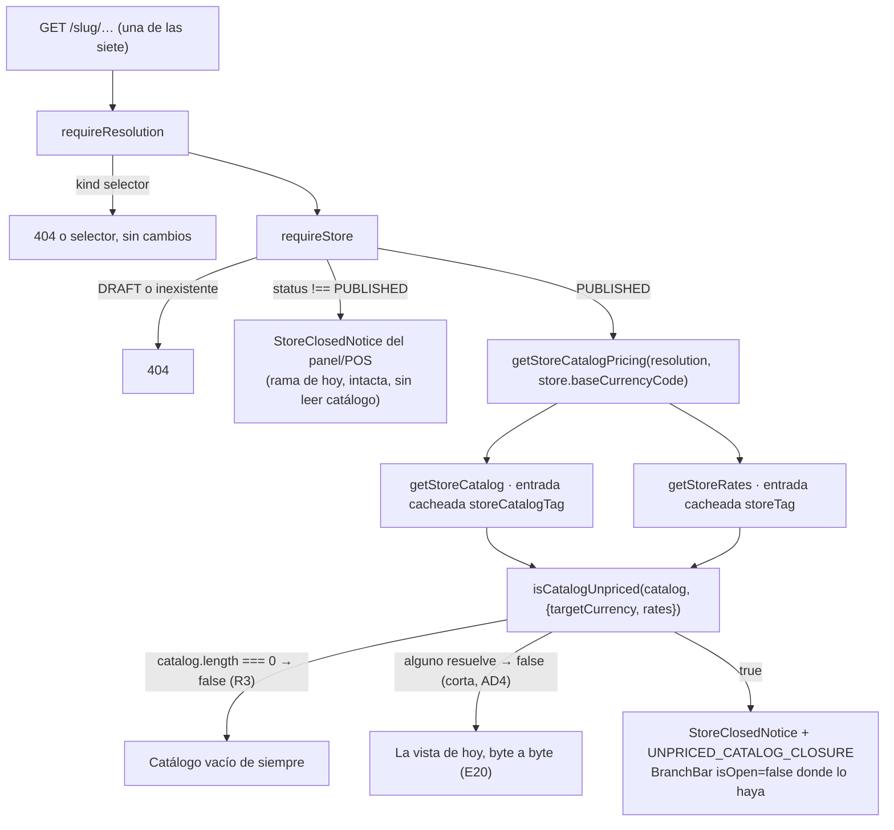

> Entrada: `.agent/specs/F-040/spec.md` en `estado: listo` (21 escenarios, 16
> reglas) y las seis decisiones del humano de `.agent/progress/F-040.md`
> § «Decisiones tomadas». Nada de eso se re-discute aquí. Este documento
> contesta **solo** lo que la spec delega por nombre en § «No decidido a
> propósito»: dónde vive la derivación, qué recibe la vista, cómo se llama el
> código, cómo se evita el trabajo repetido, cómo entra en las tres vistas que
> no leían catálogo, y si la precedencia de E15 sobrevive al diseño.
>
> **Sin preguntas al humano.** El plan se puede firmar con lo que hay aquí.

## Estado actual relevante

### Lo que se reutiliza tal cual, sin tocarlo

| Pieza                                                               | Qué aporta a F-040                                                                                                                              |
| ------------------------------------------------------------------- | ----------------------------------------------------------------------------------------------------------------------------------------------- |
| `src/features/catalog/server/queries.ts` (`getStoreCatalog:346`)    | La única lectura del catálogo público, cacheada con `storeCatalogTag`. La condición se deriva de aquí y de nada más                             |
| `src/features/catalog/server/queries.ts` (`getStoreRates:442`)      | Las tasas del negocio, cacheadas con `storeTag`, el mismo lector que el checkout (`loadCurrentRates`, `src/features/catalog/server/rates.ts`)   |
| `src/lib/pricing.ts` (`resolvePrice:65`)                            | El compositor único de precio (ADR 0017 § «Cómo se hace cumplir»). Lanza `MoneyError` (`src/lib/money.ts:35`) antes que inventar un importe     |
| `src/components/store/StoreClosedNotice.tsx`                        | La presentación del cierre, ya tipada con `disabledReasonCode: string \| null` — acepta un código que no está en la lista del panel sin cambiar |
| `src/lib/storeClosure.ts` (`resolveStoreClosureHeadline:15`)        | La frase, con el precedente exacto: la rama de `PLATFORM_ROLLOUT_REASON_CODE`, delante del respaldo por `disabledAt`                            |
| `src/constants/storeClosure.ts` (`PLATFORM_ROLLOUT_REASON_CODE:33`) | La forma de un código interno que el panel no ofrece: constante suelta, fuera de `STORE_DISABLED_REASONS`                                       |
| `src/components/store/BranchBar.tsx`                                | `isOpen={false}` ya existe y ya lo usan las cinco vistas en su rama de tienda cerrada. Cero cambios en el componente                            |
| `src/features/catalog/storeCategories.ts`                           | El precedente de módulo **puro** sobre `CatalogProduct[]` bajo `src/features/catalog/`: sin Prisma, sin React, sin `zod`                        |
| `docs/adr/0025-recortes-del-catalogo-como-proyeccion.md`            | La forma de las tres proyecciones que ya existen (`getStoreCategories:361`, `getStoreCategoryView:383`, `getFilteredStoreCatalog:410`)          |

### La duplicación que ya está en el árbol

`resolvePrice` se llama dentro de un `try/catch` que devuelve `null` en **cuatro**
sitios distintos, con el mismo cuerpo y tres formas de retorno:

| Sitio                                                      | Devuelve                         | Comentario que ya lleva                                                     |
| ---------------------------------------------------------- | -------------------------------- | --------------------------------------------------------------------------- |
| `src/components/store/ProductCard.tsx:135` (`safeResolve`) | `ResolvedPrice \| null`          | «must not take the page down»                                               |
| `src/features/catalog/catalogFilters.ts:255`               | `Money \| null`                  | «Same treatment as `ProductCard`'s own `safeResolve`» — se citan mutuamente |
| `src/app/[slug]/p/[productSlug]/page.tsx:152-162`          | `ResolvedPrice \| null` en línea | R11 de F-004                                                                |
| `src/features/orders/server/quote.ts:245-262`              | Una `QuoteLine` `NO_PRICE`       | Camino de pedido, contrato de F-010                                         |

Los dos primeros ya se citan el uno al otro en prosa para no divergir. R1 de la
spec exige que la derivación de F-040 use **la misma llamada**; con cuatro
copias, «la misma» es una convención que alguien tiene que recordar.

### Lo que hoy hacen las siete vistas

Las siete tienen ya una rama `if (store.status !== "PUBLISHED")` que devuelve
`StoreClosedNotice` **antes** de tocar el catálogo, y cinco de ellas montan
además `BranchBar` con `isOpen={false}` en esa misma rama. Lo que cada una lee
después de esa rama:

| Vista                                              | Catálogo                                             | Tasas | Otras lecturas                                          |
| -------------------------------------------------- | ---------------------------------------------------- | ----- | ------------------------------------------------------- |
| `src/app/[slug]/page.tsx:142-146`                  | sí                                                   | sí    | `getStoreCategories`                                    |
| `src/app/[slug]/p/[productSlug]/page.tsx:141-144`  | sí                                                   | sí    | —                                                       |
| `src/app/[slug]/catalogo/page.tsx:149-153`         | sí                                                   | sí    | `getStoreCategories`                                    |
| `src/app/[slug]/c/[categorySlug]/page.tsx:117-121` | vía `getStoreCategoryView`                           | sí    | `getStoreCategories`                                    |
| `src/app/[slug]/buscar/page.tsx:212`               | solo en el camino filtrado, vía `getStoreCategories` | sí    | `searchStoreProducts` (ADR 0021)                        |
| `src/app/[slug]/carrito/page.tsx:27`               | no                                                   | no    | `requireStore` y nada más                               |
| `src/app/[slug]/checkout/page.tsx:55,69`           | no                                                   | no    | `loadStoreForOrder`, cobertura de zonas si `ZONE_BASED` |

Las dos últimas son `force-dynamic` con `revalidate = 0`.

## Decisión

Once decisiones, `AD1..AD11`. Las cinco primeras son exactamente lo que la spec
delegó.

### AD1 — la derivación vive en un módulo puro nuevo, no en `catalogFilters.ts`

**Un archivo nuevo bajo `src/features/catalog/`**: src/features/catalog/unpricedCatalog.ts
(por crear), con su prueba unitaria src/features/catalog/unpricedCatalog.test.ts
(por crear).

Por qué no `src/features/catalog/catalogFilters.ts`: ese módulo declara en su
propia cabecera que es «THE module that interprets, canonizes, applies and
describes the catalogue's **querystring** vocabulary». La condición de F-040 no
tiene querystring, no tiene facetas y no tiene paginación: es un predicado sobre
la tienda entera que R2 define **en contra** de todo recorte. Meterlo ahí lo
haría el único export de 24 KB de módulo que no habla de la URL, y ataría la
derivación a `CatalogFilterContext`, un tipo que exige `categories` y `basePath`
—datos que esto no necesita— o a un tercer tipo paralelo.

Por qué sí un módulo propio: `src/features/catalog/storeCategories.ts` es el
precedente literal —derivación pura sobre `CatalogProduct[]`, sin Prisma, sin
React, sin `zod`, importable desde una página de servidor y desde un test de
proyecto `node`—, y es lo que la ADR 0025 llama «una función pura» al lado del
envoltorio. Coste de la alternativa: cero en runtime; la diferencia es de dónde
se busca y qué se rompe al cambiarlo.

Descartadas en una línea: `src/lib/` (el módulo importa el tipo `CatalogProduct`,
que vive en `features/catalog/server/queries.ts`; `lib/` no debe conocer un tipo
de feature) y `src/features/catalog/server/` (no toca Prisma, y meterlo ahí
impide probarlo sin el entorno de servidor).

### AD2 — la vista recibe un **booleano**, y el código viaja como constante de props

La función pura devuelve `boolean`. El código de motivo no viaja en su valor de
retorno: viaja en una constante congelada, exportada del mismo módulo, con la
forma exacta de las tres props que `StoreClosedNotice` necesita para este caso.

```ts
// src/features/catalog/unpricedCatalog.ts (por crear)
export const UNPRICED_CATALOG_CLOSURE = {
  disabledReasonCode: PRICES_UNAVAILABLE_REASON_CODE,
  disabledMessage: null,
  disabledAt: null,
} as const;
```

y en cada una de las siete vistas:

```tsx
<StoreClosedNotice storeName={store.name} {...UNPRICED_CATALOG_CLOSURE} … />
```

Tres razones, en orden de peso:

1. **`BranchBar` pide un booleano.** R16/E21 se resuelve con `isOpen={!unpriced}`
   en las cinco vistas con barra. Un objeto obligaría a `isOpen={verdict === null}`
   en cinco sitios, que es la misma información con una indirección de más.
2. **R8 deja de depender de que siete archivos se acuerden.** «`disabledMessage:
null` y `disabledAt: null`» es la regla que impide que el aviso se disfrace de
   cierre del comerciante; escrita a mano en siete páginas son siete
   oportunidades de teclear `disabledMessage={store.disabledMessage}` y enseñar
   el texto libre de un cierre que nadie hizo. Con la constante hay **una**
   definición y `grep` de su nombre encuentra los siete usos.
3. **El predicado no sabe de presentación.** Devolver `{ closed, reasonCode }`
   fusiona «¿está muda?» con «¿qué se pinta?», y la única variabilidad del
   segundo campo es una constante de compilación.

### AD3 — el código es `PRICES_UNAVAILABLE`

```ts
// src/constants/storeClosure.ts, junto a PLATFORM_ROLLOUT_REASON_CODE
export const PRICES_UNAVAILABLE_REASON_CODE = "PRICES_UNAVAILABLE";
```

Inglés y `SCREAMING_SNAKE_CASE` (AGENTS.md § Idioma), constante suelta **fuera**
de `STORE_DISABLED_REASONS` y de `STORE_DISABLED_REASON_CODES`, con lo que
`isStoreDisabledReasonCode("PRICES_UNAVAILABLE")` es `false` y
`storeStatusBodySchema` (`src/features/admin/schemas.ts:58`) lo rechaza sin
tocar nada: E19 pasa por construcción, igual que con `PLATFORM_ROLLOUT`.

Nombra la **condición**, no la causa: «no hay precios disponibles» es cierto tanto
si falta la tasa de la base como si falta la de la moneda de los productos (E16)
como si un `syncedPrice` no es numérico (§ Casos límite). Descartados:
`NO_EXCHANGE_RATE` (nombra una de las tres causas y filtra el detalle técnico
que § Datos y contrato prohíbe exponer), `NO_PRICES` (colisiona de lectura con el
`NO_PRICE` de `QuoteLineReason`, `src/features/orders/types.ts:13`, que es por
línea y no por tienda) y `CATALOG_UNPRICED` (adjetivo inventado en el sitio donde
el valor puede acabar leyéndolo un humano en un log).

### AD4 — el trabajo repetido no se comparte ni se memoiza: se **corta**

La condición es una negación existencial, así que se implementa con corte en el
primer producto que **sí** resuelve:

```
unpriced ⟺ catalog.length > 0 ∧ ninguno resuelve
         ⟺ catalog.length > 0 ∧ ¬∃ p : precio(p) ≠ null
```

`Array.prototype.some` corta en cuanto encuentra uno. El argumento medible, con
el orden de `loadCatalog` (`featured` desc, luego nombre), que es estable entre
el build y cualquier petición posterior:

| Caso                                                               | Llamadas a `resolvePrice` que **añade** la derivación | Llamadas que la vista hace después           | Total vs. hoy        |
| ------------------------------------------------------------------ | ----------------------------------------------------- | -------------------------------------------- | -------------------- |
| Tienda normal, el primer producto resuelve (el caso del 99 %, E20) | **1**                                                 | N (`ProductCard`, sin cambios)               | **N + 1**            |
| Tienda normal, los k primeros no resuelven                         | k + 1 (cota superior N)                               | N                                            | N + k + 1            |
| Tienda muda (todos lanzan)                                         | N                                                     | **0** — el aviso sustituye a la rejilla (R7) | **N**, igual que hoy |
| Tienda vacía (R3)                                                  | **0** — `length === 0` corta antes                    | 0                                            | 0                    |

Es decir: **el caso que paga es el que no ocurre**, y el caso que ocurre paga una
llamada. `resolvePrice` no hace E/S: es una expresión regular, dos `parseToMinor`
sobre `BigInt` y una división —del orden de 1-3 µs—, así que ese «+1» es ruido
frente a los milisegundos de una lectura de la caché de datos.

Por eso **no** se memoiza el precio por producto ni se pasa el resultado de la
derivación a `ProductCard`:

- Un mapa `productId → ResolvedPrice | null` para compartirlo con las tarjetas
  ahorraría, en el caso normal, exactamente **una** llamada de las N+1, y a
  cambio añadiría un parámetro nuevo a `ProductCard`, a `applyCatalogFilters` y a
  la ficha de producto —tres firmas públicas— más un tipo que hay que mantener en
  sincronía con `CatalogProduct`. Optimizar el 1/N por el precio de tres firmas
  es cambiar coste medible por coste estructural.
- La memoización tampoco es gratis: `Map` de N entradas por render, vivo hasta el
  fin de la petición, en un proceso que ya materializa el catálogo entero.

Lo que **sí** se memoiza es la derivación completa por petición, y sale gratis:
AD5 envuelve el envoltorio en `cache()` de React, la misma técnica que ya usan
`getStoreCategories` y `getFilteredStoreCatalog`. Dos llamadas dentro del mismo
render —el cuerpo de la página y, si algún día lo necesitara, su
`generateMetadata`— derivan una vez.

### AD5 — una sola puerta de servidor para las siete vistas

`getStoreCatalogPricing`, en `src/features/catalog/server/queries.ts`, al lado de
las tres proyecciones que la ADR 0025 ya dejó allí:

```ts
export type StoreCatalogPricing = {
  catalog: CatalogProduct[];
  rates: Record<string, string>;
  /** R1-R3: hay productos y ninguno resuelve precio. */
  unpriced: boolean;
};

export const getStoreCatalogPricing = cache(
  async (branch: StoreRef & RateRef, baseCurrencyCode: string): Promise<StoreCatalogPricing> => {
    const [catalog, rates] = await Promise.all([getStoreCatalog(branch), getStoreRates(branch)]);
    return {
      catalog,
      rates,
      unpriced: isCatalogUnpriced(catalog, { targetCurrency: baseCurrencyCode, rates }),
    };
  },
);
```

Es un **envoltorio fino**: cero Prisma propio, cero entradas de caché nuevas,
cero tags nuevos —exactamente la definición de proyección de la ADR 0025, y la
misma forma que `getStoreCategoryView`—. `StoreRef & RateRef` es la intersección
de los dos `Pick` que ya existen en ese archivo (no un tipo nuevo, y no un
injerto de `businessId` sobre `StoreRef`, que el comentario de `queries.ts:24-30`
prohíbe explícitamente); una `BranchResolution` la satisface.

Un solo mecanismo para las siete, no dos:

- **Las cuatro vistas de catálogo** sustituyen sus entradas `getStoreCatalog` y
  `getStoreRates` del `Promise.all` por esta llamada. El número de lecturas
  cacheadas distintas por petición no se mueve: siguen siendo `store-catalog` y
  `store-rates`. E13 (criterio 6) se cumple por construcción, no por suerte.
  - `src/app/[slug]/c/[categorySlug]/page.tsx` es el único que no leía
    `getStoreCatalog` directamente: lo lee vía `getStoreCategoryView` y
    `getStoreCategories`, que ya llaman a `getStoreCatalog(resolution)` **en
    paralelo entre sí** dentro del mismo `Promise.all` de hoy. Añadir un tercer
    lector de la **misma** entrada cacheada es el patrón que esa página ya
    ejecuta en producción; no cambia el número de entradas ni de tags.
- **Las tres vistas de SP3(a)** la estrenan. No hay `keyParts` nuevos, no hay
  `tags` nuevos y no hay consulta Prisma nueva: se enchufan a las dos entradas
  que `/[slug]` ya paga y que el sync ya invalida (R9, R10).

Descartado: que cada página llamara al predicado puro con el `catalog` y las
`rates` que ya tiene. Funciona en cuatro páginas y obliga a escribir las dos
lecturas y el `targetCurrency` a mano en las otras tres, con siete copias del
argumento `{ targetCurrency: store.baseCurrencyCode, rates }` — siete sitios
donde alguien puede pasar una moneda de display de F-039 en vez de la base y
romper R1 en silencio.

### AD6 — una sola definición del `try/catch`: `tryResolvePrice` en `src/lib/pricing.ts`

R14 autoriza tocar `safeResolve` y `resolveProductPrice` **para reusarlos**. Se
usa esa autorización, en la dirección que hace R1 verificable:

```ts
// src/lib/pricing.ts, junto a resolvePrice
/**
 * `resolvePrice` o `null` cuando no hay precio que resolver — falta de tasa,
 * tasa no positiva o importe no numérico. LA definición de "este producto no
 * tiene precio" que comparten la vitrina y la condición de F-040 (R1).
 */
export function tryResolvePrice(
  product: PriceFields,
  options: Parameters<typeof resolvePrice>[1],
): ResolvedPrice | null;
```

Pasan a llamarla: `src/components/store/ProductCard.tsx` (su `safeResolve`
desaparece), `src/features/catalog/catalogFilters.ts` (`resolveProductPrice` se
queda, pero su cuerpo pasa a ser `tryResolvePrice(...)?.price ?? null`),
`src/app/[slug]/p/[productSlug]/page.tsx` (el `try/catch` en línea desaparece) y
el módulo nuevo de AD1. Cuatro llamadores, una definición: «la misma llamada que
ya hacen las vistas» deja de ser una frase de la spec y pasa a ser el tipo.

Dos límites explícitos, para que el plan no los amplíe solo:

- **`src/features/orders/` no se toca.** El `try/catch` de
  `src/features/orders/server/quote.ts:245-262` devuelve una `QuoteLine`
  completa, no un `null`, y el criterio 5 se verifica **ejecutando** contra ese
  camino (I3, SP2). Un refactor allí, aunque sea equivalente, mueve el código
  bajo la demostración. Se deja para quien venga.
- **El `catch` sigue atrapando todo**, sin estrecharlo a `instanceof MoneyError`.
  Estrecharlo cambiaría el comportamiento de los tres llamadores existentes y
  pondría en riesgo E20 («HTML idéntico byte a byte»), que es un criterio de este
  feature. Si se quiere, es un cambio propio con su propia verificación.

Plan B si el refactor se complica: el módulo de AD1 lleva su propio `try/catch` y
se queda una quinta copia, con el comentario cruzado que ya usan las otras. Es
peor y es reversible; no bloquea nada.

### AD7 — la precedencia de E15 es estructural: la guarda nueva va **después** del `return`

En las siete vistas, la rama `if (store.status !== "PUBLISHED") { … return … }`
**no se toca**: sigue devolviendo antes de leer nada de catálogo. La guarda nueva
se añade después, sobre el resultado de AD5. Comprobación de E15, con dos
cinturones:

1. Una `SUSPENDED` nunca llega a la guarda nueva: la rama de arriba ya devolvió.
2. Aunque llegara, `loadCatalog` (`queries.ts:261`) filtra
   `store: { status: "PUBLISHED" }`, así que el catálogo sería `[]` y R3 daría
   `false`.

Lo que **no** se hace: fusionar los dos casos en un `closure` calculado antes
—`resolveClosure(store, catalog, rates)`—. Obligaría a leer el catálogo para
decidir si hay que leerlo, que es justo lo que el comentario HD11 de cada página
evita («no catalog query at all for a closed store»), y añadiría una consulta a
la vista de una tienda cerrada.

### AD8 — la frase entra en `resolveStoreClosureHeadline`, en su propia rama

En `src/lib/storeClosure.ts`, una rama nueva `if (code === PRICES_UNAVAILABLE_REASON_CODE)`
junto a la de `PLATFORM_ROLLOUT_REASON_CODE` y **antes** del respaldo por
`disabledAt` (R5). La firma de la función no cambia. **La redacción es del
diseñador**; la arquitectura solo fija dos cosas que le atan las manos:

- La frase **no** puede vivir en `STORE_DISABLED_REASONS`: eso la haría elegible
  desde el panel y pondría E19 en rojo.
- `classifyStoreClosure` (`src/lib/storeClosure.ts:61`) **no se toca** (I5). Solo
  se llama con valores leídos de la fila y este código nunca llega a una fila:
  la rama sería código muerto. Queda anotado como el sitio exacto del futuro
  feature de panel.

### AD9 — en `/checkout` la lectura va en el **mismo** `Promise.all` que `loadStoreForOrder`

`src/app/[slug]/checkout/page.tsx` es `force-dynamic`: su cuerpo corre entero en
cada visita, así que las dos lecturas de SP3(a) son dos accesos a la caché de
datos **por petición** (no a Postgres). En un backend de caché de red eso son
decenas de milisegundos, en la pantalla más sensible a la latencia de la
aplicación. La forma en que se pide lo hace irrelevante:

```ts
const [pricing, orderStore] = await Promise.all([
  getStoreCatalogPricing(resolution, store.baseCurrencyCode),
  loadStoreForOrder(store.canonicalSlug),
]);
```

Van en paralelo con una consulta Prisma sin caché que ya se pagaba y que es más
lenta: la latencia añadida es `max(...) - antes ≈ 0`, no la suma. La guarda de
tienda muda se evalúa **después** de ese `Promise.all` y **antes** de la
cobertura de zonas (`loadStoreZoneCoverageForRender`), que es condicional y va
detrás: una tienda muda `ZONE_BASED` se ahorra esa consulta.

Se acepta a cambio que una tienda muda pague un `loadStoreForOrder` que no va a
usar: es una consulta barata en el caso raro, frente a decenas de milisegundos en
el caso normal. `/carrito` no tiene con qué paralelizar; se queda con una ola de
dos lecturas de caché de datos que se piden a la vez entre sí.

### AD10 — en `/buscar`, la guarda va antes de leer `searchParams`

En `src/app/[slug]/buscar/page.tsx` la guarda nueva se coloca inmediatamente
después de la rama de tienda cerrada, **antes** de `await searchParams`. Tres
consecuencias, todas queridas:

- R11 se cumple por posición: ni `searchStoreProducts` ni `getStoreCategories` ni
  el `after()` que registra el término llegan a ejecutarse (E8).
- Los dos caminos —simple y filtrado— dan el mismo veredicto sin escribirlo dos
  veces, porque el veredicto se toma antes de que exista la bifurcación
  (§ Casos límite, «/buscar con filtros»).
- `/buscar` sin `q`, que hoy pinta la pantalla «Buscar en la tienda» con el enlace
  «Ver todo el catálogo», también enseña el aviso en una tienda muda. Es lo
  coherente: ese enlace lleva a `/[slug]`, que en una tienda muda enseña el aviso,
  y `/[slug]/catalogo` ya se comporta así con cualquier `searchParams` (E7). La
  spec no lo escribe porque E8 solo nombra `?q=agua`; se decide aquí y se anota
  para el probador y para el diseñador (la nota extra de esa vista).

La lectura de `getStoreRates` que hoy está en `src/app/[slug]/buscar/page.tsx:212` desaparece
como llamada suelta: las `rates` salen del mismo `StoreCatalogPricing`. El camino
filtrado sigue leyendo `getStoreCategories` como hoy.

### AD11 — I4 no gana un tipo nuevo; gana la barrera que ya existe, comprobada

La spec pide decidir si hace falta un tipo que haga **imposible** que el código
derivado acabe en la base. No se añade. Razón medible: la escritura del panel
está tipada contra el `enum` de Zod de `src/features/admin/schemas.ts:58` y la
lista blanca de columnas de ADR 0017 (a); una marca de tipo en el valor
—`string & { __renderOnly }`— seguiría asignándose a un `string | null` y **no
impediría nada** en el único camino que escribe. Lo que sí lo impide es que la
constante viva fuera de `STORE_DISABLED_REASONS`, y eso ya lo comprueba E19
ejecutando las dos funciones. Coste de la alternativa: un tipo nuevo que da
sensación de garantía sin dar garantía.

## Componentes

| Componente                                                 | Capa                       | Responsabilidad                                                                              | Archivo                                                  |
| ---------------------------------------------------------- | -------------------------- | -------------------------------------------------------------------------------------------- | -------------------------------------------------------- |
| `isCatalogUnpriced`, `UNPRICED_CATALOG_CLOSURE`            | `features/catalog/`        | El predicado puro de R1-R3 y las tres props del aviso (R8). Sin Prisma, sin React, sin `zod` | src/features/catalog/unpricedCatalog.ts (por crear)      |
| Su prueba unitaria                                         | `features/catalog/`        | R1, R2, R3, E16, E17, E18 y los casos límite, sin base de datos (proyecto `node`)            | src/features/catalog/unpricedCatalog.test.ts (por crear) |
| `tryResolvePrice`                                          | `src/lib/`                 | LA definición de «este producto no tiene precio» (AD6)                                       | `src/lib/pricing.ts`                                     |
| `PRICES_UNAVAILABLE_REASON_CODE`                           | `src/constants/`           | El código interno, fuera de `STORE_DISABLED_REASONS` (R5, E19)                               | `src/constants/storeClosure.ts`                          |
| Rama nueva de `resolveStoreClosureHeadline`                | `src/lib/`                 | La frase del aviso, delante del respaldo por `disabledAt` (R5). Redacción del diseñador      | `src/lib/storeClosure.ts`                                |
| `getStoreCatalogPricing`, `StoreCatalogPricing`            | `features/catalog/server/` | Envoltorio fino sobre `getStoreCatalog` + `getStoreRates` + el predicado (ADR 0025)          | `src/features/catalog/server/queries.ts`                 |
| Guarda + aviso + `isOpen={!unpriced}`                      | `src/app/`                 | Componer: leer, preguntar, y montar `StoreClosedNotice` en el sitio del cierre (R7, R16)     | `src/app/[slug]/page.tsx`                                |
| Ídem                                                       | `src/app/`                 | Ídem, más `BranchBar` (E21)                                                                  | `src/app/[slug]/p/[productSlug]/page.tsx`                |
| Ídem                                                       | `src/app/`                 | Ídem, con la nota extra de filtros (E7)                                                      | `src/app/[slug]/catalogo/page.tsx`                       |
| Ídem                                                       | `src/app/`                 | Ídem, con la nota extra de categoría (E6)                                                    | `src/app/[slug]/c/[categorySlug]/page.tsx`               |
| Ídem, guarda antes de `searchParams`                       | `src/app/`                 | Ídem, y ni busca ni registra (R11, AD10)                                                     | `src/app/[slug]/buscar/page.tsx`                         |
| Ídem, sin `BranchBar`                                      | `src/app/`                 | Ídem, con la nota extra del carrito guardado (E9)                                            | `src/app/[slug]/carrito/page.tsx`                        |
| Ídem, sin `BranchBar`, en paralelo con `loadStoreForOrder` | `src/app/`                 | Ídem, antes de la cobertura de zonas (AD9)                                                   | `src/app/[slug]/checkout/page.tsx`                       |

Sin componentes de UI nuevos: `StoreClosedNotice` y `BranchBar` se montan tal
cual, con las props que ya aceptan. Nada de `"use client"`, nada bajo
`src/components/`.

## Flujo de datos



Paso a paso de lo que cambia en una vista, con `/[slug]` como patrón:

1. `requireResolution` y `requireStore`: **sin cambios**.
2. La rama `status !== "PUBLISHED"`: **sin cambios** (AD7).
3. El `Promise.all` cambia sus dos entradas por una:
   `getStoreCatalogPricing(resolution, store.baseCurrencyCode)`, y sigue con
   `getStoreCategories(resolution)` al lado.
4. Guarda nueva: si `pricing.unpriced`, se devuelve el mismo bloque que la rama
   de tienda cerrada, con `{...UNPRICED_CATALOG_CLOSURE}` en vez de las tres
   columnas de la fila, y `BranchBar` con `isOpen={false}`.
5. Si no, la página sigue exactamente igual que hoy, con
   `pricing.catalog` y `pricing.rates` donde antes decía `products` y `rates`.

## Contratos

### El módulo puro

```ts
// src/features/catalog/unpricedCatalog.ts (por crear)
import { PRICES_UNAVAILABLE_REASON_CODE } from "@/constants/storeClosure";
import { tryResolvePrice } from "@/lib/pricing";
import type { RateTable } from "@/lib/money";
import type { CatalogProduct } from "./server/queries";

export type UnpricedCatalogContext = {
  /** R1: SIEMPRE `Business.baseCurrencyCode`; nunca una moneda de display
   *  de F-039 — la condición es sobre lo que se cobra, no sobre lo que se
   *  enseña de más. */
  targetCurrency: string;
  rates: RateTable;
};

/** R1-R3. Puro y con corte en el primer producto que resuelve (AD4). */
export function isCatalogUnpriced(
  catalog: readonly CatalogProduct[],
  context: UnpricedCatalogContext,
): boolean;

/** R8: las tres props del aviso, en un solo sitio. */
export const UNPRICED_CATALOG_CLOSURE: {
  readonly disabledReasonCode: typeof PRICES_UNAVAILABLE_REASON_CODE;
  readonly disabledMessage: null;
  readonly disabledAt: null;
};
```

Cuerpo, para que el plan no tenga que adivinarlo:

```ts
export function isCatalogUnpriced(catalog, context) {
  if (catalog.length === 0) return false; // R3
  return !catalog.some(
    (product) =>
      tryResolvePrice(product, {
        targetCurrency: context.targetCurrency,
        rates: context.rates,
        baseCurrency: context.targetCurrency,
        promotions: product.promotions,
      }) !== null,
  );
}
```

`baseCurrency === targetCurrency` es literalmente lo que hacen hoy `safeResolve`
y `resolveProductPrice`, y es lo que hace que E18 salga sin escribir nada: una
promoción `FIXED` en una moneda sin tasa hace lanzar a `resolvePrice`, y ese
producto cuenta como sin precio, igual que en la tarjeta.

### La proyección de servidor

```ts
// src/features/catalog/server/queries.ts
export type StoreCatalogPricing = {
  catalog: CatalogProduct[];
  rates: Record<string, string>;
  unpriced: boolean;
};

export const getStoreCatalogPricing: (
  branch: StoreRef & RateRef,
  baseCurrencyCode: string,
) => Promise<StoreCatalogPricing>;
```

Envuelta en `cache()` de React por la misma razón que `getStoreCategories`: dos
llamadas en el mismo render derivan una vez. La memoización es correcta porque
`resolvePublicSlug` (`src/features/storefront/server/resolve.ts:222`) ya está
cacheada por el slug pedido, así que `resolution` es **el mismo objeto** dentro
de una petición.

### Sin contratos HTTP nuevos

Ni endpoint, ni esquema Zod, ni código de error, ni cabecera. No hay tabla de
errores que escribir: las siete vistas responden 200 en todos los casos nuevos, y
`/api/orders` y `/api/orders/quote` quedan literalmente sin tocar (R12, R13,
SP2). El único «contrato» que cambia son firmas internas de TypeScript, y las
tres son aditivas.

| Estado                          | Las 5 vistas con `BranchBar`                         | `/carrito` y `/checkout`                  |
| ------------------------------- | ---------------------------------------------------- | ----------------------------------------- |
| `DRAFT` / inexistente           | 404 (sin cambios)                                    | 404 (sin cambios)                         |
| `SUSPENDED`                     | Aviso del panel/POS, `isOpen={false}` (sin cambios)  | Aviso del panel/POS (sin cambios)         |
| `PUBLISHED`, catálogo vacío     | Mensaje de tienda vacía (sin cambios, R3)            | `CartView` / `CheckoutForm` (sin cambios) |
| `PUBLISHED`, alguno con precio  | La vista de hoy, byte a byte (E20)                   | La de hoy, byte a byte                    |
| `PUBLISHED`, ninguno con precio | **Aviso con `PRICES_UNAVAILABLE`, `isOpen={false}`** | **Aviso con `PRICES_UNAVAILABLE`**        |

## Modelo de datos y migraciones

**Ninguna.** Ni tabla, ni columna, ni índice, ni `prisma migrate`. No se toca
`prisma/schema.prisma` y no aparece nada en `prisma/migrations/`. Ninguno de los
dos comandos prohibidos de AGENTS.md entra en juego.

`Store.status`, `Store.disabledReasonCode`, `Store.disabledMessage` y
`Store.disabledAt` **no se escriben** (criterio 4, ADR 0017 (a)): el código de
AD3 solo existe como prop de React dentro de un render, y el único módulo que
escribe columnas de `Store` —`src/features/admin/server/mutations.ts`— no lo
importa ni lo puede aceptar (AD11, E19).

Tampoco se toca `docs/sync-contract.md`: F-040 no cambia nada de lo que el POS
envía o recibe, así que su versión no se mueve (AGENTS.md § Documentación).

Sí hay un dato nuevo **de prueba**: la sucursal muda del fixture (criterios 1, 5
y 7). Dónde vive lo decide el plan con el probador, como dice la spec; la única
restricción arquitectónica es la de siempre: si acaba en `prisma/seed.ts`, tiene
que ser idempotente y no puede mover lo que ven las pruebas visuales de los
features ya cerrados.

## Escalabilidad y límites

### Coste por petición, con números

| Vista                      | Consultas Prisma añadidas (caliente) | Consultas Prisma añadidas (frío)             | Lecturas de caché de datos añadidas | Derivación             |
| -------------------------- | ------------------------------------ | -------------------------------------------- | ----------------------------------- | ---------------------- |
| `/[slug]`                  | 0                                    | 0 (ya leía las dos)                          | 0                                   | 1 `resolvePrice` (AD4) |
| `/[slug]/p/[productSlug]`  | 0                                    | 0                                            | 0                                   | 1                      |
| `/[slug]/catalogo`         | 0                                    | 0                                            | 0                                   | 1                      |
| `/[slug]/c/[categorySlug]` | 0                                    | 0 (misma entrada que `getStoreCategoryView`) | 0                                   | 1                      |
| `/[slug]/buscar`           | 0                                    | 2 la primera vez tras una invalidación       | +1 (`store-catalog`)                | 1                      |
| `/[slug]/carrito`          | 0                                    | 2 la primera vez tras una invalidación       | +2                                  | 1                      |
| `/[slug]/checkout`         | 0                                    | 2 la primera vez tras una invalidación       | +2, en paralelo con Prisma (AD9)    | 1                      |

Las cuatro primeras filas son el criterio 6 y E13: **cero**, y por construcción,
no por medición afortunada. Las tres últimas son SP3(a), y su coste real sobre
Postgres está acotado por la invalidación, no por el tráfico: **≤ 2 round-trips
por sucursal y por ventana de revalidación** (`STOREFRONT_REVALIDATE = 3600` s,
`src/lib/cache.ts`) o por evento de sync que expire su tag, compartidos con
`/[slug]`. Una sucursal con 10 000 visitas de checkout al día que ya reciba una
visita a su portada no añade **ni una** consulta.

### Multiplicar por 100

- **×100 tiendas (≈ 2 800 sucursales).** No hay estado compartido, ni entrada de
  caché nueva, ni tag nuevo: la derivación es por petición y por sucursal. El
  número de entradas del data cache no se mueve.
- **×100 productos en una sucursal (≈ 1 500).** Caso normal: sigue siendo 1
  llamada. Caso mudo: 1 500 llamadas que lanzan; una excepción en V8 captura
  pila, del orden de 5-20 µs, así que ~10-30 ms de CPU en el render de esa
  página. No es nuevo: hoy esa misma página ya paga esas 1 500 excepciones en
  `ProductCard`. Y antes de llegar ahí se rompe otra cosa: la entrada del
  incremental cache de Next que la ADR 0025 marca como su condición de reapertura
  («el día que se pagine el catálogo»). F-040 **no mueve ese umbral**: no
  materializa nada que `/[slug]` no materializara ya.
- **×100 peticiones a `/checkout`.** Cero consultas añadidas (ver arriba); dos
  lecturas de caché de datos más por petición, en paralelo con una consulta
  Prisma que ya se pagaba (AD9).

### Pooler, N+1 y JavaScript

- **Pooler de Supabase en modo transacción**: no aplica. Cero consultas nuevas,
  cero `$transaction`, cero conexiones nuevas. Las dos lecturas que las tres
  vistas estrenan son las que ya existen, con su `Promise.all` de dos
  round-trips dentro de `loadCatalog`.
- **N+1**: imposible por construcción. La derivación no consulta; recorre una
  lista que ya está en memoria.
- **`export const revalidate`**: no se toca en ninguna de las siete. `/carrito` y
  `/checkout` siguen con su literal `0` (AGENTS.md § Cosas que muerden: tiene que
  ser un literal).
- **`src/proxy.ts`**: no se toca. Su `matcher` sigue sin ver `/[slug]`.
- **JavaScript de cliente: +0 KB.** Nada nuevo lleva `"use client"`;
  `StoreClosedNotice` y `BranchBar` son componentes de servidor. En una tienda
  muda la página envía **menos** JavaScript que hoy, porque `/carrito` y
  `/checkout` dejan de montar `CartView` y `CheckoutForm`. `npm run check:bundle`
  no debería moverse; si se moviera, sería a la baja.
- **ISR**: sin cambios. R10 se cumple sola —`revalidateStores` ya expira
  `storeTag` y `storeCatalogTag` de cada sucursal renderizable en cada evento de
  sync (`src/lib/cache.ts:86-93`)—, así que E14 no necesita nada nuevo.

## Patrones a seguir / antipatrones a evitar

**A seguir**

- **Proyección, no consulta** (ADR 0025 y AGENTS.md § Arquitectura): el
  envoltorio de AD5 es la cuarta pieza de la misma familia que
  `getStoreCategories`, `getStoreCategoryView` y `getFilteredStoreCatalog`.
- **Prisma solo en `src/features/*/server/`**: el módulo de AD1 no importa
  `@/lib/prisma` ni nada de `server/` salvo el **tipo** `CatalogProduct`, igual
  que `src/features/catalog/storeCategories.ts`.
- **Sin `any`, sin magic strings**: el código va a `src/constants/storeClosure.ts`
  (AGENTS.md § Prohibiciones), no escrito a mano en siete JSX.
- **Sin interfaces duplicadas**: `StoreCatalogPricing` compone `CatalogProduct` y
  el `Record<string, string>` de `getStoreRates`; no define un producto paralelo.
- **Instrumentación**: si el plan decidiera registrar el caso, `console.warn` con
  un prefijo `[catalog]` literal al principio de la línea, **nunca**
  `console.error` (AGENTS.md § Cosas que muerden; ficha
  `.agent/playbook/console-error-dispara-guardian-servidor.md`). La
  recomendación de esta arquitectura es **no registrar nada**: no hay nadie
  escuchando y E12 exige una salida de servidor limpia.

**A evitar**

- Escribir `Store.disabledReasonCode` «ya que estamos» (criterio 4, ADR 0017 (a)).
- Evaluar la condición sobre el recorte que pinta la vista: R2, y rompe el
  criterio 2.
- Un `catch` alrededor de `getStoreRates` que convierta un fallo de base en
  «tienda muda» (§ Casos límite: un fallo de infraestructura disfrazado de estado
  de negocio es peor que el fallo).
- Mover la guarda **delante** de la rama `status !== "PUBLISHED"`: rompe E15 y
  añade una consulta a la vista de una tienda cerrada (AD7).
- Añadir `robots: { index: false }` o un título distinto en `generateMetadata`
  (R15). Nota para el probador: `src/app/[slug]/catalogo/page.tsx:104` seguirá
  titulando «N productos · Tienda» sobre una página que enseña el aviso. Es
  deliberado —ya va con `robots: { index: false }`— y cambiarlo obligaría a
  derivar la condición dentro de `generateMetadata`, que es el coste que el
  criterio 6 evita.
- Un archivo nuevo citado entre comillas invertidas antes de existir: AGENTS.md
  § «Cosas que muerden», y por eso los dos archivos por crear de este documento
  van sin ellas.

## Riesgos y plan B

| #   | Riesgo                                                                                                                                           | Probabilidad        | Plan B                                                                                                                                                                                                                                                  |
| --- | ------------------------------------------------------------------------------------------------------------------------------------------------ | ------------------- | ------------------------------------------------------------------------------------------------------------------------------------------------------------------------------------------------------------------------------------------------------- |
| 1   | El refactor de AD6 toca tres archivos vivos (`ProductCard.tsx`, `catalogFilters.ts`, la ficha de producto) y podría mover el HTML — E20 en rojo  | Baja                | Es un refactor sin cambio de comportamiento y `src/features/catalog/catalogFilters.test.ts` ya cubre el camino. Si molesta: el módulo de AD1 se queda su propio `try/catch` y el refactor sale del feature                                              |
| 2   | Sustituir dos entradas del `Promise.all` por `getStoreCatalogPricing` en las cuatro vistas de catálogo mueve el conteo de E13                    | Muy baja            | Las lecturas subyacentes son las mismas dos entradas cacheadas. Si el conteo se moviera, se llama al predicado puro con el `catalog` y las `rates` que la página ya tiene, y el envoltorio queda solo para las tres vistas de SP3(a)                    |
| 3   | En frío, dos llamadas concurrentes a `getStoreCatalog` dentro del mismo `Promise.all` (envoltorio + `getStoreCategories`) provocan dos consultas | Baja                | Es el patrón que `src/app/[slug]/page.tsx:142-146` y `src/app/[slug]/c/[categorySlug]/page.tsx:117-121` ya ejecutan hoy en producción. Si el probador lo ve en el log de F-025, se secuencia el envoltorio detrás del `Promise.all` en esas dos páginas |
| 4   | `/carrito` y `/checkout` son `force-dynamic`: dos lecturas de caché de datos por petición                                                        | Alta (es el diseño) | AD9 las paraleliza con la consulta Prisma que ya había en `/checkout`. En `/carrito` el coste queda documentado, que es lo que SP3(a) pidió                                                                                                             |
| 5   | El fixture de la tienda muda mueve una prueba visual de un feature ya cerrado                                                                    | Media               | Un negocio propio, nuevo, con su sucursal — nunca una sucursal más de un negocio que ya sale en una captura. Lo decide el plan con el probador                                                                                                          |
| 6   | La condición cierra una tienda que el comerciante no quería cerrar (falso positivo)                                                              | Muy baja            | Solo puede pasar si **ningún** producto resuelve, que es exactamente el estado en que hoy no se ve ni un precio. La recuperación es automática y sin intervención: R10, E14                                                                             |

## ¿Hace falta una ADR?

**No.** Las dos decisiones estructurales que este diseño usa ya están tomadas y
este feature las **aplica**, no las contradice ni las extiende:

- **ADR 0017 (a)** — el panel nunca comparte columna: aquí no se escribe ninguna
  columna en absoluto, que es el caso más fuerte de esa frontera.
- **ADR 0025** — un recorte del catálogo es una proyección: `getStoreCatalogPricing`
  es la cuarta proyección de la misma familia, con la misma promesa de cero
  consultas y cero tags.

Lo único que F-040 estrena es un **código de motivo que no se persiste nunca**,
frente a `PLATFORM_ROLLOUT_REASON_CODE`, que sí vive en la columna. Es una
variación dentro de ADR 0017, no una decisión que la supere.

Cuándo **sí** habrá que escribir una: el día que se abra el feature de panel que
SP1 dejó fuera. Ese sí tiene que decidir si este estado derivado se le enseña al
comerciante, si `classifyStoreClosure` (I5) gana una rama, y —lo estructural— si
el código pasa a ser persistible, que es lo que invalidaría AD11. Título
sugerido para ese día: «Los motivos de cierre derivados y los persistidos son dos
listas, no una».

## Preguntas al humano

**Ninguna.** `AP1..APn` está vacío: la spec llegó en `estado: listo` y las seis
decisiones del humano cubren todo lo que era de producto o de coste. Lo que
quedaba delegado —dónde vive la derivación (AD1), qué recibe la vista (AD2), el
nombre del código (AD3), el trabajo repetido (AD4), cómo entra en las tres vistas
sin caché nueva (AD5) y la precedencia (AD7)— se decide aquí, con su argumento.

Tres decisiones se toman en el margen de lo que la spec escribió, y se marcan
para que el plan las vea de una pasada en vez de descubrirlas en revisión:

1. **AD6** usa la autorización de R14 para unificar el `try/catch` en
   `src/lib/pricing.ts`, tocando tres archivos que este feature no nombraba. Tiene
   plan B en una línea (riesgo 1).
2. **AD10** hace que `/[slug]/buscar` **sin** `q` también enseñe el aviso. La spec
   solo escribe el caso con término (E8).
3. **AD9** acepta que una tienda muda pague un `loadStoreForOrder` inútil a cambio
   de no añadir latencia al checkout de las demás.

Siguiente agente: `sdd-designer` corre en paralelo y escribe la frase de
`resolveStoreClosureHeadline` y las notas extra por vista; después el orquestador
destila `plan.md` y el humano lo firma.
