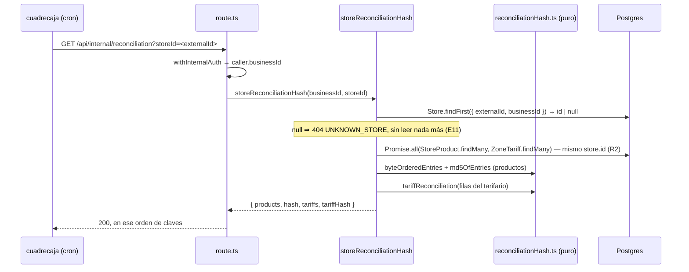

## Estado actual relevante

Lo que ya existe y de lo que este diseño se cuelga, leído en el código y no
supuesto:

- `src/features/sync/server/reconciliation.ts` (92 líneas). Resuelve la
  sucursal con un `findFirst` por `(externalId, businessId)` que selecciona solo
  el `id`, lee `StoreProduct`, precomputa la clave de orden con
  `utf8SortKey`, ordena con `compareUtf8Keys`, alimenta un `createHash("md5")`
  con `reconciliationEntry(row)` fila a fila y devuelve `{ products, hash }` o
  `null`. **Dos consultas por petición.**
- `src/lib/byteOrder.ts`: `utf8SortKey`/`compareUtf8Keys`/`compareUtf8Bytes`.
  Puro, sin Prisma. Su comentario de cabecera dice explícitamente que existe
  partido en dos primitivas para que **la ordenación de producción y su test
  ejerciten el MISMO código, no dos implementaciones que hoy coinciden**. Es el
  precedente que gobierna la decisión D1 de abajo.
- `src/app/api/internal/reconciliation/route.ts` (25 líneas): `withInternalAuth`,
  `400 MISSING_STORE_ID`, `404 UNKNOWN_STORE`, `NextResponse.json(result)`.
  **No conoce la forma del resultado**: lo serializa entero.
- `src/features/zones/precedence.ts`: `TariffRow` =
  `{ zoneCode: string; rule: ZoneTariffRule; deliveryFee?: MoneyInput | null }`,
  puro, sin Prisma. `MoneyInput` (`src/lib/money.ts`) es
  `string | number | { toString(): string }`, así que **la fila que devuelve
  Prisma y la fila del vector (importe como cadena) encajan las dos en ese
  tipo**. `src/features/zones/server/tariffs.ts` ya le pasa el resultado literal
  de `select: { zoneCode, rule, deliveryFee }`.
- `src/features/zones/precedence.test.ts`: el mecanismo del vector —recorte de
  sección por encabezado hasta el siguiente de nivel 2-4, captura del **único**
  bloque con `/```json\n([\s\S]*?)\n```/` con fallo ruidoso en cero/dos/JSON
  inválido, ejecución de cada caso, aserto de que se ejecutaron tantos como
  declara el documento y recálculo del `sha256` sobre esos mismos bytes—. Su
  `extractPublishedHash` ancla en la cadena literal
  `sha256 del bloque JSON del vector (v13):` y busca en **todo** el documento.
- `src/features/sync/server/reconciliation.db.test.ts`: ya cruza el hash de
  productos contra un espejo SQL **escrito a mano** (`runMirrorSql`), incluida
  la tienda vacía. Es una segunda implementación independiente: cualquier
  cambio de valor del hash de productos lo pone en rojo.
- `prisma/schema.prisma`: `ZoneTariff` con `@@id([storeId, zoneCode])` —el
  índice de la clave primaria ya sirve `WHERE "storeId" = $1` por prefijo, **no
  hace falta índice nuevo**—, `rule` enum, `deliveryFee` nullable de tipo
  `Decimal(14,2)`, FK a `Zone` por `zoneCode` y `onDelete: Cascade` sobre
  `Store`.
- `scripts/compute-zone-vector.ts` + `npm run vector:zones`: el precedente de
  «el bloque del contrato lo imprime un guion ejecutando la función», con
  `JSON.stringify(vector, null, 2)`, que es exactamente lo que Prettier deja en
  un bloque `json` dentro de un `.md`.
- `scripts/check-reconciliation.mjs`: verificación HTTP del § ⑤ contra un
  servidor levantado. **Afirma la forma exacta de la respuesta en dos sitios**
  (línea 90, `keys !== "hash,products"`; línea 277, `JSON.stringify(body)`
  contra `{ products: 0, hash: … }`). Ver H1.

Lo que se reutiliza **tal cual, sin tocar una línea**: `src/lib/byteOrder.ts`
(sus tres exports), `src/lib/money.ts` (solo el **tipo** `MoneyInput`), el
`TariffRow` de `src/features/zones/precedence.ts`, `reconciliationEntry`, la
ruta `src/app/api/internal/reconciliation/route.ts`, `withInternalAuth`, el
fixture `src/features/marketplace/server/dbFixtures.ts` y el patrón de
`src/features/sync/server/handlers/zoneTariff.db.test.ts` para postear un lote
real con `next/cache` mockeado.

## Decisión

**El cálculo del tarifario vive en un módulo puro nuevo, sin Prisma, junto con
el esqueleto que los dos hashes del § ⑤ comparten (ordenar por bytes +
concatenar + md5); `storeReconciliationHash` sigue siendo la única puerta de
entrada, resuelve la sucursal una sola vez y lanza las dos lecturas en
paralelo.** Cuatro decisiones, en orden de consecuencias.

### D1 — dónde vive el cálculo: módulo puro nuevo, con el esqueleto extraído

Nuevo archivo src/features/sync/reconciliationHash.ts (por crear), capa
`src/features/*/` (lógica de dominio, **sin Prisma, sin React**), con cuatro
exports:

| Export                                     | Qué hace                                                                                                                              |
| ------------------------------------------ | ------------------------------------------------------------------------------------------------------------------------------------- |
| `byteOrderedEntries(rows, keyOf, entryOf)` | Precomputa `utf8SortKey(keyOf(row))` una vez por fila, ordena con `compareUtf8Keys` y devuelve las entradas ya serializadas, en orden |
| `md5OfEntries(entries)`                    | `createHash("md5")`, `update` por entrada, `digest("hex")`. Cero entradas → `d41d8cd98f00b204e9800998ecf8427e` sin caso especial      |
| `tariffEntry(row)`                         | `<zoneCode>:<rule>:<importe>\|` (R4, R6, R7)                                                                                          |
| `tariffReconciliation(rows)`               | Filtra `INHERIT` (R3), llama a los dos de arriba y devuelve `{ tariffs, entries, tariffHash }`                                        |

Por qué un módulo aparte y no una función más en
`src/features/sync/server/reconciliation.ts`: **el test del vector corre en el
proyecto `server`, sin base**, y ese archivo importa `@/lib/prisma` en su
cabecera. Un módulo puro deja el test del vector con cero dependencias de
Prisma y hace imposible que alguien meta una consulta dentro de la función que
el vector ejecuta.

Por qué **sí** se extrae el esqueleto (y no se duplican las ocho líneas): es
literalmente el argumento que ya está escrito en `src/lib/byteOrder.ts` —«que
la ordenación de producción y el test ejerciten el MISMO código, no dos
implementaciones que hoy coinciden»—. El orden por bytes y el md5 son la
invariante que los dos hashes tienen que compartir; si se duplican, el día que
uno se corrija el otro se queda atrás en silencio.

**Cómo se garantiza R14 —que el hash de productos no cambia de valor para
ninguna sucursal, ni por accidente— en cuatro capas:**

1. **La refactorización es mecánica y preserva los bytes por construcción.** La
   misma clave (`externalId`), el mismo comparador, la **misma**
   `reconciliationEntry` (que no se toca ni una letra), el mismo orden de
   `update`, el mismo `md5`/hex. Lo único que cambia es que las entradas se
   materializan en un array antes de digerirse; `update(a); update(b)` y
   `update(a+b)` producen el mismo digest, y aquí ni siquiera se concatena.
2. **Un golden puro, sin base, contra el número que el propio contrato ya
   publica.** El vector de productos del § ⑤ publica
   `hash = 62e399684e3a8eafadaae58391537955` sobre cuatro filas `a`/`b`/`c`/`d`
   a `1990.00`/`1990.50`/`1990.10`/`0.00`, `CUP`, `AVAILABLE`. El test nuevo
   pasa esas cuatro entradas literales por `byteOrderedEntries` + `md5OfEntries`
   y afirma ese hexadecimal. **Comprobado ejecutando al escribir esta
   arquitectura**: coincide. Cualquier deriva del esqueleto se cae ahí, en
   milisegundos y sin Postgres.
3. **El espejo SQL escrito a mano que ya existe.** `runMirrorSql` de
   `src/features/sync/server/reconciliation.db.test.ts` es una implementación
   independiente del hash de productos contra filas reales; ese archivo **no se
   toca** y seguir verde es la prueba sobre datos, no sobre literales.
4. **E17.** Un lote de solo `ZONE_TARIFF` deja `products`/`hash` idénticos y uno
   de solo `PRODUCT` deja `tariffs`/`tariffHash` idénticos, leídos antes y
   después contra Postgres real.

Alternativas descartadas: **duplicar el esqueleto** (dos ordenaciones por bytes
que hoy coinciden, justo lo que `byteOrder.ts` existe para impedir);
**mover `reconciliationEntry` al módulo nuevo** (toca el camino de productos más
de lo necesario y rompe el import del `.db.test.ts` que lo vigila — se queda
donde está, con la asimetría documentada); **un `src/lib/` para el esqueleto**
(no es lógica reutilizable de propósito general: es el § ⑤ del contrato).

### D2 — la serialización del importe acepta las dos formas del mismo número

`tariffEntry` serializa el importe con `String(value)` —que sobre el `Decimal`
de Prisma es exactamente el `deliveryFee.toString()` que exige R5, la misma
primitiva que `reconciliationEntry` usa con `syncedPrice`— y le aplica después
un recorte **idempotente** de ceros de relleno:

```ts
// Sobre un Decimal(14,2) de Prisma es un NO-OP: `toString()` ya da "300",
// "250.5", "0". Sobre la cadena "300.00" del vector da "300". El guardia del
// punto es obligatorio: sin él, "1000" (sin punto) se convertiría en "1".
const text = String(value);
const amount = text.includes(".") ? text.replace(/0+$/, "").replace(/\.$/, "") : text;
```

Es el espejo exacto, expresión por expresión, del
`trim(trailing '.' from trim(trailing '0' from round(…, 2)::text))` que R5
publica en SQL. **Hace falta porque el vector publica el importe como cadena de
dos decimales (R12)** y la spec exige que el endpoint y el test del vector usen
la **misma** función: un `.toString()` a secas daría `"300.00"` sobre la fila
del documento y `"300"` sobre la de la base, es decir dos hashes.

Descartado **convertir la cadena del vector a `Prisma.Decimal` en el test**:
mete el cliente generado en el proyecto `server` y deja una función que devuelve
la entrada equivocada si alguien le pasa una cadena, que es exactamente el tipo
que su firma acepta. Descartado **pasar por `toDecimalString` de
`src/lib/money.ts`** y recortar después: R5 lo prohíbe con nombre y apellido, y
es la puerta por la que entra la «armonización» que rompe el hash.

El tipo de entrada es `TariffRow` de `src/features/zones/precedence.ts`, **el
que ya existe** — no uno nuevo. Su `deliveryFee?: MoneyInput | null` cubre las
tres formas (Decimal de la base, cadena del vector, número del payload), y la
condición de R6 se escribe sobre `rule`, no sobre la nulidad:
`row.rule === "FEE" && row.deliveryFee != null ? … : ""` (el `!=` cubre también
el `undefined` de la propiedad opcional, que es el `FEE` sin importe del caso
límite 3).

### D3 — una resolución de sucursal, dos lecturas en paralelo, cero `$transaction`

`storeReconciliationHash(businessId, storeExternalId)` **conserva su nombre y su
firma** (la ruta, su test con `vi.mock` y el `.db.test.ts` la nombran; renombrar
solo añadiría diff) y pasa a devolver
`{ products, hash, tariffs, tariffHash } | null`, en **ese orden de claves**:

1. `prisma.store.findFirst({ where: { externalId, businessId }, select: { id: true } })`
   — **la línea de hoy, sin tocar**. `null` ⇒ `404 UNKNOWN_STORE` (E11).
2. `const [products, tariffRows] = await Promise.all([…])`, las dos acotadas por
   `store.id`. **R2 queda satisfecha estructuralmente, no por disciplina**: en
   el ámbito de la función no existe ningún otro identificador de sucursal que
   pasarle a la segunda consulta.
3. Los dos hashes se calculan sobre lo leído y se devuelven en un solo objeto.

**Nada entra en un `$transaction`** (R16, y AGENTS.md § Cosas que muerden: el
pooler corre en modo transacción y el cliente global dentro de un `$transaction`
interactivo hace deadlock contra la conexión del pool). `Promise.all` sobre dos
`findMany` independientes **no abre transacción**: son dos sentencias sueltas,
cada una con su conexión del pool, y el coste en latencia es el de la más lenta
en vez de la suma. Descartado el `$transaction([p1, p2])` de batch —que también
sería un solo round-trip— porque R16 lo prohíbe por su nombre; descartados los
dos `await` secuenciales (correctos, pero pagan dos latencias por nada).

**El filtro de `INHERIT` va en la función pura, no en el `where`.** La consulta
lee las ≤184 filas de la sucursal y `tariffReconciliation` descarta `INHERIT`
(R3). Un `where: { rule: { not: "INHERIT" } }` sería una **segunda
implementación de R3** que el vector no ejerce nunca, y R3 es —lo dice la
spec— la decisión que más fácil se falsea. El espejo SQL publicado sí lleva su
`AND t."rule" <> 'INHERIT'`, porque del otro lado no hay función pura; que las
dos formas coinciden es justo lo que prueba E13, y E14b prueba que quitarlo
duele.

### D4 — en qué archivos van las pruebas

| Escenarios                                               | Archivo                                                                | Proyecto |
| -------------------------------------------------------- | ---------------------------------------------------------------------- | -------- |
| R3-R10, E15 (mitad pura), E16, golden de productos (R14) | src/features/sync/reconciliationHash.test.ts (por crear)               | `server` |
| E2-E10, E13, E14, E15 (mitad de base), E17, E18          | src/features/sync/server/reconciliationTariff.db.test.ts (por crear)   | `db`     |
| E1 (forma de la respuesta), E11, E12                     | `src/app/api/internal/reconciliation/route.test.ts` (se actualiza, I5) | `server` |

Un archivo `.db.test.ts` **nuevo**, no un apéndice del de productos: el de hoy
es el guardián de R14 y lo que menos conviene es tocarlo. Dentro, dos `describe`
que comparten sesión de fixture —uno que escribe filas con
`prisma.zoneTariff.create` (E2, E3, E4, E9, E10, E13, E14, E15b, E18) y otro que
las mete por el `POST /api/internal/sync/catalog` real (E5, E6, E7, E8, E17)—,
que es la misma partición que F-041 ya hizo entre
`src/features/zones/server/tariffs.db.test.ts` y
`src/features/sync/server/handlers/zoneTariff.db.test.ts`, y por el mismo
motivo. El segundo necesita el mock passthrough de `next/cache` que
`zoneTariff.db.test.ts` ya documenta (ficha
`db-test-revalidatetag-static-generation-store-missing`).

Los escenarios que hablan de «la respuesta» (E1, E9, E10, E11) se afirman
llamando al `GET` real de `src/app/api/internal/reconciliation/route.ts` con el
`session.syncToken` del fixture, no a la función: es la única forma de que
`toEqual` vea las cuatro claves y ninguna más.

**El vector se lee del documento en los dos proyectos con UN solo mecanismo.**
Para no tener dos extracciones, el recorte de sección + captura del bloque +
lectura del `sha256` publicado vive en src/features/sync/contractVector.ts
(por crear) —módulo de soporte de pruebas dentro de `src/`, con el precedente
exacto de `src/features/marketplace/server/dbFixtures.ts`: no lo importa ningún
camino de producción—, copiando línea por línea lo que hace
`src/features/zones/precedence.test.ts` (cero bloques, dos bloques o JSON
inválido fallan ruidosamente y cada uno con su mensaje). Refactorizar
`precedence.test.ts` para que también lo use queda **fuera**: es de F-041 y está
verde.

## Componentes

| Componente                                     | Capa                     | Responsabilidad                                                                                    | Archivo                                                              |
| ---------------------------------------------- | ------------------------ | -------------------------------------------------------------------------------------------------- | -------------------------------------------------------------------- |
| Esqueleto compartido + hash del tarifario      | `src/features/*/`        | `byteOrderedEntries`, `md5OfEntries`, `tariffEntry`, `tariffReconciliation`. Puro, sin Prisma      | src/features/sync/reconciliationHash.ts (por crear)                  |
| Orquestación y lectura                         | `src/features/*/server/` | Resuelve la sucursal una vez, dos lecturas en paralelo, devuelve los cuatro campos                 | `src/features/sync/server/reconciliation.ts`                         |
| Ruta                                           | `src/app/`               | **Sin cambios**: ya serializa el resultado entero                                                  | `src/app/api/internal/reconciliation/route.ts`                       |
| Lector del vector publicado (soporte de tests) | `src/features/*/`        | Recorta la sección, captura el único bloque `json`, lee el `sha256` publicado                      | src/features/sync/contractVector.ts (por crear)                      |
| Calculadora del vector                         | `scripts/`               | Imprime el bloque **ejecutando** `tariffReconciliation`, con `JSON.stringify(v, null, 2)`          | scripts/compute-tariff-vector.ts (por crear)                         |
| Pruebas puras + vector                         | `src/features/*/`        | R3-R10, E15a, E16 y el golden de productos de R14                                                  | src/features/sync/reconciliationHash.test.ts (por crear)             |
| Pruebas contra Postgres real                   | `src/features/*/server/` | E2-E10, E13, E14, E15b, E17, E18                                                                   | src/features/sync/server/reconciliationTariff.db.test.ts (por crear) |
| Guardián de la forma de la respuesta           | `src/app/`               | I5: `toEqual` con las cuatro claves, **sin** relajar a `toMatchObject`, más el orden de las claves | `src/app/api/internal/reconciliation/route.test.ts`                  |
| Verificación HTTP                              | `scripts/`               | H1: las dos afirmaciones de forma pasan a cuatro claves                                            | `scripts/check-reconciliation.mjs`                                   |
| Contrato                                       | docs                     | § ⑤ ampliado, vector, `sha256`, v13.4                                                              | `docs/sync-contract.md`                                              |
| Comentario del orden por bytes                 | `src/lib/`               | Su cabecera nombra `reconciliation.ts` como «la ordenación de producción»: pasa a nombrar las dos  | `src/lib/byteOrder.ts`                                               |
| Guion npm                                      | —                        | `vector:tariff`, hermano de `vector:zones`                                                         | `package.json`                                                       |

## Flujo de datos



Dentro de `tariffReconciliation`: descartar `rule === "INHERIT"` (R3) → contar
las que quedan (`tariffs`) → precomputar `utf8SortKey(zoneCode)` una vez por
fila y ordenar con `compareUtf8Keys` (R8) → serializar cada una con
`tariffEntry` (R4, R6, R7) → md5 hex de la concatenación (R10), que sobre cero
entradas da `d41d8cd98f00b204e9800998ecf8427e` sin ninguna rama especial (R9).

## Contratos

### 1. La respuesta del endpoint

```ts
export type StoreReconciliation = {
  products: number;
  hash: string;
  tariffs: number;
  tariffHash: string;
};
```

Cuatro claves, **en ese orden de inserción**, que es el orden en que
`NextResponse.json` las serializa. No es cosmético: `--empty` de
`scripts/check-reconciliation.mjs` compara con `JSON.stringify` (H1), y R1 pide
que un lector de la v12.1 encuentre `products`/`hash` donde siempre.
`entries` **nunca** sale en la respuesta: es del vector, no del cable.

Errores, sin cambios (R1): `400 MISSING_STORE_ID` (sin `storeId` o vacío, antes
de tocar la base), `404 UNKNOWN_STORE` (`{"error":"UNKNOWN_STORE"}` y **ningún**
campo de tarifario), `401`/`403`/`503` los del guard.

### 2. El módulo puro

```ts
export function byteOrderedEntries<T>(
  rows: readonly T[],
  keyOf: (row: T) => string,
  entryOf: (row: T) => string,
): string[];

export function md5OfEntries(entries: readonly string[]): string;

export function tariffEntry(row: TariffRow): string;

export function tariffReconciliation(rows: readonly TariffRow[]): {
  tariffs: number;
  entries: readonly string[];
  tariffHash: string;
};
```

`TariffRow` se importa de `@/features/zones/precedence` (import de tipo);
`ZoneTariffRule` no hace falta aquí porque viaja dentro de `TariffRow`. Sin Zod:
esta función no valida entrada del cable, opera sobre filas ya escritas.

### 3. La forma del vector publicado

Bajo un encabezado propio de nivel 4 en `docs/sync-contract.md`, un **único**
bloque ` ```json `, sin comentarios:

```json
{
  "version": "1",
  "cases": [
    {
      "id": "T1",
      "rows": [
        { "zoneCode": "40.01", "rule": "INHERIT", "deliveryFee": null },
        { "zoneCode": "23.05", "rule": "FEE", "deliveryFee": "300.00" },
        { "zoneCode": "21", "rule": "FEE", "deliveryFee": "0.00" },
        { "zoneCode": "23.01", "rule": "FEE", "deliveryFee": "250.50" },
        { "zoneCode": "21.05", "rule": "NOT_SERVED", "deliveryFee": null }
      ],
      "expected": {
        "tariffs": 4,
        "entries": ["21:FEE:0|", "21.05:NOT_SERVED:|", "23.01:FEE:250.5|", "23.05:FEE:300|"],
        "tariffHash": "<lo imprime el guion, nunca se escribe a mano>"
      }
    },
    {
      "id": "T2",
      "rows": [],
      "expected": {
        "tariffs": 0,
        "entries": [],
        "tariffHash": "d41d8cd98f00b204e9800998ecf8427e"
      }
    }
  ]
}
```

Cinco propiedades de esa forma, cada una con su motivo:

1. **Las `rows` van en un orden distinto del orden por bytes** (R12): una
   implementación que concatene «según le llegan» falla el caso, no lo aprueba
   por casualidad.
2. **El importe entra como cadena de dos decimales o `null`** (R12) — la forma
   de la tabla, no la del payload. Es lo que obliga a D2.
3. **`entries` se publica** (R12): con las entradas delante, cuadrecaja puede
   decir si su diferencia está en el **orden** o en la **serialización**, que es
   la frase con la que se cierra el vector de productos.
4. **`21` y `21.05` en vez de `03` y `03.05`** — ver **AP1**, es la única
   pregunta abierta de este documento.
5. **`tariffHash` lo imprime el guion ejecutando**, nunca una persona.

### 4. Las dos frases del contrato que el test ancla, y la colisión que hay que evitar

- Encabezado propuesto del bloque: **`#### Vector del hash del tarifario (v13.4)`**.
  No colisiona con el `contract.indexOf("#### Vector de precedencia de ZONE_TARIFF (v13)")`
  de `src/features/zones/precedence.test.ts` ni con
  `#### Vector de prueba, para autoverificarse sin nuestra base` (el de
  productos), y al ser de nivel 4 corta la sección del siguiente igual que hoy.
- Línea del hash publicado: **`**sha256 del bloque JSON del vector del tarifario (v13.4):**`**
  seguida del hexadecimal en su propia línea entre comillas invertidas.
  **No contiene la cadena `sha256 del bloque JSON del vector (v13):`** (R13), que
  es la que ancla la expresión regular de `precedence.test.ts`; si la
  contuviera, ese test —que busca en el documento entero y se queda con la
  primera coincidencia— compararía el hash equivocado. El lector nuevo ancla en
  su propia frase, que contiene `del tarifario`.

## Modelo de datos y migraciones

**Ninguna.** No hay tabla nueva, ni columna nueva, ni índice nuevo: el
`@@id([storeId, zoneCode])` de `ZoneTariff` ya sirve `WHERE "storeId" = $1` por
prefijo de la clave primaria. `prisma/schema.prisma` no se toca, así que no
aparece ningún comando de los prohibidos por AGENTS.md.

## Escalabilidad y límites

Con números, no con adjetivos:

- **Round-trips por petición: 3** (hoy 2), en **2 latencias** gracias al
  `Promise.all`. Es exactamente «una consulta más» (R16).
- **Conexiones simultáneas por petición en vuelo: 2** durante el `Promise.all`
  (hoy 1). El cron de reconciliación es secuencial y de baja frecuencia; con 10
  peticiones concurrentes serían 20 conexiones, por debajo del pool. Ninguna
  transacción abierta, ni un `$transaction` (el pooler corre en modo
  transacción).
- **Filas del tarifario: ≤184 por sucursal**, tope duro del catálogo (16 de
  primer nivel + 168 municipios), 3 columnas ≈ 6 KB. **Nunca hará falta
  paginar**, y por eso no se pagina.
- **Coste del hash del tarifario:** ≤184 claves de orden, ≤184 cadenas de ~20
  bytes, md5 sobre ~4 KB. Microsegundos; el `findMany` domina.
- **La respuesta crece ~45 bytes.** `tariffs` es un entero y `tariffHash` 32
  caracteres.
- **Lo que se rompe primero al multiplicar por 100 no es esto**: es el hash de
  **productos**, que ya carga todas las filas de la sucursal en memoria. Umbral
  aproximado: a 100.000 ofertas por sucursal son ~100.000 objetos de clave y
  fila —los que ya se crean hoy— y, esto es lo único que la refactorización de
  D1 añade, un array de 100.000 cadenas retenido hasta el `digest`, del orden de
  **4 MB transitorios** frente a los ~40 MB que ya cuestan las filas. A 10.000
  ofertas, que es el orden real, son ~400 KB. Aceptado y medido en la cabeza, no en
  producción; si algún día molesta, el arreglo es convertir
  `byteOrderedEntries` en un generador, sin tocar a los llamadores.
- **Sin caché ni ISR**: la ruta es `dynamic = "force-dynamic"` y no revalida
  ningún tag. **Cero JavaScript de cliente**: no hay UI.

## Patrones a seguir / antipatrones a evitar

- **Prisma solo en `features/*/server/`** (AGENTS.md § Arquitectura). El módulo
  nuevo es puro; quien quiera meterle una consulta tiene que moverlo de capa
  primero.
- **El orden lo decide `src/lib/byteOrder.ts`, nunca `ORDER BY`, `.sort()` ni
  `.localeCompare()`** (R8). Y la clave se precomputa una vez por fila: 132 ms
  contra 312 ms sobre 100.000 claves, medido en F-014 y escrito en ese archivo.
- **`toDecimalString` de `src/lib/money.ts` no entra aquí** (R5): es la
  serialización de dos decimales de la **resolución** de la tarifa, con otro
  propósito. Reutilizarla rompe el hash. De `money.ts` se importa el **tipo**
  `MoneyInput`, nada más.
- **Nada de `$transaction`** (R16 y AGENTS.md § Cosas que muerden).
- **Sin logs nuevos** (R19). Si la implementación se viera obligada a añadir
  uno: `console.warn` con `[scope]` **al principio** de la línea, jamás
  `console.error`, que dispara el guardián del servidor.
- **`toEqual` en el test de la ruta, nunca `toMatchObject`** (I5): relajarlo
  dejaría pasar un campo de más para siempre.
- **Un archivo que aún no existe se cita sin comillas invertidas y con
  `(por crear)`** (AGENTS.md § Cosas que muerden; ya mordió en F-011 y F-017).
- **`npm run format` sobre lo que uno escribe** antes de dar una etapa por
  buena — y en `docs/sync-contract.md`, **copia, formatea, diffea**: es un
  documento largo y ajeno, y una línea de continuación que empiece por `-` o
  `+` se convierte en viñeta y cambia de sentido.

## El plan del contrato (no lo edita esta arquitectura)

Ocho ediciones de `docs/sync-contract.md`, **en este orden**, todas en el mismo
commit:

1. **Línea 3 → `**Versión 13.4**`** con su fecha, conservando el aviso de
   BORRADOR. Primero, para que el hook `.claude/hooks/sync-contract-version.sh`
   no proteste en ninguna edición posterior.
2. **Párrafo nuevo `v13.4 (F-044, …)` al principio de § «Cambios respecto a la
   v12.2»**, encima del de v13.3: qué añade (los dos campos y el hash del
   tarifario), que es **aditivo** y que quien ignore los dos campos nuevos sigue
   siendo un lector correcto, y que la mayor que los lleva es la **v13**, que
   sigue sin publicarse (R17).
3. **El párrafo de publicación de la v13** —el que empieza «Sube como
   **mayor** …»— **nombra los dos campos nuevos** `tariffs` y `tariffHash` de
   la respuesta de ⑤ (R17, I1). Sin esto, un lector de la v12.2 no se entera de
   que la respuesta creció.
4. **§ Endpoints, la fila de `GET /api/internal/reconciliation?storeId=`**:
   `200 { products, hash }` → `200 { products, hash, tariffs, tariffHash }`
   (línea 1838 hoy).
5. **§ ⑤, sección nueva de nivel 3 `El hash del tarifario de envío (v13.4)`**,
   después del vector de productos, con la misma estructura que el hermano:
   pseudocódigo, qué filas entran (R3 con sus tres razones y su costo
   aceptado), el SQL espejo **literal de R11** con la nota «ajustad los nombres
   de vuestras columnas» y sus **cinco decisiones numeradas**, el párrafo del
   orden por bytes (`ORDER BY "zoneCode" COLLATE "C"`), la precondición de los
   dos decimales, y el párrafo de **qué prueba y qué no prueba** la
   implementación de este lado (§ Datos y contrato de la spec).
6. **Dentro de esa sección, `#### Vector del hash del tarifario (v13.4)`** con
   el bloque que imprime el guion, y a continuación
   `#### El hash del bloque JSON del vector del tarifario`, con el alcance de
   los bytes (el grupo 1 de la misma expresión regular, sin normalizar) y la
   frase del `sha256` de § Contratos 4.
7. **La recuperación, partida en dos (I4, R18).** El párrafo de hoy —«Si los
   hashes difieren: poner `dispPublicada = NULL` … y alertar»— pasa a decir qué
   acción pertenece a **qué** hash: la resincronización completa es **solo** la
   de productos, y para el tarifario **no hay query convergente ni acción de
   recuperación de este lado**; una fila que sobre aquí no se puede borrar desde
   aquí (`DELETE` está rechazado, `INHERIT` es la única retracción) y solo la
   corrige un `ZONE_TARIFF` con `rule: "INHERIT"` y `updatedAt` posterior;
   mientras diverge, **el domicilio de la sucursal sigue funcionando** con el
   importe que este lado tiene.
8. **La frase de la línea 212 (I3)**: «El `storeId` de ⑤ Reconciliación —que
   todavía no existe para `ZONE_TARIFF`, es F-044—» deja de ser cierta y se
   reescribe.

Recomendado además, y barato: una línea en § «Cambios requeridos en cuadrecaja
› De la v13» que apunte al SQL espejo nuevo, porque es la sección donde
cuadrecaja busca qué implementar.

**El orden que evita perder un ciclo con el `sha256`:** (a) `npm run
vector:tariff` imprime el bloque; (b) se pega bajo su encabezado; (c) `npm run
format` — Prettier no debería tocar un bloque emitido con
`JSON.stringify(v, null, 2)`, que es la lección de F-041, pero se comprueba con
`git diff`; (d) **solo entonces** se calcula el `sha256` sobre los bytes que
quedaron en el archivo y se escribe en su línea; (e) el test lo recalcula y
tiene que coincidir. Calcular el hash antes de formatear es la forma conocida de
publicarlo mal.

## Riesgos y plan B

- **AP1 sin contestar bloquea la mitad de base de E15.** Plan B si el humano
  prefiere conservar `03`/`03.05`: el caso `T1` se verifica solo por la mitad
  pura y la mitad de base usa un `T1'` con códigos reales — dos fixtures, y la
  propiedad «lo que se inserta es literalmente lo que publica el documento» se
  pierde. Por eso la recomendación es cambiar los códigos.
- **Prettier reordenando el bloque del vector** y moviendo el `sha256`.
  Mitigación: el orden (a)-(e) de arriba. Plan B si algún día Prettier decide
  reindentarlo: `.prettierignore` no sirve para un fragmento, así que sería el
  test quien avise — que es exactamente para lo que está.
- **Que la refactorización de D1 mueva el hash de productos.** Cuatro guardas
  (D1, puntos 1-4). Plan B: revertir la extracción y duplicar las ocho líneas
  del esqueleto; el hash del tarifario no depende de esa decisión.
- **Divergencia transitoria por leer mientras entra un lote** (caso límite 7).
  No se toca: es la propiedad que el hash de productos ya tiene y este feature
  no cambia.
- **H1 —`scripts/check-reconciliation.mjs` se rompe en silencio.** No lo corre
  `verify.sh` (necesita servidor y token), así que nadie se enteraría hasta la
  próxima verificación manual del contrato. Es trabajo del plan, no una
  pregunta: línea 90, `keys !== "hash,products"` →
  `"hash,products,tariffHash,tariffs"` (ordenadas), y línea 277, comparar
  clave a clave —o con las claves ordenadas— en vez de con `JSON.stringify`,
  que ata la aserción al orden de inserción del handler.

## ¿Hace falta una ADR?

**No.** No hay decisión estructural nueva: la forma del hash, su SQL espejo y su
vector son **contrato**, y su sitio es `docs/sync-contract.md` — como ya pasó con
el hash de productos en F-014, que tampoco tiene ADR. La extracción del
esqueleto compartido es una refactorización interna sin efecto observable, y las
decisiones de fondo que sí eran estructurales ya están tomadas: ADR 0032
(catálogo de zonas), ADR 0033 (cobrar y ofrecer son dos preguntas) y ADR 0034
(qué valida el sobre y qué el aplicador).

## Trazabilidad de los criterios

| Criterio de `features.json`                 | Se cierra con                                                                     |
| ------------------------------------------- | --------------------------------------------------------------------------------- |
| 1 (pseudocódigo + SQL espejo)               | Plan del contrato, puntos 5-6 + E13/E14 en el `.db.test.ts` nuevo                 |
| 2 (dos sucursales, misma dos veces)         | E2, E3 (y E4 de propina)                                                          |
| 3 (aplicar un `ZONE_TARIFF`)                | E5, con E6, E7 y E8 al lado                                                       |
| 4 (sucursal sin filas)                      | E9 y E10 contra la base, más el caso `T2` **leído del documento**                 |
| 5 (el vector, leído del documento)          | E15 y E16, con el lector único de src/features/sync/contractVector.ts (por crear) |
| 6 (`docs/sync-contract.md` sube de versión) | Plan del contrato, puntos 1-3; `sed -n 3p` dice v13.4                             |
| 7 (`verify.sh --full` en 0)                 | Todo lo anterior, más `npm run format` sobre los `.md` escritos                   |

## Preguntas al humano

**AP1 — los `zoneCode` del vector: `03` y `03.05` no existen y la mitad de base
de E15 no puede insertarlos.** La tabla de R12 fija cinco filas literales con
`23.05`, `23.01`, `03`, `03.05` y `40.01`. Comprobado contra el artefacto
`src/features/zones/zone-index.json`: los códigos de primer nivel publicados son
`21`…`35` y `40`; **`03` y `03.05` no están**. Y `ZoneTariff.zoneCode` tiene
clave ajena contra `Zone`, así que E15 —«las filas del caso `T1` se insertan en
una sucursal real y se lee el endpoint»— fallaría con violación de clave ajena.
Sembrar `03`/`03.05` a mano tampoco vale: `src/features/zones/server/catalogSeed.db.test.ts`
afirma que `Zone` tiene exactamente 184 filas, y la ADR 0032 dice que la base es
espejo de los bytes commiteados.

- **Opción A (recomendada):** sustituir `03` → `21` (Pinar del Río,
  `FIRST_LEVEL`) y `03.05` → `21.05` (La Palma, `MUNICIPALITY`), dejando el
  resto de la tabla intacta. Se conserva **todo** lo que R12 quiere enseñar: el
  importe `0.00` sobre una zona de primer nivel, el `NOT_SERVED` sin importe, el
  orden por bytes con el prefijo delante (`21` < `21.05` < `23.01` < `23.05`,
  la misma forma que `03` < `03.05` < `23.01` < `23.05`), la fila `INHERIT` que
  no entra, y el vector se puede insertar tal cual en la base. Coste: dos
  códigos distintos de los que la spec escribió.
- **Opción B:** conservar `03`/`03.05` y renunciar a la mitad de base de E15
  (el vector se verifica solo ejecutando la función pura). Coste: el vector deja
  de ser lo que se inserta, y el criterio 5 pierde su mitad más cara.
- **Opción C:** conservar los códigos y sembrar dos `Zone` sintéticas en el
  fixture. Descartada: rompe `catalogSeed.db.test.ts` y la ADR 0032.

**Recomendación: A.** Es un cambio de dos literales en un vector que todavía no
existe, contra un fallo garantizado de clave ajena.
